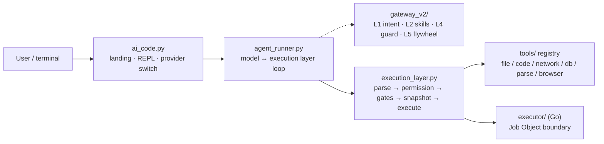

<p align="center">
  
</p>

<h1 align="center">ACE · AI Code Engine</h1>

<p align="center"><strong>English</strong> · <a href="README.zh-CN.md">中文</a></p>

<p align="center">
  <strong>An AI coding agent that pushes safety <em>below</em> the model — into the execution layer.<br>
  The model proposes; permissions, isolation, snapshots and rollback are decided by code it cannot talk its way past.</strong>
</p>

<p align="center">
  <a href="https://github.com/ace-code-engine/ace-agent/actions/workflows/ci.yml"></a>
  
  <a href="LICENSE"></a>
  
  <a href="CHANGELOG.md"></a>
</p>

| Property | What you get |
|---|---|
| **Local** | pure-stdlib core, runs on your machine, no cloud in the loop; the offline demo needs no API key |
| **Model-agnostic** | 9 vendors · 10 endpoints behind one `/provider` switch (Zhipu, DeepSeek, Moonshot, OpenAI, Anthropic, Qwen, SiliconFlow, OpenRouter, Ollama), OpenAI *and* Anthropic wire formats |
| **Pluggable** | every tool is declared once in [`tools/registry.py`](tools/registry.py); **MCP servers connect over stdio** (`mcp_servers` in config → their tools appear as `mcp__<server>__<tool>`, permission/approval/audit unchanged — see [SECURITY-MODEL](docs/SECURITY-MODEL.md), *an MCP server runs outside ACE's sandbox*); skills are plain `SKILL.md` files |

## Why ACE?

Most agents put safety in the prompt: *"please don't delete files"*. ACE doesn't. Every tool call passes through a separate execution layer that makes the permission decision, detects dangerous behaviour, and takes a physical snapshot before any write. When the prompt fails — jailbreak, injected web page, tampered tool output — that layer is still there.

If you only want chat-style code help, you probably don't need ACE. If your agent really edits files, runs commands and reaches the network, and you don't want that to depend on the model's self-restraint, this is the target case.

## ACE vs. the usual prompt-guard agent

| | Typical prompt-guard agent | ACE |
|---|---|---|
| Where "am I allowed?" is decided | in the prompt | in the execution layer, per call (`execution_layer.py`) |
| After a prompt injection / jailbreak | whatever the model decides | permission gate, path boundary and sensitive-target blocks still apply |
| Running a shell command | the model just runs it | `terminal_exec` asks a human **every time** — its blacklist is bypassable, so the human *is* the boundary |
| Undoing a bad edit | hope for git | physical snapshot before every write, `/undo` to roll back |
| Data leaving the machine | whenever the model calls an API | egress gate: unknown destination ⇒ confirm; `egress_allowlist` ⇒ one-time authorization |
| Offline / no API key | usually needs a key | `python ai_code.py --mock` runs the whole loop offline |
| Isolation | prompt-level | three tiers: `off` (in-process policy) / `job` (Windows Job Object) / `docker` (one-shot container) — if the boundary is unavailable it returns **503, never a silent fallback** |

## Run it in 30 seconds (no API key)

```bash
git clone https://github.com/ace-code-engine/ace-agent.git && cd ace-agent
python test_all.py         # end-to-end test suite, pure stdlib — should be all green
python ai_code.py --mock   # offline demo: the full model ↔ execution-layer loop
```

Real models: `python ai_code.py` → menu `2` runs the setup wizard → `1` enters chat, or `/provider deepseek <key>` in one line.
On Windows the repo ships `ace.cmd` — add it to `PATH` and just type `ace`.

Prefer to read before running? [`docs/GETTING-STARTED.md`](docs/GETTING-STARTED.md) has the 5-minute path, the three-axis matrix (`permission` / `sandbox` / `approval_policy`) and the ten classic traps. Three hands-on scenarios live in [`examples/`](examples/README.md).

## See it run

<p align="center">
  
</p>

<p align="center">
  <sub><b>The screen you actually start on.</b> One panel states the boundaries in force (permission · sandbox · network · approval), the directory it will edit, and which past session was resumed —
  then a grouped menu, then the status bar. Rendered by <code>ace --preview</code> at 88 columns; the panel width follows your terminal.</sub>
</p>

<p align="center">
  
</p>

<p align="center">
  <sub>Recorded from a real <code>python ai_code.py --mock</code> session (offline, no key needed).
  Re-record with <a href="demo/record_demo.py"><code>demo/record_demo.py</code></a>; CI runs <code>--check</code> so the image can't silently rot.</sub>
</p>

<p align="center">
  
</p>

<p align="center">
  <sub><b>What changed, not just what ran.</b> The agent writes a file, then edits one line; the card carries a <code>+1 -0</code> stat and the lines themselves —
  green for additions, red for removals — and the request closes with a one-line tool timeline. Run the wrong command and you know immediately; change the wrong line and you may not find out for days.</sub>
</p>

<p align="center">
  
</p>

<p align="center">
  <sub><b>The same agent, trying something it shouldn't.</b> It reaches for <code>~/.ssh/id_rsa</code>; the execution layer refuses before the tool ever runs —
  <code>403</code>, path outside the project. Not a prompt asking nicely: a check the model cannot argue with.
  Recorded from a real session with <code>python ai_code.py --mock</code> (<code>--session blocked</code>).</sub>
</p>

## Design stance

- **Safety is an execution-layer property, not a prompt property.** The model never decides its own permissions.
- **Read-only by default.** Elevation is a human action (`/permission write`), not something the model can grant itself.
- **Say what the boundary can and cannot stop.** No "fully secure" claims anywhere in this repo — see [Security boundary](#security-boundary).

## Core capabilities

**Core — execution safety**

| Capability | One-line hook |
|---|---|
| Three permission levels | `readonly` / `write` / `full`; the tool list is trimmed per level (declared once in `tools/registry.py`), so the model only chooses among tools it can actually see |
| Three sandbox tiers | `off` (in-process policy) / `job` (Windows Job Object: process tree, memory cap, restricted token) / `docker` (one-shot container: `network none`, `cap-drop ALL`); if the boundary is unreachable → 503, never a silent fallback |
| Pre-write snapshots | every write takes a physical snapshot first; `/undo` rolls back; HMAC-signed, and the snapshot directory is not writable by the agent itself |
| Egress gate | data headed for a **model-chosen** destination (`api_get` / `api_post` / `browser_*` / `notify_send` email) is confirmed per call unless the destination is allowlisted; `egress_allowlist` = one-time authorization |
| Security triage | security blocks (path escape / allowlist / sandbox) are counted apart from ordinary argument errors, and a run of them raises a user-facing alert — that usually means something is injecting instructions through a file or page |
| Go executor | dangerous tools are delegated to a separate Go process (NDJSON), whole-tree reaping via Job Object plus a second policy check; official prebuilt binary via `ace --install-executor` |

**Core — agent**

| Capability | One-line hook |
|---|---|
| Persistent goals | `goal_create` then it re-drives round after round until done / paused / blocked / budget spent; `blocked` needs a machine code, and `/goal resume` continues after a restart |
| Subagents | `subagent` spawn (fresh context) or fork (inherit the parent session); its own tool loop, result handed back to the parent |
| Key-free web search | `search` with a two-engine fallback (`Bing RSS → DuckDuckGo`) plus `search_read` to fetch top result bodies in one step; all egress goes through SSRF checks and the allowlist |

**Optional** — custom knowledge base (`kb_search` / `kb_add` / `kb_list`), session event log and restart recovery (`/audit`), Plan Mode, approval-fatigue relief, browser automation, document parsing (Word / Excel / PPT / PDF / OCR), SimHash memory, `AGENTS.md` project instructions, context compaction, network backoff, i18n (zh/en/ja).

**Experimental** — the built-in chat scroll engine (implemented, real-terminal wiring pending; see [`docs/history/UI-CHAT-SCROLL.md`](docs/history/UI-CHAT-SCROLL.md)).

## Architecture



One line per layer: **user layer** = landing page / REPL / slash commands; **loop** = the model ↔ execution-layer closed loop (up to 20 rounds); **execution layer** = protocol parsing → permission ruling → safety gates → pre-write snapshot → tool execution (a 14-stage state machine, and the only place safety is actually enforced); **tool set** = single-point declaration in `registry.py` plus per-domain executors; support modules (`core/work.py`, `core/guardian.py`, `core/archive.py`, `core/nuwa.py`) hang off the layer and the loop.

> **Gateway vs. execution layer**: the gateway (L1/L2/L4/L5) is a policy/assist layer *called inside each round* by the execution layer — not a second, independent security pipeline. The dashed edge in the diagram says exactly that. Layer table, authoritative directory tree and ADR index: [`docs/ARCHITECTURE.md`](docs/ARCHITECTURE.md).

## Common commands

Landing page: ↑/↓ to move, digits to jump, Enter to confirm, Esc/q to quit. Inside chat, `exit` returns to the landing page; `7` / Esc / q on the landing page actually quits.

```bash
/provider                    # list 9 vendors · 10 endpoints (current one ticked)
/provider zhipu              # switch to Zhipu in one command
/permission write            # elevate (read-only by default)
/undo                        # roll back to the pre-write snapshot
```

Slash: `/help` `/clear` `/status` `/snapshots` `/rollback <id>` `/model <name>` `/mock` `/open <path>` `/edit <path>` `/search <term>` `/memory` `/report` `/expand` `/history [keyword]`
`@` shortcuts: `@lang` (zh/en/ja) · `@skill` · `@file` · `@folder` · `@refs`
Input: `Enter` sends, `Alt+Enter` / `Ctrl+J` inserts a newline, `Ctrl+R` walks history backwards, `/history dsk` fuzzy-finds it. The `/` menu and `/help` group commands into Session / Security / Model / Tools.
Tool output longer than 8 lines is folded into the card — `/expand` reprints the full output (up to 4000 characters per call, and it says so when truncated). Write-tool cards show a colourised diff and an `exit N` code; ↑/↓ and Ctrl+R search `~/.ace_history` across sessions (`ACE_NO_HISTORY=1` keeps history in-process only).

→ Full command table, every `/provider` example and all startup flags: [`docs/COMMANDS.md`](docs/COMMANDS.md).

## Security boundary

ACE's safety comes in four layers, enabled to different degrees:

| Layer | What ACE does |
|---|---|
| Prompt | guides the model only — **promises nothing** |
| Application (default) | execution-layer policy: three permission levels, AST behaviour checks, pre-write snapshot/rollback, path boundaries, SSRF/allowlist egress checks, egress-destination confirmation (including "overwrite or delete something outside the project" ⇒ ask) |
| OS (optional, Windows) | `--sandbox job`: Job Object process/memory caps plus a restricted token |
| Container (optional) | `--sandbox docker`: one-shot container, `network none`, `cap-drop ALL`, `read-only` root, `--init`, only the workspace mounted — the image is built once locally (`docker/Dockerfile.sandbox`); a registry-hosted image can be pulled with `ACE_SANDBOX_PULL=1` |

Honest limits: **without the OS/container tier** everything above is in-process policy (the AST blacklist and AST evaluation cannot be closed; `terminal_exec`'s verdict layer is only a tourniquet) — **not OS-level isolation**. The `job` tier is a Windows-only primitive; Docker containers share the kernel, so an escape is still an escape. When a boundary is unavailable, `job`/`docker` return 503 and **never silently fall back to the host**.

The egress gate has a scope too: it governs **model-chosen destinations** — built-in endpoints (search engines, the image service) are not confirmed per call, and `image_generate` sends its prompt to a third-party service in clear text; `terminal_exec` can still delete the audit log inside the project, but that step is confirmed by a human every time. Both are written down in [`docs/SECURITY-MODEL.md`](docs/SECURITY-MODEL.md) rather than hidden.

→ Full security model and production notes: [`docs/SECURITY-MODEL.md`](docs/SECURITY-MODEL.md). Vulnerability reports: [`SECURITY.md`](SECURITY.md).

## Configuration

```python
# ~/.ai_code.json  (CLI flags > this file > ~/.claude/settings.json > environment)
config = {
    "permission": "readonly",   # readonly / write / full
    "sandbox": "off",           # off / job / docker
    "max_snapshots": 20,        # hard cap, oldest pruned automatically
}
```

→ Every key, plus the mechanisms behind egress allowlists, search boundaries, `str_replace` encoding and read-only `db_query`: [`docs/CONFIGURATION.md`](docs/CONFIGURATION.md).

## Testing

```bash
python test_all.py                      # full suite (pure stdlib, non-zero exit = failure)
python test_all.py --only 40            # run one section (declared dependencies are pulled in)
python test_all.py --list               # list sections and their dependencies
ruff check . --select E9,F63,F7,F82     # the hard-error subset CI uses
```

Three sections exist purely to keep **promises** honest: `[38]` the authoritative directory tree ↔ real files, `[39]` documented numbers ↔ `PROVIDERS`/`TOOL_SPECS`, `[40]` the raw payloads from the security audit. They exist because "the docs say it asks the human" once turned out to mean "the code never asked".

→ Framework, CI matrix, benchmarks and e2e details: [`docs/TESTING.md`](docs/TESTING.md).

## Recent changes

- **v3.25.0** (2026-09-19): the fourth batch of the full UI/interaction pass covers **layout and the status line**. `--fullscreen` / `/fullscreen` puts the session on the alternate screen with four fixed regions (header, a scrollable transcript, a configurable status line, the input line) — the transcript has its own viewport (`PageUp`/`↑` to look back, `End` to return to the bottom) instead of scrolling your terminal buffer away, and `F5` drops back to the plain REPL. The status line became data: segments carry priorities, so a narrow terminal drops decoration (turn/tool counts) instead of the context meter, and `/statusline model,context,-turns` reorders or removes them (unknown names are reported, never silently ignored). Waiting now shows how long it has been and says "no progress for Ns · Ctrl+C to interrupt" when nothing changes; `/tasks` draws the goal, the checklist and the running tool as one multi-line tree; `/status` got a context meter; the banner animates once on a real terminal (skipped in pipes and CI).
- **v3.24.0** (2026-09-19): the third batch of the full UI/interaction pass covers **dialogs**. One model (`ui/ace_dialog.py`) now renders every question the app asks — single/multi select, groups, progress bar, tabs, footer key hints — and all lines are width-exact, CJK included. Multi-select rides the same fuzzy-search overlay (`Space` to check, `Enter` to confirm). `/permission rules` turns one-off grants into an editable, visible list: checking a tool stops the prompts for this session, unchecking revokes immediately, and tools that refuse session grants by design (terminal_exec, outbound tools) are listed but marked — nothing is silently allowed. The `/config` wizard is now a real state machine (step back with `b`, re-ask on invalid input) and **collects answers before applying them**, so cancelling changes nothing — previously it mutated the in-memory config while saying "not saved".
- **v3.23.0** (2026-09-19): the second batch of the full UI/interaction pass covers the **text the model produces**. Replies render as Markdown — headings, lists, quotes, rules, fenced code with a border and language label (nothing inside is parsed inline), display-width-aligned tables, inline bold/italic/code/links; anything unrecognised passes through unchanged. Rendering is **per completed line**, so streamed output matches whole-document layout line for line. Glyphs mark who is speaking (`❯` you / `◈` model / `⚙` tools), consecutive repeats in a tool summary merge (`file_read ×2 ✓`), and thinking gets a framed, capped block. `/diff` is now two-level: which files changed first, then the lines of one entry (`/diff <n>`). Ctrl+O — listed in `/keys` since v3.22.0 but never bound — now expands the last folded output
- **v3.22.0** (2026-09-19): the first batch of the full UI/interaction pass covers the **input line**. ! <command> runs it directly — same as Claude Code’s !, but through our own gate (per-call confirmation, sandbox, audit), with the output pasted into context; the prompt changes colour by mode so you never guess whether a line goes to the model or your shell. Pastes over 6 lines or 800 chars fold into [paste #1 +30 lines] and expand on submit (echo is truncated too, and says how much was actually sent). Ctrl+S / /stash parks a half-written thought, /queue runs a prompt right after this turn, and both show up in the footer. /keys (or a lone ?) prints the whole shortcut table
- **v3.21.0** (2026-09-19): the last capability line. `/review` writes the last change out as a **unified diff**, opens it in your editor, and **reads it back and applies it** — through the same execution-layer gate (snapshot/permission/audit), with our own minimal patch applier (no `patch(1)`, no `git apply`; a context mismatch applies **nothing** and names the line). `@image <path>` attaches a picture to the next turn (footer shows `img1`; the image **goes to the provider as-is**, and the command says so). `vim_mode` + `keybindings` give you vi keys and custom bindings through the same channel as F1–F4. `/status` reports an estimated session cost — labelled an estimate, with "price unknown" rather than an invented number
- **v3.20.0** (2026-09-19): sessions can be listed, continued, forked and rewound — `/sessions` (time / turns / first line / whether it was compacted), `/resume` (history rebuilt and **subsequent events appended to that same log**), `/fork` (new session seeded from another, no shared history), and `/rewind` which touches the **conversation only** (files are `/rollback`'s job, and it says so). Plus an itemised **todo list**: the `todo_write` tool (read-only group — a checklist should not need authorisation), `/todo`, a `todo 1/3` footer badge, and the log as the single source so it survives `/resume`. Guard `[46]` drives real files and a real CLI: after `/resume` the new messages really land in the continued log, and after `/rewind` every file on disk is byte-identical
- **v3.19.0** (2026-09-19): `ace --json` emits a **machine-readable event stream** — one JSON object per line (`session_start` / `user_message` / `model_request` / `tool_call` / `tool_result` / `permission_request` / `notice` / `final` / `session_end`), with the contract table (`core/ace_events.EVENT_REQUIRED`) as the single source for docs, runtime validation and assertions. The prose is not lost: in `--json` mode stdout is replaced by a `NoticeProxy`, so every `print` becomes a `notice` event — one place to change, and no ANSI, no `\r` redraws, no spinner noise. `model_delta` is deliberately not emitted. Guards run a **real subprocess** and parse stdout line by line
- **v3.18.0** (2026-09-19): your own rules, wired in. **Event hooks** (`pre_tool` / `post_tool` / `user_prompt` / `session_start` / `session_end`) read JSON on stdin and answer `{"decision":"block","reason":…}` on stdout, with exit code 2 blocking — and the default is **fail-close**, so a hook that crashes or times out does not count as "check passed". A `pre_tool` block returns `HOOK_BLOCKED` (not a security violation) and the tool genuinely does not run. **Custom slash commands** come from `.ace/commands/*.md` (filename = command, `$ARGUMENTS`/`$1` substituted, no YAML dependency, built-ins always win). **Plugins** live in `.ace/plugins/<name>/` and contribute commands (auto-prefixed) and hooks; they deliberately cannot ship tools. Hooks are local commands outside the sandbox — same boundary statement as MCP → [`docs/EXTENDING.md`](docs/EXTENDING.md)
- **v3.17.0** (2026-09-19): ACE speaks **MCP** over stdio JSON-RPC 2.0 (`initialize` → `tools/list` → `tools/call`). Point `mcp_servers` at a server and its tools appear as `mcp__<server>__<tool>` with the input schema passed through; permissions, approval and audit apply unchanged. `/mcp` shows status, failure reason and the tool list. Permissions default to strict (read-only only when the server declares `readOnlyHint`). Failures are reported separately — `503` unavailable, `504` timeout, `500` protocol error or peer `isError` — and child processes are closed explicitly. **stdio only**; HTTP/SSE is not implemented
- **v3.16.1** (2026-09-19): CI's lint job had gone red on the two previous tags while the test matrix stayed green — `ui/ace_diff.py` imported a `display_width` that only its docstring mentioned. Fixed, and `[38]` now runs an AST-based **unused-import check** (F401's shape) locally, so the same "green here, red in CI" cannot repeat when ruff is unavailable. The check was verified by injecting the import back and watching it fail
- **v3.16.0** (2026-09-19): the input line grew up. **Multiline**: `Alt+Enter` or `Ctrl+J` inserts a newline (`Shift+Enter` where the terminal reports it), `Enter` sends, and continuation lines are aligned with `… `. **`/history [keyword]`** fuzzy-searches your past inputs with the picker's subsequence scoring (`dsk` finds the `deepseek` entry), highlights the match, and fills the next prompt with the pick — never auto-sends. **25 commands are grouped** (Session / Security / Model / Tools) in the `/` menu and in `/help`, and the menu's data source is a pure function so it is asserted even where prompt_toolkit is absent
- **v3.15.0** (2026-09-19): write-tool cards now carry a **colourised unified diff** (`+N -M` in the title, `+` green, `-` red, hunk headers cyan) — run the wrong command and you know at once, change the wrong line and you may not find out for days. `file_write` gained `data["diff"]`; `str_replace` had been returning one all along that the terminal never showed. Three boundaries: no diff for new files, **no re-read of credential files** (same SEC-04 list the snapshot refuses to copy — otherwise old contents reach the card *and* the model context), and nothing over 200 KB. Command cards show `· exit N` ("finished" ≠ "succeeded"), and a request that runs two or more tools ends with a one-line timeline. A fourth demo image joins CI
- **v3.14.0** (2026-09-19): the landing screen was rebuilt — a **session panel** (model, the four boundary axes, directory, and which past session was resumed), a **recent-sessions panel**, and a grouped menu, all laid out by a new width-aware `ui/ace_panel.py` that guarantees every line matches the panel width (CJK counted as two columns). The previous session has been auto-resumed since v3.9, but nothing on screen ever said *which* one; now it does. New `ace --preview` draws that screen and exits — no interactive terminal needed, which is how the README hero image and its CI check work. `ui/ace_text` now ignores ANSI colour codes when measuring width, so colouring a line no longer shifts the border
- **v3.13.0** (2026-09-19): context headroom is now visible instead of announced only after the fact. The footer ends with a usage figure (`ctx 38%`) whose colour is the semantics — grey with room, yellow at 80% of the compaction trigger, red once compaction is due — and `/status` prints the detail (`~12k tokens / window 32768 (38%, trigger ~23k; an estimate, not a server reading)`). Before a request, a one-time warning fires as the trigger approaches (throttled per 10% band, so it stays worth reading). The display figures and the actual compaction decision share one policy constructor — two copies would eventually disagree, and a number that contradicts reality stops being trusted. Guards: +20 assertions in `[9]`, including a same-source invariant on the trigger point and two integration assertions that drive a real (mock) `converse` — helper-only tests would pass even if nothing called the helper
- **v3.12.0** (2026-09-19): the fold hint became a real feature. Tool cards have said "N lines folded (use /expand for the rest)" since early versions, but no such command existed — an empty promise in the one place the user needs it. `/expand` reprints the last folded output, says so honestly when nothing was folded, and marks output cut at the 4000-character cap. Completions now persist across sessions in `~/.ace_history` (↑/↓ and Ctrl+R; `ACE_NO_HISTORY=1` keeps them in-process, since the file can retain pasted keys), and the spinner shows elapsed seconds so a long think is distinguishable from a hang. Guards: +12 assertions in `[9]`, including a generic "the table's parts flag matches the handler's real signature" invariant (it caught `/expand`'s own mismatch on first run), and `[11]` now enforces that zh/en/ja have identical key sets, identical `{placeholders}` per key, and no empty translations
- **v3.11.1** (2026-09-19): the picker matches **subsequences**, not substrings — `glm4` finds `glm-4.6` (0 → 10 hits on `/model`), `dsk` finds `deepseek`; scoring and highlighting share one matcher, so a fuzzy hit is highlighted exactly where it matched. New `ui/ace_text.py` makes text handling **column-aware** (CJK is two columns wide): tool cards used to truncate by character count, so a line truncated to "60 characters" of Chinese occupied 120 columns and pushed the card border off-screen

- **v3.11.0** (2026-09-19): the container tier's run flags were hardened and are now verified against a real daemon instead of by reading code — `--init` (reap zombies, or they eat the `--pids-limit` budget), `--ulimit nofile`, `HOME=/tmp` (pip can't write cache under a read-only root), automatic `,z` on SELinux-enforcing hosts (Fedora/RHEL can't write the mount without it), `--label` for cleanup, optional `ACE_SANDBOX_SECCOMP`. A new `sandbox-smoke` CI job builds the image and runs it through the client's own argument construction, asserting `--network none` and `--read-only` really hold. **Official prebuilt images are not published**: the org's package policy forbids making GHCR packages public, so `ACE_SANDBOX_PULL=1` remains as an opt-in for self-hosted registries and the default stays "build it once locally" → [full release notes](docs/RELEASE-NOTES-v3.11.0.md)
- **v3.10.1** (2026-09-19): three fixes forced by a real-model smoke test and by actual runs. The correction loop no longer wraps execution-layer errors in the SEC-011 untrusted-content block — the model was correctly refusing to act on it, and deadlocked until the stall breaker fired; the format error now quotes what the layer actually received. The Go executor asks for `PROCESS_SUSPEND_RESUME` only when it needs it, names the denied access right when the attach fails, and can fall back to a non-suspended start (reported as `degraded`) so Tier-1 still works under restricted-token hosts. `ace.cmd` ships CRLF, pinned by `.gitattributes`. **This release re-publishes the executor binaries** — `ace --install-executor` still fetches the pre-fix build until it is out
- **v3.10.0** (2026-09-18): the flat root is gone — 20 modules moved into `ui/` (terminal presentation), `cli/` (doctor / context / session log) and `core/` (policy, network, executor client, memory, snapshots), leaving 4 files at the root; README is now English-first (Chinese in [`README.zh-CN.md`](README.zh-CN.md)); the demo covers the *blocked* path too
- **v3.9.0** (2026-09-18): section-level test runner (0.3s for a targeted section instead of a full run), `tools/file_tools.py` split along its three execution paths (method bodies verified byte-identical), `run_command` 125→25 lines, `converse` 234→175 lines, shared model-layer helpers in `core/ace_model.py`
- **v3.8** (2026-09-18): promise guards (`[38]/[39]/[40]`), the full 19-item security-audit reconciliation, the egress gate, snapshot/audit hardening, and the `examples/` scenarios. Same-day tags are merged into one entry — see [`CHANGELOG.md`](CHANGELOG.md)

## Known gaps and unverified items

To be explicit about what is **not** done or **not** verified — don't read these as "probably fine":

- **R-03 engine merge: done; the *vendor* half of its verification is still open.** The client merge is real now — `core/ace_client.py` is the single model HTTP client (one `ace_http` egress point, one place that builds `/chat/completions`, the two frontends keep only their own contract: `chat_stream` for the CLI, `chat_once` for the headless runner). It is merged on the local verification branch as a merge commit, not yet on `main` — that is the owner's call to push. The credential-free half of the acceptance is now automated and green: `python e2e/r03_contract_smoke.py` stands up a real listening socket, answers **both wire formats**, and drives **both frontends** through it (7/7), so an accidental change to either request/response shape fails there. The vendor half is still open: this machine had **no provider API key and no local Ollama**, so "a real vendor endpoint" remains unrun. Run `python e2e/real_model_smoke.py` with `ACE_E2E_BASE_URL` / `ACE_E2E_API_KEY` / `ACE_E2E_MODEL` set; without them it prints `SKIP`. Order and rationale: [`docs/design/STRUCT-REFACTOR.md`](docs/design/STRUCT-REFACTOR.md).
- **REL-03 native smoke: walked through (Windows).** `ace.cmd` → interpreter self-resolution → a real console conversation, offline `--mock`, exit 0, Chinese and emoji both intact. `e2e/rel03_native_smoke.ps1` reproduces it in three scenarios (launcher / direct entry / legacy `chcp 936`) and is ASCII-only on purpose — Windows PowerShell 5.1 reads a BOM-less script as ANSI, and the first version of that file died on its own Chinese comments. Still unverified: the **Textual full-screen UI under a real TTY** (sections `[60]/[62]/[63]/[64]/[66]` skip without `textual` installed), and any non-Windows console.
- **Found by that smoke and fixed:** `_generate_text` (the no-`--tools` fallback) used to hand the model's plain text straight to the execution layer, which expects protocol text — so `agent_runner.py --base-url …` never reached a final reply and printed "max rounds reached" instead. Mock mode and `--tools` both wrap, which is why no test caught it. Now wrapped like `_generate_tools`, with two assertions in `[8]`.
- Same class: the **darwin/amd64 executor artifact has no native smoke test** — it cross-compiles, but no Intel Mac has ever run it. See the REL section of [`docs/BACKLOG.md`](docs/BACKLOG.md).

## Project layout

```
ace-agent/
├── ai_code.py / agent_runner.py   # terminal frontends (landing/REPL) + agent loop
├── execution_layer.py             # the layer where safety is actually enforced
├── ui/  cli/  core/               # terminal presentation / operator tools / engine support
├── tools/  gateway_v2/  executor/ # tool registry / gateway policy / Go sandbox executor
├── test_all.py  benchmarks/  e2e/ # tests / benchmarks / real-model smoke
├── examples/  docker/  docs/  demo/
└── SECURITY.md  CHANGELOG.md  LICENSE
```

→ Authoritative directory tree with per-module responsibilities: [`docs/ARCHITECTURE.md`](docs/ARCHITECTURE.md).

## Contributing

Read [`CONTRIBUTING.md`](CONTRIBUTING.md) first; the standard workflow lives in [`docs/DEVELOPMENT.md`](docs/DEVELOPMENT.md), interface contracts in [`docs/INTERFACES.md`](docs/INTERFACES.md), and the backlog in [`docs/BACKLOG.md`](docs/BACKLOG.md).

## Docs map

| What you want | Where to go |
|---|---|
| **Start here** (5-minute path · three-axis matrix · ten traps) | [`docs/GETTING-STARTED.md`](docs/GETTING-STARTED.md) |
| **Hands-on scenarios** (security lab / document parsing / multi-turn agent) | [`examples/`](examples/README.md) |
| Layers · full directory tree · ADR index | [`docs/ARCHITECTURE.md`](docs/ARCHITECTURE.md) |
| Security model / audit / reporting | [`docs/SECURITY-MODEL.md`](docs/SECURITY-MODEL.md) · [`docs/SECURITY-AUDIT.md`](docs/SECURITY-AUDIT.md) · [`SECURITY.md`](SECURITY.md) |
| Every configuration key | [`docs/CONFIGURATION.md`](docs/CONFIGURATION.md) |
| Commands and startup flags | [`docs/COMMANDS.md`](docs/COMMANDS.md) |
| Tests and CI | [`docs/TESTING.md`](docs/TESTING.md) |
| Development / contracts / backlog | [`docs/DEVELOPMENT.md`](docs/DEVELOPMENT.md) · [`docs/INTERFACES.md`](docs/INTERFACES.md) · [`docs/BACKLOG.md`](docs/BACKLOG.md) |
| Version history | [`CHANGELOG.md`](CHANGELOG.md) |
| Design cards / session notes / research | [`docs/design/`](docs/design/) · [`docs/history/`](docs/history/) |

## License

[MIT](LICENSE) © 2026 jincheng3870682453-hash

## Design references

Architecture decisions align with the following work — **let the model only "understand, choose, output", and push permissions, safety, rollback and memory down into the execution layer**:

- [Agent Harness engineering best practices](https://github.com/Delphoa/study-awesome-harness-engineering) (tools / permissions / memory / sandbox / observability)
- [DeepSeek Harness design analysis](https://developer.aliyun.com/article/1756780) (internal research: `docs/history/dsh_research.md`)
- [20-chapter Chinese AI agent architecture course](https://github.com/ryzqi/learn-agent)
