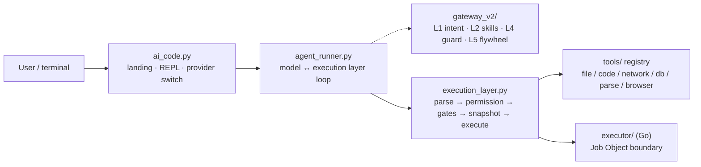

<p align="center">
  
</p>

<h1 align="center">ACE · AI Code Engine</h1>

<p align="center"><strong>English</strong> · <a href="README.zh-CN.md">中文</a></p>

<p align="center">
  <strong>An AI coding agent that pushes safety <em>below</em> the model — into the execution layer.<br>
  The model proposes; permissions, isolation, snapshots and rollback are decided by code it cannot talk its way past.</strong>
</p>

<p align="center">
  <a href="https://github.com/jincheng3870682453-hash/ace-agent/actions/workflows/ci.yml"></a>
  
  <a href="LICENSE"></a>
  
  <a href="CHANGELOG.md"></a>
</p>

| Property | What you get |
|---|---|
| **Local** | pure-stdlib core, runs on your machine, no cloud in the loop; the offline demo needs no API key |
| **Model-agnostic** | 9 vendors · 10 endpoints behind one `/provider` switch (Zhipu, DeepSeek, Moonshot, OpenAI, Anthropic, Qwen, SiliconFlow, OpenRouter, Ollama), OpenAI *and* Anthropic wire formats |
| **Pluggable** | every tool is declared once in [`tools/registry.py`](tools/registry.py); skills are plain `SKILL.md` files; MCP is just `register()`-ing a `ToolSpec` |

## Why ACE?

Most agents put safety in the prompt: *"please don't delete files"*. ACE doesn't. Every tool call passes through a separate execution layer that makes the permission decision, detects dangerous behaviour, and takes a physical snapshot before any write. When the prompt fails — jailbreak, injected web page, tampered tool output — that layer is still there.

If you only want chat-style code help, you probably don't need ACE. If your agent really edits files, runs commands and reaches the network, and you don't want that to depend on the model's self-restraint, this is the target case.

## ACE vs. the usual prompt-guard agent

| | Typical prompt-guard agent | ACE |
|---|---|---|
| Where "am I allowed?" is decided | in the prompt | in the execution layer, per call (`execution_layer.py`) |
| After a prompt injection / jailbreak | whatever the model decides | permission gate, path boundary and sensitive-target blocks still apply |
| Running a shell command | the model just runs it | `terminal_exec` asks a human **every time** — its blacklist is bypassable, so the human *is* the boundary |
| Undoing a bad edit | hope for git | physical snapshot before every write, `/undo` to roll back |
| Data leaving the machine | whenever the model calls an API | egress gate: unknown destination ⇒ confirm; `egress_allowlist` ⇒ one-time authorization |
| Offline / no API key | usually needs a key | `python ai_code.py --mock` runs the whole loop offline |
| Isolation | prompt-level | three tiers: `off` (in-process policy) / `job` (Windows Job Object) / `docker` (one-shot container) — if the boundary is unavailable it returns **503, never a silent fallback** |

## Run it in 30 seconds (no API key)

```bash
git clone https://github.com/jincheng3870682453-hash/ace-agent.git && cd ace-agent
python test_all.py         # end-to-end test suite, pure stdlib — should be all green
python ai_code.py --mock   # offline demo: the full model ↔ execution-layer loop
```

Real models: `python ai_code.py` → menu `2` runs the setup wizard → `1` enters chat, or `/provider deepseek <key>` in one line.
On Windows the repo ships `ace.cmd` — add it to `PATH` and just type `ace`.

Prefer to read before running? [`docs/GETTING-STARTED.md`](docs/GETTING-STARTED.md) has the 5-minute path, the three-axis matrix (`permission` / `sandbox` / `approval_policy`) and the ten classic traps. Three hands-on scenarios live in [`examples/`](examples/README.md).

## See it run

<p align="center">
  
</p>

<p align="center">
  <sub>Recorded from a real <code>python ai_code.py --mock</code> session (offline, no key needed).
  Re-record with <a href="demo/record_demo.py"><code>demo/record_demo.py</code></a>; CI runs <code>--check</code> so the image can't silently rot.</sub>
</p>

<p align="center">
  
</p>

<p align="center">
  <sub><b>The same agent, trying something it shouldn't.</b> It reaches for <code>~/.ssh/id_rsa</code>; the execution layer refuses before the tool ever runs —
  <code>403</code>, path outside the project. Not a prompt asking nicely: a check the model cannot argue with.
  Recorded from a real session with <code>python ai_code.py --mock</code> (<code>--session blocked</code>).</sub>
</p>

## Design stance

- **Safety is an execution-layer property, not a prompt property.** The model never decides its own permissions.
- **Read-only by default.** Elevation is a human action (`/permission write`), not something the model can grant itself.
- **Say what the boundary can and cannot stop.** No "fully secure" claims anywhere in this repo — see [Security boundary](#security-boundary).

## Core capabilities

**Core — execution safety**

| Capability | One-line hook |
|---|---|
| Three permission levels | `readonly` / `write` / `full`; the tool list is trimmed per level (declared once in `tools/registry.py`), so the model only chooses among tools it can actually see |
| Three sandbox tiers | `off` (in-process policy) / `job` (Windows Job Object: process tree, memory cap, restricted token) / `docker` (one-shot container: `network none`, `cap-drop ALL`); if the boundary is unreachable → 503, never a silent fallback |
| Pre-write snapshots | every write takes a physical snapshot first; `/undo` rolls back; HMAC-signed, and the snapshot directory is not writable by the agent itself |
| Egress gate | data headed for a **model-chosen** destination (`api_get` / `api_post` / `browser_*` / `notify_send` email) is confirmed per call unless the destination is allowlisted; `egress_allowlist` = one-time authorization |
| Security triage | security blocks (path escape / allowlist / sandbox) are counted apart from ordinary argument errors, and a run of them raises a user-facing alert — that usually means something is injecting instructions through a file or page |
| Go executor | dangerous tools are delegated to a separate Go process (NDJSON), whole-tree reaping via Job Object plus a second policy check; official prebuilt binary via `ace --install-executor` |

**Core — agent**

| Capability | One-line hook |
|---|---|
| Persistent goals | `goal_create` then it re-drives round after round until done / paused / blocked / budget spent; `blocked` needs a machine code, and `/goal resume` continues after a restart |
| Subagents | `subagent` spawn (fresh context) or fork (inherit the parent session); its own tool loop, result handed back to the parent |
| Key-free web search | `search` with a two-engine fallback (`Bing RSS → DuckDuckGo`) plus `search_read` to fetch top result bodies in one step; all egress goes through SSRF checks and the allowlist |

**Optional** — custom knowledge base (`kb_search` / `kb_add` / `kb_list`), session event log and restart recovery (`/audit`), Plan Mode, approval-fatigue relief, browser automation, document parsing (Word / Excel / PPT / PDF / OCR), SimHash memory, `AGENTS.md` project instructions, context compaction, network backoff, i18n (zh/en/ja).

**Experimental** — the built-in chat scroll engine (implemented, real-terminal wiring pending; see [`docs/history/UI-CHAT-SCROLL.md`](docs/history/UI-CHAT-SCROLL.md)).

## Architecture



One line per layer: **user layer** = landing page / REPL / slash commands; **loop** = the model ↔ execution-layer closed loop (up to 20 rounds); **execution layer** = protocol parsing → permission ruling → safety gates → pre-write snapshot → tool execution (a 14-stage state machine, and the only place safety is actually enforced); **tool set** = single-point declaration in `registry.py` plus per-domain executors; support modules (`core/work.py`, `core/guardian.py`, `core/archive.py`, `core/nuwa.py`) hang off the layer and the loop.

> **Gateway vs. execution layer**: the gateway (L1/L2/L4/L5) is a policy/assist layer *called inside each round* by the execution layer — not a second, independent security pipeline. The dashed edge in the diagram says exactly that. Layer table, authoritative directory tree and ADR index: [`docs/ARCHITECTURE.md`](docs/ARCHITECTURE.md).

## Common commands

Landing page: ↑/↓ to move, digits to jump, Enter to confirm, Esc/q to quit. Inside chat, `exit` returns to the landing page; `7` / Esc / q on the landing page actually quits.

```bash
/provider                    # list 9 vendors · 10 endpoints (current one ticked)
/provider zhipu              # switch to Zhipu in one command
/permission write            # elevate (read-only by default)
/undo                        # roll back to the pre-write snapshot
```

Slash: `/help` `/clear` `/status` `/snapshots` `/rollback <id>` `/model <name>` `/mock` `/open <path>` `/edit <path>` `/search <term>` `/memory` `/report`
`@` shortcuts: `@lang` (zh/en/ja) · `@skill` · `@file` · `@folder` · `@refs`

→ Full command table, every `/provider` example and all startup flags: [`docs/COMMANDS.md`](docs/COMMANDS.md).

## Security boundary

ACE's safety comes in four layers, enabled to different degrees:

| Layer | What ACE does |
|---|---|
| Prompt | guides the model only — **promises nothing** |
| Application (default) | execution-layer policy: three permission levels, AST behaviour checks, pre-write snapshot/rollback, path boundaries, SSRF/allowlist egress checks, egress-destination confirmation (including "overwrite or delete something outside the project" ⇒ ask) |
| OS (optional, Windows) | `--sandbox job`: Job Object process/memory caps plus a restricted token |
| Container (optional) | `--sandbox docker`: one-shot container, `network none`, `cap-drop ALL`, only the workspace mounted |

Honest limits: **without the OS/container tier** everything above is in-process policy (the AST blacklist and AST evaluation cannot be closed; `terminal_exec`'s verdict layer is only a tourniquet) — **not OS-level isolation**. The `job` tier is a Windows-only primitive; Docker containers share the kernel, so an escape is still an escape. When a boundary is unavailable, `job`/`docker` return 503 and **never silently fall back to the host**.

The egress gate has a scope too: it governs **model-chosen destinations** — built-in endpoints (search engines, the image service) are not confirmed per call, and `image_generate` sends its prompt to a third-party service in clear text; `terminal_exec` can still delete the audit log inside the project, but that step is confirmed by a human every time. Both are written down in [`docs/SECURITY-MODEL.md`](docs/SECURITY-MODEL.md) rather than hidden.

→ Full security model and production notes: [`docs/SECURITY-MODEL.md`](docs/SECURITY-MODEL.md). Vulnerability reports: [`SECURITY.md`](SECURITY.md).

## Configuration

```python
# ~/.ai_code.json  (CLI flags > this file > ~/.claude/settings.json > environment)
config = {
    "permission": "readonly",   # readonly / write / full
    "sandbox": "off",           # off / job / docker
    "max_snapshots": 20,        # hard cap, oldest pruned automatically
}
```

→ Every key, plus the mechanisms behind egress allowlists, search boundaries, `str_replace` encoding and read-only `db_query`: [`docs/CONFIGURATION.md`](docs/CONFIGURATION.md).

## Testing

```bash
python test_all.py                      # full suite (pure stdlib, non-zero exit = failure)
python test_all.py --only 40            # run one section (declared dependencies are pulled in)
python test_all.py --list               # list sections and their dependencies
ruff check . --select E9,F63,F7,F82     # the hard-error subset CI uses
```

Three sections exist purely to keep **promises** honest: `[38]` the authoritative directory tree ↔ real files, `[39]` documented numbers ↔ `PROVIDERS`/`TOOL_SPECS`, `[40]` the raw payloads from the security audit. They exist because "the docs say it asks the human" once turned out to mean "the code never asked".

→ Framework, CI matrix, benchmarks and e2e details: [`docs/TESTING.md`](docs/TESTING.md).

## Recent changes

- **v3.9.0** (2026-09-18): section-level test runner (0.3s for a targeted section instead of a full run), `tools/file_tools.py` split along its three execution paths (method bodies verified byte-identical), `run_command` 125→25 lines, `converse` 234→175 lines, shared model-layer helpers in `core/ace_model.py`
- **v3.8** (2026-09-18): promise guards (`[38]/[39]/[40]`), the full 19-item security-audit reconciliation, the egress gate, snapshot/audit hardening, and the `examples/` scenarios. Same-day tags are merged into one entry — see [`CHANGELOG.md`](CHANGELOG.md)

## Known gaps and unverified items

To be explicit about what is **not** done or **not** verified — don't read these as "probably fine":

- **R-03 engine merge (not done).** Only the safe half was merged: the pure logic both frontends share now lives in `core/ace_model.py` (history trimming, HTTP error-code hints). The streaming client itself is **not** merged — the interactive frontend is streaming + `requests` + retries + Anthropic compatibility, while the headless one is a single `urllib` call, and their output contracts differ (stream-as-you-go vs. the single `🤖 Agent:` line that `e2e` and CI depend on). Merging them is a **behaviour change**, and the current tests only cover the `--mock` path — it needs verification against a **real model endpoint** before it is safe to do. The order of work is written down in [`docs/design/STRUCT-REFACTOR.md`](docs/design/STRUCT-REFACTOR.md).
- **REL-03 native smoke (not verified).** Repo automation covers the offline `--mock` path, the headless `agent_runner`, and CI on three Python versions. **"`ace.cmd` → a real terminal conversation" has never been walked through on a real machine.** Windows console VT/encoding, the `prompt_toolkit` completion menu and streaming under a real model all belong to this bucket.
- Same class: the **darwin/amd64 executor artifact has no native smoke test** — it cross-compiles, but no Intel Mac has ever run it. See the REL section of [`docs/BACKLOG.md`](docs/BACKLOG.md).

## Project layout

```
ace-agent/
├── ai_code.py / agent_runner.py   # terminal frontends (landing/REPL) + agent loop
├── execution_layer.py             # the layer where safety is actually enforced
├── ui/  cli/  core/               # terminal presentation / operator tools / engine support
├── tools/  gateway_v2/  executor/ # tool registry / gateway policy / Go sandbox executor
├── test_all.py  benchmarks/  e2e/ # tests / benchmarks / real-model smoke
├── examples/  docker/  docs/  demo/
└── SECURITY.md  CHANGELOG.md  LICENSE
```

→ Authoritative directory tree with per-module responsibilities: [`docs/ARCHITECTURE.md`](docs/ARCHITECTURE.md).

## Contributing

Read [`CONTRIBUTING.md`](CONTRIBUTING.md) first; the standard workflow lives in [`docs/DEVELOPMENT.md`](docs/DEVELOPMENT.md), interface contracts in [`docs/INTERFACES.md`](docs/INTERFACES.md), and the backlog in [`docs/BACKLOG.md`](docs/BACKLOG.md).

## Docs map

| What you want | Where to go |
|---|---|
| **Start here** (5-minute path · three-axis matrix · ten traps) | [`docs/GETTING-STARTED.md`](docs/GETTING-STARTED.md) |
| **Hands-on scenarios** (security lab / document parsing / multi-turn agent) | [`examples/`](examples/README.md) |
| Layers · full directory tree · ADR index | [`docs/ARCHITECTURE.md`](docs/ARCHITECTURE.md) |
| Security model / audit / reporting | [`docs/SECURITY-MODEL.md`](docs/SECURITY-MODEL.md) · [`docs/SECURITY-AUDIT.md`](docs/SECURITY-AUDIT.md) · [`SECURITY.md`](SECURITY.md) |
| Every configuration key | [`docs/CONFIGURATION.md`](docs/CONFIGURATION.md) |
| Commands and startup flags | [`docs/COMMANDS.md`](docs/COMMANDS.md) |
| Tests and CI | [`docs/TESTING.md`](docs/TESTING.md) |
| Development / contracts / backlog | [`docs/DEVELOPMENT.md`](docs/DEVELOPMENT.md) · [`docs/INTERFACES.md`](docs/INTERFACES.md) · [`docs/BACKLOG.md`](docs/BACKLOG.md) |
| Version history | [`CHANGELOG.md`](CHANGELOG.md) |
| Design cards / session notes / research | [`docs/design/`](docs/design/) · [`docs/history/`](docs/history/) |

## License

[MIT](LICENSE) © 2026 jincheng3870682453-hash

## Design references

Architecture decisions align with the following work — **let the model only "understand, choose, output", and push permissions, safety, rollback and memory down into the execution layer**:

- [Agent Harness engineering best practices](https://github.com/Delphoa/study-awesome-harness-engineering) (tools / permissions / memory / sandbox / observability)
- [DeepSeek Harness design analysis](https://developer.aliyun.com/article/1756780) (internal research: `docs/history/dsh_research.md`)
- [20-chapter Chinese AI agent architecture course](https://github.com/ryzqi/learn-agent)
