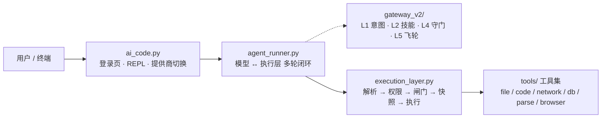

<p align="center">
  
</p>

<h1 align="center">ACE · AI Code Engine</h1>


<p align="center">
  <strong>一个把安全下沉到执行层的 AI 编码 Agent —— 模型只负责理解和输出，<br>
  权限、沙箱、快照回滚全部由执行层裁决。</strong>
</p>

<p align="center">
  <a href="https://github.com/jincheng3870682453-hash/ace-agent/actions/workflows/ci.yml"></a>
  
  
  <a href="LICENSE"></a>
  <a href="CHANGELOG.md"></a>
  <a href="CHANGELOG.md"></a>
</p>

<p align="center">
  
</p>

<p align="center">
  <sub>上图是 <code>python ai_code.py --mock</code> 的真实会话录制（离线、无需密钥），
  用 <a href="demo/record_demo.py"><code>demo/record_demo.py</code></a> 可随时重录。</sub>
</p>

大多数 Agent 把安全交给提示词："请不要删除文件"。ACE 不这么做：模型的每一次工具调用都要穿过一个独立的执行层，由它做权限裁决、危险行为检测、写入前快照。提示词失效时，执行层仍然拦得住。

配套一个 Claude Code 风格的终端：登录页、`/` 实时补全、10 家模型提供商一键切换、流式输出。核心零第三方依赖。

v3.7 起，Go 执行器提供**官方预编译二进制**（随 GitHub Release 发布，5 平台）：`ace --install-executor` 一条命令装好，Windows 开 `--sandbox job` **不再需要本机装 Go**；想自己编译也随时支持。通道设计见 [`docs/EXECUTOR-RELEASE.md`](docs/EXECUTOR-RELEASE.md)。

## 目录

- [快速开始](#快速开始)
- [设计取向](#设计取向)
- [核心能力](#核心能力)
- [架构概览](#架构概览)
- [常用命令](#常用命令)
- [安全设计](#安全设计)
- [配置入口](#配置入口)
- [最近更新](#最近更新)
- [开发与测试](#开发与测试)
- [项目结构](#项目结构)
- [许可](#许可)
- [设计参考](#设计参考)

## 快速开始

**前置**：Python ≥ 3.10（用到 `int.bit_count`，建议 3.11/3.12）。核心不需要装任何第三方包。

```bash
git clone https://github.com/jincheng3870682453-hash/ace-agent.git && cd ace-agent
python test_all.py          # 端到端测试，纯 stdlib，应当全绿
python ai_code.py --mock    # 离线演示：完整跑一遍 模型↔执行层 闭环（无需密钥）
```

接真实模型：`python ai_code.py` 进首页 → 选 `2` 走配置向导（① 选提供商 → ② 隐藏输入 API Key → ③ 选模型）→ 选 `1` 进聊天；单次对话用 `python ai_code.py --input "现在几点"`。

Windows 上项目目录已带 `ace.cmd`，加入 PATH 后可在任意目录直接敲 `ace`。

<details>
<summary>其他启动方式（工具调用 / 沙箱 / 知识库；完整参数见 docs/COMMANDS.md）</summary>

```bash
ace --tools                    # 原生工具调用（function calling，不支持时自动降级）
ace --install-executor         # 官方预编译执行器（--sandbox job 前置，无需本机 Go）
ace --sandbox job              # Windows Job Object：进程树/内存上限
ace --sandbox docker           # 容器隔离：真实内核边界（需 Docker + 构建 ace-sandbox 镜像）
ace --kb D:\我的资料库         # 外挂知识库（kb_search/kb_add 跨会话持久）
# 更多启动参数：Ollama 本地模型 / 上下文压缩 / --install-ui / 容器编排等 → docs/COMMANDS.md「启动参数」
```

</details>

## 设计取向

三条贯穿全项目的决定，先说清楚，免得你读代码时觉得奇怪：

**安全属于执行层，不属于提示词。** 权限裁决、危险命令拦截、写入前快照都在 `execution_layer.py` 里，与模型无关。换模型、模型被越狱、提示词被覆盖，这层都还在。

**默认只读。** 起步权限是 `readonly`，写工具会被 403 拦下。模型可以申请授权（`request_permission`），由用户选「本次」或「本会话」。`terminal_exec` 例外：它只接受逐次确认，因为它的危险命令黑名单本身可被绕过，「人看一眼命令」是它唯一有效的防线。

**边界要说清能挡什么、挡不住什么。** 不开沙箱时，`code_execute` 是进程内策略层沙箱、`terminal_exec` 的判定层只是止血层——两者都不是 OS 级隔离。要真正的内核边界就开 `--sandbox docker`（容器）或 `--sandbox job`（Windows Job Object），见 [docs/SECURITY-MODEL.md](docs/SECURITY-MODEL.md)。

## 核心能力

| 能力 | 一句话钩子 |
|---|---|
| 三级权限 + 按权限裁剪工具表 | `readonly`/`write`/`full`；工具清单随档位裁剪（`tools/registry.py` 单点声明），模型只在"看得见用得了"的工具里决策 |
| 三层沙箱 | `off`（策略层）/ `job`（Windows Job Object：进程树/内存上限 + 受限令牌）/ `docker`（一次性容器：network none + cap-drop ALL）；job/docker 拿不到边界就 503，绝不静默回退 |
| 写入前快照 | 每次写操作自动物理快照，`/undo` 一键回滚；HMAC 签名防伪造，快照目录 Agent 自身不可写 |
| 持久目标（goal） | `goal_create` 后**自动逐轮续跑**直到完成/暂停/阻塞/预算耗尽；blocked 须给机器 code，重启后 `/goal resume` 才续 |
| 子代理 | `subagent` spawn（全新）/ fork（继承父会话）独立上下文会话，自带工具循环（最多 8 轮），结果回传父代理整合 |
| 免 key 联网搜索 | `search` 双引擎兜底（Bing RSS → DuckDuckGo）+ `search_read` 一步抓 top 正文；出站全走 SSRF 校验 + 白名单 |
| 行为检测闸门 | 首次 `code_execute` 注入语义诱饵验证模型清醒 + AST 6 规则（无限递归 / 硬编码密钥 / SQL 注入等） |
| Go 执行器 | 危险工具委派独立 Go 进程（NDJSON），Job Object 整树回收 + 第二道策略复检；官方产物 `ace --install-executor`（v3.7+） |

更多能力见 [docs/COMMANDS.md](docs/COMMANDS.md) 与 [docs/INTERFACES.md](docs/INTERFACES.md)：

- 自定义知识库（`kb_*`）、会话事件日志与重启恢复（`/audit`）、Plan Mode、审批疲劳缓解
- 本地检索与局部编辑、浏览器自动化、文档解析全家桶、SimHash 记忆、AGENTS.md 项目指令
- 上下文压缩、网络退避、i18n（zh/en/ja）、9 家厂商 · 10 入口（`/provider`）

## 架构概览



| 层 | 组件 | 职责 |
|---|---|---|
| 用户层 | `ai_code.py` | 登录页、聊天 REPL、斜杠命令、提供商切换 |
| 交互循环 | `agent_runner.py` | 模型 ↔ 执行层多轮闭环，错误自动回喂修正（最多 20 轮） |
| 模型网关 | `gateway_v2/` | L1 意图 → L2 技能 → L4 守门 → L5 飞轮 |
| 执行层 | `execution_layer.py` | 协议解析、权限裁决、安全闸门、快照与守门串联 |
| 工具集 | `tools/` | registry 单点声明 + 按域拆分的执行器 |
| 支撑模块 | `work.py` `guardian.py` `Archive.py` `Nuwa.py` | 诱饵/AST 检测、快照回滚、SimHash 记忆、POC 报告（图上未展开，挂在执行层与循环上） |

详细架构决策（为什么用 SimHash、为什么双层协议、为什么坚持零依赖）见 [`docs/ADR.md`](docs/ADR.md)。

## 常用命令

**首页**：↑/↓ 选择 · 数字直选 · Enter 确认 · Esc/q 退出。聊天内 `exit` 回首页，首页 `7`/`Esc`/`q` 才真正退出。

```bash
/provider                    # 列出 9 家厂商 · 10 入口（当前标 ✓）
/provider zhipu              # 一键切智谱（自动换到 glm-4.7-flash）
/permission write            # 提权（默认 readonly）
/undo                        # 写入前快照 → 一键回滚
```

斜杠：`/help` `/clear` `/status` `/snapshots` `/rollback <id>` `/model <名称>` `/mock` `/open <路径>` `/edit <路径>` `/search <词>` `/memory` `/report`
`@` 快捷：`@lang`（zh/en/ja）· `@skill` · `@file` · `@folder` · `@refs`

→ 完整命令表、`/provider` 全示例、技能清单与 @ 用法见 [docs/COMMANDS.md](docs/COMMANDS.md)。

## 安全设计

ACE 的安全属于**执行层**，不属于提示词。每次工具调用都穿过独立的权限裁决 + 危险行为检测 + 写入前快照——换模型、越狱、提示词被覆盖，这层都还在。

→ 详细安全模型（权限与授权 / 执行隔离 / 路径边界 / 回滚与网络 / 联网搜索双通道 / 容器与 Job Object 沙箱 / 生产部署必读）见 [docs/SECURITY-MODEL.md](docs/SECURITY-MODEL.md)。漏洞报告见 [SECURITY.md](SECURITY.md)。

## 配置入口

```python
# ~/.ai_code.json（命令行参数 > 本文件 > ~/.claude/settings.json > 环境变量）
config = {
    "permission": "readonly",   # readonly / write / full
    "sandbox": "off",           # off / job / docker
    "max_snapshots": 20,        # 快照硬上限，自动清理最旧
}
```

→ 全部配置项（出站白名单 / 检索边界 / str_replace 编码 / db_query 只读等机制说明）见 [docs/CONFIGURATION.md](docs/CONFIGURATION.md)。

## 最近更新

- **v3.7** (2026-09-06)：执行器官方预编译二进制 + `ace --install-executor`（首个 GitHub Release）
- **v3.6** (2026-09-05)：UI 交互重设计（/thinking + 内置滚动引擎）、环境自检 ace_doctor、issue 模板

→ 完整版本历史见 [CHANGELOG.md](CHANGELOG.md)。

## 开发与测试

```bash
python test_all.py                          # 全量测试，退出码非 0 即失败
python benchmarks/bench_core.py             # 实测基准 → benchmarks/results/bench_report.md
python e2e/real_model_smoke.py              # 真实模型端到端（需 ACE_E2E_* env，缺省自动跳过）
python ace_doctor.py                        # 环境自检（Python/依赖/Go 执行器/Docker/配置）
ruff check . --select E9,F63,F7,F82         # CI 用的同一套硬错误检查
python demo/record_demo.py [--check]        # 重录 / 校验顶部演示动画
```

测试是单文件、纯 stdlib、无框架的端到端断言，用例总数随平台浮动（Windows 上多十余项），看退出码与失败列表即可。CI 在 Python 3.10/3.11/3.12 跑编译检查 + 全量测试 + ruff + Go executor + bench；真实模型 e2e 在配好 `ACE_E2E_*` secrets 后自动启用。

改动前请读 [`CONTRIBUTING.md`](CONTRIBUTING.md)；标准化流程见 [`docs/DEVELOPMENT.md`](docs/DEVELOPMENT.md)，接口契约见 [`docs/INTERFACES.md`](docs/INTERFACES.md)，待办见 [`docs/BACKLOG.md`](docs/BACKLOG.md)。提示词工程归档见 [`docs/prompt-engineering/`](docs/prompt-engineering/README.md)。

Windows 提示：控制台 GBK 已做 UTF-8 兜底，但建议全局设 `PYTHONUTF8=1`。文档解析的增强依赖（python-docx / openpyxl / pdfplumber / pymupdf / pytesseract）按需装，见 `requirements.txt`；旧版 Office 格式（.doc/.xls/.ppt/.wps/.et）回退依赖系统级 LibreOffice 或 antiword。

## 项目结构

<details>
<summary>完整目录树（以它为准，点开）</summary>

```
ace-agent/
├── ai_code.py                  # 命令行前端：登录页 / REPL / 斜杠补全 / 提供商注册表 / goal 续跑 / 会话恢复
├── agent_runner.py             # 交互循环：模型 ↔ 执行层多轮闭环，错误自动回喂，工具结果确定性裁剪
├── execution_layer.py          # 执行层主入口：单轮 _stage_* 状态机（RoundCtx）；协议解析、权限、安全闸门、Plan Mode、全链路日志
├── ace_execpolicy.py           # 命令三值判定（allow / prompt / forbidden），纯函数、可单测
├── ace_net.py                  # 出站请求闸门：全记录校验 + pin-to-IP + 逐跳复检（SSRF）
├── ace_isolation.py            # 外部内容定界与来源标注（SEC-011）
├── ace_http.py                 # 模型调用的重试与退避（Retry-After + full jitter，纯判定可单测）
├── ace_context.py              # 上下文压缩判定：保住任务锚点，中间段折成摘要
├── ace_executor.py             # Go 执行器客户端（NDJSON 协议，纯 stdlib）
├── ace_sessionlog.py           # 会话事件日志：append-only JSONL，seq 契约，深冻结，replay 重建
├── ace_theme.py                # 语义调色板（dark/light 自动检测）
├── ace_selector.py             # 搜索式选择器（/model /provider 输入即过滤）
├── ace_cards.py                # 工具结果卡片（状态+参数+折叠输出）
├── ace_doctor.py               # 环境自检（python ace_doctor.py）
├── ace_chatscroll.py           # 聊天内置滚动引擎(方案 C:视口只滚会话行)
├── executor/                   # Go 执行器：Job Object 沙箱（官方产物 ace --install-executor；或自编译）

├── tools/                      # 工具执行器包（清单与权限以 tools/registry.py 为准）
│   ├── registry.py             #   工具唯一声明处（name / schema / 权限组 / handler）
│   ├── result.py               #   ExecutionResult 结果类型
│   ├── base.py                 #   共享助手 + 敏感目标判定 + execute 分发
│   ├── file_tools.py           #   文件/终端/检索（grep/glob/str_replace）
│   ├── code_tools.py           #   代码执行（AST 白名单 + Go 执行器/docker 边界）
│   ├── web_tools.py            #   网络/搜索/search_read/Playwright 浏览器
│   ├── db_tools.py             #   SQLite 读写
│   ├── notify_tools.py         #   通知（console/file/toast）
│   ├── parse_tools.py          #   文档解析（Word/Excel/PPT/PDF/OCR）
│   ├── goal_tools.py           #   持久目标状态机（revision CAS / blocked 白名单 / 轮次驱动）
│   ├── subagent_tools.py       #   子代理（spawn/fork，独立工具执行循环）
│   ├── skill_tools.py          #   文件式技能库（SKILL.md 目录扫描）
│   ├── kb_tools.py             #   自定义知识库（kb_search/kb_add/kb_list）
│   └── docker_sandbox.py       #   容器执行层（--sandbox docker）
├── gateway_v2/                 # 网关包：intent(L1/L2) · guard(L4) · flywheel(L5)
├── work.py                     # 诱饵工厂 + AST 行为检测（ASTDetector）
├── guardian.py                 # 物理快照回滚：快照 / 完整性预检 / HMAC / 自动清理
├── Archive.py                  # SimHash 记忆引擎
├── Nuwa.py                     # POC 报告（HTML + JSON）
├── universal_document_parser.py# N 合一文档解析 + 懒加载 + 50MB 防线
├── i18n.py + locales/          # 轻量国际化（zh / en / ja JSON 字典）
├── prompts/                    # 系统提示词：v7 完整版 · v8 精简版 · tools 原生调用版
├── test_all.py                 # 全模块端到端测试（纯 stdlib，断言数随平台浮动）
├── benchmarks/                 # 实测基准：bench_core.py 一键复现，results/ 存报告（正确率/延迟/吞吐）
├── e2e/                        # 真实模型端到端冒烟（real_model_smoke.py，OpenAI 兼容端点）
├── demo/                       # README 演示动画 + 录制脚本（跑真实 --mock 会话）
├── assets/logo.svg             # 标识（原创几何构图，无第三方素材）

├── docs/                       # 设计文档
│   ├── ADR.md                  #   架构决策记录（内联序列 001-006）
│   ├── ADR-002-executor-boundary.md  #   执行器进程边界 / NDJSON 协议 / Windows 沙箱选型
│   ├── prompt-engineering/     #   提示词工程规范文档 v1→v7 + 上下文包（历史归档）
│   ├── SECURITY-MODEL.md       #   安全模型（README 拆分：权限/隔离/路径/网络/沙箱）
│   ├── CONFIGURATION.md        #   配置全项（README 拆分：config + 白名单/检索/编码/DB 边界）
│   ├── COMMANDS.md             #   命令参考（README 拆分：斜杠/@ 全表）
│   ├── SECURITY-AUDIT.md       #   安全审计（OWASP + STRIDE；部分条目与现码漂移，以代码为准，见 BACKLOG SEC-*）
│   ├── DEVELOPMENT.md          #   开发者标准化流程（改代码到推送的八步 + 新增工具八步清单）
│   ├── INTERFACES.md           #   接口与类型契约（文本协议/状态码/注册表/权限模型/网络）
│   ├── BACKLOG.md              #   待办事项（P0 安全 / P1 快速项 / P2 结构 / REL）
│   ├── BACKLOG-P2.md           #   P2 重构立项卡(R-01~R-05 范围/验收/顺序,供新会话照做)
│   ├── EXECUTOR-RELEASE.md     #   执行器发布通道立项卡(官方预编译二进制 + ace --install-executor)
│   ├── README-RESTRUCTURE.md   #   README 瘦身立项卡(本卡)
│   ├── SESSION-2026-09-06.md   #   评审会话纪要(风险清单/决策/提交/遗留 OPEN 项)
│   ├── PACKAGING.md            #   打包与分发评估（Q-13 结论:源运行,布局重构后再 wheel）
│   ├── UI-CHAT-SCROLL.md       #   聊天内置滚动立项卡(引擎已实现,接线待真机)
│   ├── codex_research.md       #   Codex 源码调研（45+ 可借鉴设计）
│   └── dsh_research.md         #   DeepSeek Harness 源码调研（62 项可借鉴设计）

├── LICENSE                     # MIT
├── CHANGELOG.md                # 逐版本更新日志（Keep a Changelog 风格）
├── docker/                     # lite / standard / full 三档整体镜像 + sandbox 执行镜像 + 模型下载脚本

└── .github/workflows/ci.yml    # CI：Python 3.10/3.11/3.12 全量测试 + ruff + Go executor vet/build/test/race + bench + e2e（secrets 门控）
    └── .github/workflows/release-executor.yml  # 发布：交叉编译 5 平台执行器产物 → GitHub Release（手动 dispatch）
```

</details>

## 许可

[MIT](LICENSE) © 2026 jincheng3870682453-hash

## 设计参考

架构决策与以下工作对齐——**让模型只负责"理解、选择、输出"，把权限、安全、回滚、记忆全部下沉到执行层**：

- [Agent Harness 工程最佳实践](https://github.com/Delphoa/study-awesome-harness-engineering)（工具 / 权限 / 记忆 / 沙箱 / 可观测性）
- [DeepSeek Harness 设计解析](https://developer.aliyun.com/article/1756780)
- [20 章中文 AI Agent 架构实战](https://github.com/ryzqi/learn-agent)
