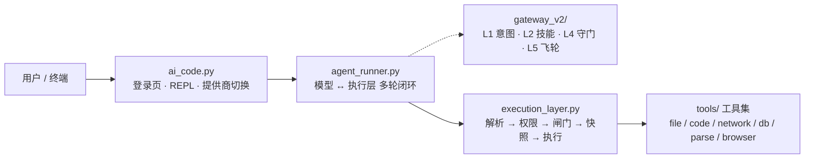

<p align="center">
  
</p>

<h1 align="center">ACE · AI Code Engine</h1>


<p align="center">
  <strong>一个把安全下沉到执行层的 AI 编码 Agent —— 模型只负责理解和输出，<br>
  权限、沙箱、快照回滚全部由执行层裁决。</strong>
</p>

<p align="center">
  <a href="https://github.com/jincheng3870682453-hash/ace-agent/actions/workflows/ci.yml"></a>
  
  
  <a href="LICENSE"></a>
  <a href="CHANGELOG.md"></a>
  <a href="CHANGELOG.md"></a>
</p>

<p align="center">
  
</p>

<p align="center">
  <sub>上图是 <code>python ai_code.py --mock</code> 的真实会话录制（离线、无需密钥），
  用 <a href="demo/record_demo.py"><code>demo/record_demo.py</code></a> 可随时重录；
  CI 跑 <code>--check</code> 盯着它，CLI 输出一变这张图就得跟着重录。</sub>
</p>

大多数 Agent 把安全交给提示词："请不要删除文件"。ACE 不这么做：模型的每一次工具调用都要穿过一个独立的执行层，由它做权限裁决、危险行为检测、写入前快照。提示词失效时，执行层仍然拦得住。

配套一个 Claude Code 风格的终端：登录页、`/` 实时补全、9 家厂商 · 10 入口一键切换、流式输出。核心零第三方依赖。

v3.7 起，Go 执行器提供**官方预编译二进制**（随 GitHub Release 发布，5 平台）：`ace --install-executor` 一条命令装好，Windows 开 `--sandbox job` **不再需要本机装 Go**。通道设计见 [`docs/design/EXECUTOR-RELEASE.md`](docs/design/EXECUTOR-RELEASE.md)。

v3.8 起，**执行层的承诺有断言守着**：数据发往模型指定的目的地要人点头、项目外"已存在的东西"被覆盖/删除要人点头、安全拦截到阈值就向你告警；同时 README 与 `docs/` 里的结构树、口径数字、审计结论都有 `test_all` 的三节守卫盯着，改坏了 CI 直接红。想直接上手看行为，[`examples/`](examples/README.md) 里有三个可以照做的剧本。

## Why ACE?

如果你的需求只是**聊天式 AI 编程**（对话里生成代码、不改文件、不执行命令）——ACE 未必必要。

如果你的 Agent 要**真实地改文件、执行代码、访问工具**，并且你希望权限裁决、隔离、快照回滚**不完全依赖模型的自觉**——ACE 才是目标场景。模型被越狱、提示词被覆盖、输出被篡改时，执行层仍在。

一句话：**模型负责"想"，执行层负责"管"。**

## 目录

- [快速开始](#快速开始)
- [Why ACE?](#why-ace)
- [设计取向](#设计取向)
- [核心能力](#核心能力)
- [架构概览](#架构概览)
- [常用命令](#常用命令)
- [安全边界](#安全边界)
- [配置入口](#配置入口)
- [测试](#测试)
- [最近更新](#最近更新)
- [项目结构](#项目结构)
- [开发与贡献](#开发与贡献)
- [文档地图](#文档地图)
- [许可](#许可)
- [设计参考](#设计参考)

## 快速开始

**前置**：Python ≥ 3.10（用到 `int.bit_count`，建议 3.11/3.12）。核心不需要装任何第三方包。

```bash
git clone https://github.com/jincheng3870682453-hash/ace-agent.git && cd ace-agent
python test_all.py          # 端到端测试，纯 stdlib，应当全绿
python ai_code.py --mock    # 离线演示：完整跑一遍 模型↔执行层 闭环
```

**Demo 不需要 API Key。** 接真实模型时：`python ai_code.py` 进首页 → 选 `2` 走配置向导（① 选提供商 → ② 隐藏输入 API Key → ③ 选模型）→ 选 `1` 进聊天；单次对话用 `python ai_code.py --input "现在几点"`。

Windows 上项目目录已带 `ace.cmd`，加入 PATH 后可在任意目录直接敲 `ace`。

想按场景走一遍？[`examples/`](examples/README.md) 里有三个可以直接照做的剧本：安全实验室（权限裁决 / 快照 / 回滚，无需密钥）、文档解析、多轮真实任务（持久目标 + 子代理 + 知识库）。第一次来建议先读 [`docs/GETTING-STARTED.md`](docs/GETTING-STARTED.md)——它把"permission / sandbox / approval 三个正交维度"和十个常见坑讲清楚了。

<details>
<summary>其他启动方式（工具调用 / 沙箱 / 知识库；完整参数见 docs/COMMANDS.md）</summary>

```bash
ace --tools                    # 原生工具调用（function calling，不支持时自动降级）
ace --install-executor         # 官方预编译执行器（--sandbox job 前置，无需本机 Go）
ace --sandbox job              # Windows Job Object：进程树/内存上限
ace --sandbox docker           # 容器隔离：真实内核边界（需 Docker + 构建 ace-sandbox 镜像）
ace --kb D:\我的资料库         # 外挂知识库（kb_search/kb_add 跨会话持久）
# 更多启动参数：Ollama 本地模型 / 上下文压缩 / --install-ui / 容器编排等 → docs/COMMANDS.md「启动参数」
```

</details>

## 设计取向

三条贯穿全项目的决定，先说清楚，免得你读代码时觉得奇怪：

**安全属于执行层，不属于提示词。** 权限裁决、危险命令拦截、写入前快照都在 `execution_layer.py` 里，与模型无关。换模型、模型被越狱、提示词被覆盖，这层都还在。

**默认只读。** 起步权限是 `readonly`，写工具会被 403 拦下。模型可以申请授权（`request_permission`），由用户选「本次」或「本会话」。`terminal_exec` 例外：它只接受逐次确认，因为它的危险命令黑名单本身可被绕过，「人看一眼命令」是它唯一有效的防线。

**边界要说清能挡什么、挡不住什么。** 不开沙箱时，`code_execute` 是进程内策略层沙箱、`terminal_exec` 的判定层只是止血层——两者都不是 OS 级隔离。要真正的内核边界就开 `--sandbox docker`（容器）或 `--sandbox job`（Windows Job Object），见 [安全边界](#安全边界)。

## 核心能力

**Core — 执行安全**

| 能力 | 一句话钩子 |
|---|---|
| 三级权限 + 按权限裁剪工具表 | `readonly`/`write`/`full`；工具清单随档位裁剪（`tools/registry.py` 单点声明），模型只在"看得见用得了"的工具里决策 |
| 三层沙箱 | `off`（策略层）/ `job`（Windows Job Object：进程树/内存上限 + 受限令牌）/ `docker`（一次性容器：network none + cap-drop ALL）；job/docker 拿不到边界就 503，绝不静默回退 |
| 写入前快照 | 每次写操作自动物理快照，`/undo` 一键回滚；HMAC 签名防伪造，快照目录 Agent 自身不可写 |
| 外发闸门 | 数据去往**模型指定的目的地**（`api_get`/`api_post`/`browser_*`/`notify_send` 的 email）时，目的地不在白名单内就逐次问人；配置 `egress_allowlist` 即一次性授权，清单外一律 403 |
| 安全事件分级 | 403 里"执行层主动防御"与"模型参数写错"分开计数：前者本会话累计到阈值就明确告警（可能在借被读取的文件/网页注入指令试探边界） |
| 行为检测闸门 | 首次 `code_execute` 注入语义诱饵验证模型清醒 + AST 6 规则（无限递归 / 硬编码密钥 / SQL 注入等） |
| Go 执行器 | 危险工具委派独立 Go 进程（NDJSON），Job Object 整树回收 + 第二道策略复检；官方产物 `ace --install-executor`（v3.7+） |

**Core — Agent 能力**

| 能力 | 一句话钩子 |
|---|---|
| 持久目标（goal） | `goal_create` 后**自动逐轮续跑**直到完成/暂停/阻塞/预算耗尽；blocked 须给机器 code，重启后 `/goal resume` 才续 |
| 子代理 | `subagent` spawn（全新）/ fork（继承父会话）独立上下文会话，自带工具循环（最多 8 轮），结果回传父代理整合 |
| 免 key 联网搜索 | `search` 双引擎兜底（Bing RSS → DuckDuckGo）+ `search_read` 一步抓 top 正文；出站全走 SSRF 校验 + 白名单 |

**Optional — 可选能力**：自定义知识库（`kb_search`/`kb_add`/`kb_list`）、会话事件日志与重启恢复（`/audit`）、Plan Mode、审批疲劳缓解、浏览器自动化、文档解析全家桶（Word/Excel/PPT/PDF/OCR）、SimHash 记忆、AGENTS.md 项目指令、上下文压缩、网络退避、i18n（zh/en/ja）、9 家厂商 · 10 入口（`/provider`）。

**Experimental — 实验性**：聊天内置滚动引擎（引擎已实现，真机接线待做，见 [`docs/history/UI-CHAT-SCROLL.md`](docs/history/UI-CHAT-SCROLL.md)）。

用法细节见 [docs/COMMANDS.md](docs/COMMANDS.md) 与 [docs/INTERFACES.md](docs/INTERFACES.md)。

## 架构概览



每层职责（一行版）：用户层 = 登录页/REPL/斜杠；交互循环 = 模型↔执行层闭环（最多 20 轮）；执行层 = 协议解析 → 权限裁决 → 安全闸门 → 写前快照 → 工具执行（14 阶段状态机，安全裁决的强制边界所在）；工具集 = registry 单点声明 + 按域执行器；支撑模块 `work.py`/`guardian.py`/`Archive.py`/`Nuwa.py` 挂在执行层与循环上。

> **Gateway 与执行层的关系**：网关（L1/L2/L4/L5）是执行层**每轮内调用**的策略/辅助层，不是独立的第二道安全流水线——图中虚线即此意。分层详表、权威目录树与 ADR 索引见 [docs/ARCHITECTURE.md](docs/ARCHITECTURE.md)。

## 常用命令

**首页**：↑/↓ 选择 · 数字直选 · Enter 确认 · Esc/q 退出。聊天内 `exit` 回首页，首页 `7`/`Esc`/`q` 才真正退出。

```bash
/provider                    # 列出 9 家厂商 · 10 入口（当前标 ✓）
/provider zhipu              # 一键切智谱（自动换到 glm-4.7-flash）
/permission write            # 提权（默认 readonly）
/undo                        # 写入前快照 → 一键回滚
```

斜杠：`/help` `/clear` `/status` `/snapshots` `/rollback <id>` `/model <名称>` `/mock` `/open <路径>` `/edit <路径>` `/search <词>` `/memory` `/report`
`@` 快捷：`@lang`（zh/en/ja）· `@skill` · `@file` · `@folder` · `@refs`

→ 完整命令表、`/provider` 全示例、启动参数见 [docs/COMMANDS.md](docs/COMMANDS.md)。

## 安全边界

ACE 的安全分四层，默认启用程度不同：

| 层 | ACE 的做法 |
|---|---|
| Prompt 层 | 提示词只做引导，**不承诺安全** |
| Application 层（默认） | 执行层策略：三级权限 + AST 行为检测 + 写前快照/回滚 + 路径边界 + 网络 SSRF/白名单闸门 + 外发目的地确认（含项目外覆盖/删除要人点头） |
| OS 层（可选，Windows） | `--sandbox job`：Job Object 进程树/内存上限 + 受限令牌 |
| Container 层（可选） | `--sandbox docker`：一次性容器，network none + cap-drop ALL + 只挂工作目录 |

诚实边界：**不开 OS/Container 档时**，上述只是进程内策略（AST 黑名单/AST 求值无法闭合、`terminal_exec` 判定只是止血层），**不是 OS 级隔离**；`job` 档是 Windows 专属原语；Docker 容器共享内核，逃逸仍是逃逸。job/docker 拿不到边界一律 503，**绝不静默回退宿主执行**。

外发闸门也有范围：它管的是**模型挑的目的地**——内置端点（搜索引擎、图片服务）不逐次问，其中 `image_generate` 会把 prompt 明文交给第三方服务；`terminal_exec` 仍能删项目内的审计日志，但那一步每次都过人。这两条都写进了 [docs/SECURITY-MODEL.md](docs/SECURITY-MODEL.md)，不是隐藏行为。

→ 完整安全模型与生产部署必读见 [docs/SECURITY-MODEL.md](docs/SECURITY-MODEL.md)。漏洞报告见 [SECURITY.md](SECURITY.md)。

## 配置入口

```python
# ~/.ai_code.json（命令行参数 > 本文件 > ~/.claude/settings.json > 环境变量）
config = {
    "permission": "readonly",   # readonly / write / full
    "sandbox": "off",           # off / job / docker
    "max_snapshots": 20,        # 快照硬上限，自动清理最旧
}
```

→ 全部配置项（出站白名单 / 检索边界 / str_replace 编码 / db_query 只读等机制说明）见 [docs/CONFIGURATION.md](docs/CONFIGURATION.md)。

## 测试

```bash
python test_all.py          # 全量测试（纯 stdlib，退出码非 0 即失败）
ruff check . --select E9,F63,F7,F82   # CI 硬错误子集
```

→ 测试框架说明、CI 矩阵、基准 / e2e / 冒烟细节见 [docs/TESTING.md](docs/TESTING.md)。

其中三节是**给文档与安全承诺用的守卫**（v3.8 起）：`[38]` 权威目录树 ↔ 真实文件、`[39]` 文档口径数字 ↔ `PROVIDERS`/`TOOL_SPECS`、`[40]` 安全审计里那些原始 payload。它们的作用是让"文档说要问人"这件事不会某天悄悄变成"代码里从来没问过"。

## 最近更新

- **v3.8.2** (2026-09-18)：上手路径 [docs/GETTING-STARTED.md](docs/GETTING-STARTED.md)（三维度矩阵 + 十个坑）+ 沙箱档启动预检（job 非 Windows / 缺执行器 / 缺 docker 启动就提示）
- **v3.8.1** (2026-09-18)：无人值守边界写清楚（需要审批的动作在 CI 里被拒绝、无需审批的工具照跑）+ `--approval-policy` 与策略键透传 + 启动风险提示；自评边界与红队清单入档
- **v3.8** (2026-09-18)：执行层承诺兑现为断言——外发闸门、项目外覆盖/删除确认、安全拦截分级告警；文档 `[38]/[39]/[40]` 三节守卫；审计 `SEC-001~019` 全面对账（含新发现并修复的 `SEC-009`）；场景示例 [`examples/`](examples/README.md)（P1 全清）
- **v3.7** (2026-09-06)：执行器官方预编译二进制 + `ace --install-executor`（首个 GitHub Release）

→ 完整版本历史见 [CHANGELOG.md](CHANGELOG.md)。

## 项目结构

架构级视图（逐文件清单与模块职责见 docs/ARCHITECTURE.md）：

```
ace-agent/
├── ai_code.py / agent_runner.py   # 前端（登录页/REPL）+ 交互循环
├── execution_layer.py             # 执行层：安全裁决的强制边界所在
├── tools/  gateway_v2/  executor/ # 工具集 / 网关策略 / Go 沙箱执行器
├── test_all.py  benchmarks/  e2e/ # 测试 / 基准 / 真实模型冒烟
├── docker/  docs/  demo/          # 容器编排 / 文档（见下）/ 演示
├── examples/                      # 场景剧本：安全实验室 · 文档解析 · 多轮任务
└── SECURITY.md  CHANGELOG.md  LICENSE
```

→ 权威完整目录树与逐模块职责见 [docs/ARCHITECTURE.md](docs/ARCHITECTURE.md)。

## 开发与贡献

改动前请读 [CONTRIBUTING.md](CONTRIBUTING.md)；开发者标准化流程见 [docs/DEVELOPMENT.md](docs/DEVELOPMENT.md)，接口与类型契约见 [docs/INTERFACES.md](docs/INTERFACES.md)，待办见 [docs/BACKLOG.md](docs/BACKLOG.md)。

## 文档地图

| 想了解 | 去这里 |
|---|---|
| **第一次来先看这个**（5 分钟跑起来 · 三维度矩阵 · 十个坑） | [docs/GETTING-STARTED.md](docs/GETTING-STARTED.md) |
| **跑起来看场景**（安全实验室 / 文档解析 / 多轮任务） | [examples/](examples/README.md) |
| 分层架构 · 完整目录树 · ADR 索引 | [docs/ARCHITECTURE.md](docs/ARCHITECTURE.md) |
| 安全模型 / 审计 / 漏洞报告 | [docs/SECURITY-MODEL.md](docs/SECURITY-MODEL.md) · [docs/SECURITY-AUDIT.md](docs/SECURITY-AUDIT.md) · [SECURITY.md](SECURITY.md) |
| 配置全项与机制 | [docs/CONFIGURATION.md](docs/CONFIGURATION.md) |
| 命令与启动参数 | [docs/COMMANDS.md](docs/COMMANDS.md) |
| 测试与 CI | [docs/TESTING.md](docs/TESTING.md) |
| 开发流程 / 契约 / 待办 | [docs/DEVELOPMENT.md](docs/DEVELOPMENT.md) · [docs/INTERFACES.md](docs/INTERFACES.md) · [docs/BACKLOG.md](docs/BACKLOG.md) |
| 版本历史 | [CHANGELOG.md](CHANGELOG.md) |
| 历史立项卡 / 会话纪要 / 调研 / 提示词规范 | [docs/design/](docs/design/) · [docs/history/](docs/history/) |

## 许可

[MIT](LICENSE) © 2026 jincheng3870682453-hash

## 设计参考

架构决策与以下工作对齐——**让模型只负责"理解、选择、输出"，把权限、安全、回滚、记忆全部下沉到执行层**：

- [Agent Harness 工程最佳实践](https://github.com/Delphoa/study-awesome-harness-engineering)（工具 / 权限 / 记忆 / 沙箱 / 可观测性）
- [DeepSeek Harness 设计解析](https://developer.aliyun.com/article/1756780)（对应内部调研 docs/history/dsh_research.md）
- [20 章中文 AI Agent 架构实战](https://github.com/ryzqi/learn-agent)
