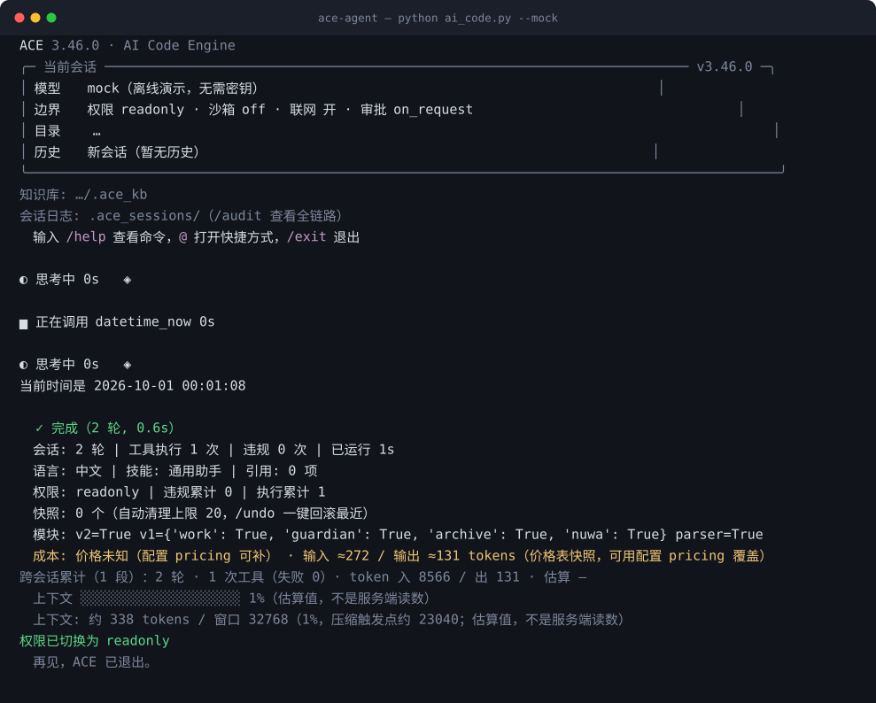

<p align="center">
  <a href="https://github.com/ace-code-engine/ace-agent/actions/workflows/ci.yml"></a>
  
  <a href="LICENSE"></a>
  
  
  <a href="CHANGELOG.md"></a>
</p>

<h1 align="center">ACE · AI Code Engine</h1>

<p align="center"><strong>English</strong> · <a href="README.zh-CN.md">中文</a> · <a href="CHANGELOG.md">更新日志 · Changelog</a></p>

<p align="center">
  <strong>An AI coding agent that pushes safety <em>below</em> the model — into the execution layer.<br>
  The model proposes; permissions, isolation, snapshots and rollback are decided by code it cannot talk its way past.</strong>
</p>

### TL;DR

1. **Safety is code, not prompt.** Every tool call passes a separate execution layer that decides permission, detects dangerous behaviour and snapshots before any write — a jailbroken model still cannot delete your files. → **[Security boundary FAQ](docs/security/SECURITY-FAQ.md)**: what it does and does not stop.
2. **Local, model-agnostic, zero-dep core.** Pure-stdlib safety core (no cloud in the loop); **9 vendors · 10 endpoints** behind one `/provider` switch, over both the OpenAI and Anthropic wire formats. Model calls need `requests`; the safety core does not.
3. **One path for everything.** Every tool is declared once in `tools/registry.py`; **MCP servers** and plain `SKILL.md` skills reach it through the same permission, approval and audit path — an MCP server itself runs outside ACE's sandbox.

**Quickstart** — offline, no key, no network:

```bash
python ai_code.py --mock
```

<p align="center">
  
</p>

<p align="center"><sub>Really recorded, not a mock-up — re-record with <code>python demo/record_demo.py</code>, or verify it has not rotted with <code>--check</code> (CI runs this on every push). More screens: <a href="docs/SHOWCASE.md">Demo &amp; screenshots</a>.</sub></p>

---

## Why ACE?

### Safety that does not live in the prompt

Most agents put safety in the prompt: *"please don't delete files"*. ACE does not.

Every tool call passes through a **separate execution layer** that makes the permission decision, detects dangerous behaviour, and takes a physical snapshot before any write. When the prompt fails — jailbreak, injected web page, tampered tool output — that layer is still there.

> If you only want chat-style code help, you probably do not need ACE. If your agent really edits files, runs commands and reaches the network, and you do not want that to depend on the model's self-restraint, this is the target case.

### ACE vs. the usual prompt-guard agent

| | Typical prompt-guard agent | ACE |
|---|---|---|
| Where "am I allowed?" is decided | in the prompt | in the execution layer, per call (`execution_layer.py`) |
| After a prompt injection or jailbreak | whatever the model decides | permission gate, path boundary and sensitive-target blocks still apply |
| Running a shell command | the model just runs it | `terminal_exec` asks a human **every time** — its blacklist is bypassable, so the human *is* the boundary |
| Undoing a bad edit | hope for git | physical snapshot before every write, `/undo` to roll back |
| Data leaving the machine | whenever the model calls an API | egress gate: unknown destination ⇒ confirm; `egress_allowlist` ⇒ one-time authorization |
| Offline, no API key | usually needs a key | `python ai_code.py --mock` runs the whole loop offline |
| Isolation | prompt-level | three tiers: `off` / `job` / `docker` — if the boundary is unavailable it returns **503, never a silent fallback** |

### Design stance

- **Safety is an execution-layer property, not a prompt property.** The model never decides its own permissions.
- **Read-only by default.** Elevation is a human action (`/permission write`), not something the model can grant itself.
- **Say what the boundary can and cannot stop.** No "fully secure" claims anywhere in this repo — see [Security boundary](#security-boundary).

---

## Run it in 30 seconds

### From source, no API key

```bash
git clone https://github.com/ace-code-engine/ace-agent.git && cd ace-agent
python test_all.py         # end-to-end test suite, pure stdlib — should be all green
python ai_code.py --mock   # offline demo: the full model ↔ execution-layer loop
```

### Point it at a real model

```bash
python ai_code.py          # menu 2 runs the setup wizard, then 1 enters chat
```

- Or switch in one line inside chat: `/provider deepseek <key>`.
- On Windows the repo ships `ace.cmd` — add it to `PATH` and type `ace`.

### Prebuilt Windows build, no Python needed

Download `ace-<version>-windows-amd64.zip` from the [Releases page](https://github.com/ace-code-engine/ace-agent/releases), unzip it anywhere, and run `ace\ace.exe` — a self-contained bundle, so `python` is **not** required on the machine.

```powershell
.\ace\ace.exe --mock     # prove the bundle is intact: offline, no account, no key
.\ace\ace.exe            # or point it at a real model from the landing screen
```

Two things that surprise people: **SmartScreen will warn you** (the build is not code-signed — *More info* → *Run anyway*),
and **it is a folder, not a file** (keep `ace.exe` next to its `_internal\`).

**What the frozen build cannot do, and the smoke gate that refuses to publish an unverified bundle** — [`docs/PACKAGING-EXE.md`](docs/PACKAGING-EXE.md).

### See it run

[Demo & screenshots](docs/SHOWCASE.md) — the landing screen, a real recorded session, the diff card, and the execution layer refusing an SSH key.

**Further reading** — 5-minute path plus the three-axis matrix (`permission` / `sandbox` / `approval_policy`) and the ten classic traps: `docs/GETTING-STARTED.md`. Hands-on scenarios: `examples/`.

---

## Core capabilities

### Execution safety

| Capability | One-line hook |
|---|---|
| Three permission levels | `readonly` / `write` / `full`. The tool list is trimmed per level, declared once in `tools/registry.py`, so the model only chooses among tools it can actually see. |
| Three sandbox tiers | `off` (in-process policy) / `job` (Windows Job Object: process tree, memory cap, restricted token) / `docker` (one-shot container, `network none`, `cap-drop ALL`). Unreachable boundary → 503, never a silent fallback. |
| Pre-write snapshots | every write takes a physical snapshot first, and `/undo` rolls back. HMAC-signed, and the snapshot directory is not writable by the agent itself. |
| Egress gate | data headed for a **model-chosen** destination is confirmed per call unless the destination is allowlisted; `egress_allowlist` means one-time authorization. |
| Security triage | security blocks (path escape, allowlist, sandbox) are counted apart from ordinary argument errors, and a run of them raises a user-facing alert — that usually means something is injecting instructions through a file or a page. |
| Go executor | dangerous tools are delegated to a separate Go process over NDJSON, with whole-tree reaping via Job Object plus a second policy check. Official prebuilt binary via `ace --install-executor`. |

### Agent

| Capability | One-line hook |
|---|---|
| Persistent goals | `goal_create`, then it re-drives round after round until done, paused, blocked or out of budget. `blocked` needs a machine code, and `/goal resume` continues after a restart. |
| Subagents | `subagent` spawn (fresh context) or fork (inherit the parent session), each with its own tool loop; the result is handed back to the parent. |
| Key-free web search | `search` with a two-engine fallback (Bing RSS → DuckDuckGo) plus `search_read` to fetch top result bodies in one step. All egress goes through SSRF checks and the allowlist. |

### Optional and experimental

- **Optional** — custom knowledge base (`kb_search` / `kb_add` / `kb_list`), session event log and restart recovery (`/audit`), Plan Mode, approval-fatigue relief, browser automation, document parsing (Word / Excel / PPT / PDF / OCR), SimHash memory, `AGENTS.md` project instructions, context compaction, network backoff, i18n (zh / en / ja).
- **Experimental** — the built-in chat scroll engine. Implemented, real-terminal wiring pending; see `docs/history/UI-CHAT-SCROLL.md`.

---

## Architecture

One line per layer: `ai_code.py` (terminal: landing, REPL, slash commands) → `agent_runner.py` (the model ↔ execution-layer loop, up to 20 rounds) → **`execution_layer.py`** (parse → permission ruling → safety gates → pre-write snapshot → execute; a 14-stage state machine and **the only place safety is actually enforced**) → `tools/registry.py` (single-point tool declaration) → `core/` (snapshots, memory, meta-processing).

Gateway (L1 / L2 / L4 / L5) is a policy layer **called inside each round** by the execution layer — not a second, independent security pipeline.

**Diagram (Mermaid, rendered by GitHub), the per-layer table and the authoritative directory tree** → **[`docs/ARCHITECTURE.md`](docs/ARCHITECTURE.md)**.

---

## Common commands

Landing page: **↑/↓** to move, digits to jump, **Enter** to confirm, **Esc/q** to quit. Inside chat, `exit` returns to the landing page.

```bash
/provider                    # list 9 vendors · 10 endpoints (the current one ticked)
/provider zhipu              # switch to Zhipu in one command
/permission write            # elevate (read-only by default)
/undo                        # roll back to the pre-write snapshot
```

Input and output: `Alt+Enter` / `Ctrl+J` newline · `Ctrl+R` walk history backwards (`/history dsk` fuzzy-finds it) ·
long tool output is folded into the card, `/expand` reprints it · write cards carry a colourised diff and an `exit N` code.

**Full command table** (every slash command, all `@` shortcuts, every startup flag) — **[`docs/COMMANDS.md`](docs/COMMANDS.md)**.

---

## Security boundary

> **Start here:** **[Security boundary FAQ](docs/security/SECURITY-FAQ.md)** — 11 questions on what ACE stops and what it does not, including the two that usually surprise people: *which actions fail closed in unattended runs*, and *what snapshots do not cover*.

### Four layers, enabled to different degrees

| Layer | What ACE does |
|---|---|
| Prompt | guides the model only — **promises nothing** |
| Application (default) | execution-layer policy: three permission levels, AST behaviour checks, pre-write snapshot and rollback, path boundaries, SSRF and allowlist egress checks, and egress-destination confirmation (including "overwrite or delete something outside the project" ⇒ ask) |
| OS (optional, Windows) | `--sandbox job`: Job Object process and memory caps plus a restricted token |
| Container (optional) | `--sandbox docker`: one-shot container, `network none`, `cap-drop ALL`, `read-only` root, `--init`, only the workspace mounted |

The sandbox image is built once locally from `docker/Dockerfile.sandbox`; a registry-hosted image can be pulled with `ACE_SANDBOX_PULL=1`.

### Honest limits

**Without the OS or container tier**, everything above is in-process policy — the AST blacklist and AST evaluation cannot be closed, and `terminal_exec`'s verdict layer is only a tourniquet. That is **not OS-level isolation**.

The `job` tier is a Windows-only primitive. Docker containers share the kernel, so an escape is still an escape. When a boundary is unavailable, `job` and `docker` return 503 and **never silently fall back to the host**.

### Scope of the egress gate

The gate governs **model-chosen destinations**. Built-in endpoints — search engines, the image service — are not confirmed per call, and `image_generate` sends its prompt to a third-party service in clear text.

`terminal_exec` can still delete the audit log inside the project, but that step is confirmed by a human every time. Both facts are written down rather than hidden.

**Further reading** — full security model and production notes: [`docs/security/SECURITY-MODEL.md`](docs/security/SECURITY-MODEL.md). Vulnerability reports: [`SECURITY.md`](SECURITY.md).

---

## Configuration

### The config file

```python
# ~/.ai_code.json  (CLI flags > this file > ~/.claude/settings.json > environment)
config = {
    "permission": "readonly",   # readonly / write / full
    "sandbox": "off",           # off / job / docker
    "max_snapshots": 20,        # hard cap, oldest pruned automatically
}
```

**Further reading** — every key, plus the mechanisms behind egress allowlists, search boundaries, `str_replace` encoding and read-only `db_query`: `docs/CONFIGURATION.md`.

---

## Testing

### Run the suite

```bash
python test_all.py                      # full suite (pure stdlib, non-zero exit = failure)
python test_all.py --only 40            # run one section (declared dependencies are pulled in)
python test_all.py --list               # list sections and their dependencies
ruff check . --select E9,F63,F7,F82     # the hard-error subset CI uses
```

### Promise guards

Three sections exist purely to keep **promises** honest: `[38]` the authoritative directory tree ↔ real files, `[39]` documented numbers ↔ `PROVIDERS` / `TOOL_SPECS`, and `[40]` the raw payloads from the security audit.

They exist because "the docs say it asks the human" once turned out to mean "the code never asked".

### Done and still unverified

Both halves are here on purpose: the README used to say "not done" about things that are now finished, and a stale admission is its own kind of lie. **Read the second half as the actual warning** — do not read it as "probably fine".

**Recently closed** — R-03 engine merge, REL-03 native Windows smoke, and the `--tools` fallback bug that smoke found — recorded in [`CHANGELOG.md`](CHANGELOG.md).

**Still unverified:**

- The **Textual full-screen UI under a real TTY** (those sections skip without `textual` installed), and any **non-Windows console**.
- The **darwin/amd64 executor artifact has no native smoke test** — it cross-compiles, but no Intel Mac has ever run it.

**Further reading** — framework, CI matrix, benchmarks and e2e details: [`docs/TESTING.md`](docs/TESTING.md).

---

## Engineering debt (what is still not done, with links)

This is a **hand-off list**, not a second copy of the backlog. Each row states what is owed in one line;
the evidence, the boundaries and the decisions live in the linked **design card** —
**do not read this table as the whole story, open the card**.

| Owed | In one line | Authoritative record |
|---|---|---|
| **Batch 0 is not closed** | The convergences, `RL-01`, `R-2`, and W0-C's P-07/08/09 have landed — **only W0-B (protocol consumption) and W0-C's "four duplicate dialogs merged" remain** | [`docs/design/WP-0-FRONTEND-CONVERGENCE.md`](docs/design/WP-0-FRONTEND-CONVERGENCE.md) · batch table in [`docs/ROADMAP.md`](docs/ROADMAP.md) §7.2 |
| **The acceptance gates are half-done** | The machine half is in `test_all`, but **`measured_*` still has no reader**, no threshold rule exists, and `benchmarks/results/` is not wired to the checker | [`docs/design/ACC-GATES.md`](docs/design/ACC-GATES.md) §7.5 / §8.6 / §10.4 |
| **Only one of the three spine layers has landed** | `RL-01` (the result envelope) is implemented and verified; `RL-02~04`, `HL-01~05` and `DL-01~04` are all unstarted | [`docs/design/THREE-LAYERS.md`](docs/design/THREE-LAYERS.md) §9 |
| **Batches 1–6 and WP-10 are unstarted** | cheap faces · git · prefix cache · workspace layers · session tree · presets · skills · egress & snapshots · sandbox backend · Rust core-ization | [`docs/ROADMAP.md`](docs/ROADMAP.md) §7.2 |

**Why it stops here: the author is heading back to school.** This list is the hand-off —
every row points at a card carrying the evidence, the boundaries, and what to do next.

---

## Documentation

**Everything is indexed in [`docs/README.md`](docs/README.md)** — a "what do you want to do?" table plus the full
grouping. The few you are most likely to want first:

| What you want | Where to go |
|---|---|
| **Start here** — 5-minute path, three-axis matrix, ten traps | [`docs/GETTING-STARTED.md`](docs/GETTING-STARTED.md) |
| **What ACE stops and what it does not** | [`docs/security/SECURITY-FAQ.md`](docs/security/SECURITY-FAQ.md) |
| Demo and screenshots | [`docs/SHOWCASE.md`](docs/SHOWCASE.md) · hands-on scenarios in [`examples/`](examples/) |
| Layers, full directory tree, ADR index | [`docs/ARCHITECTURE.md`](docs/ARCHITECTURE.md) |
| Security model / audit / reporting | [`docs/security/`](docs/security/) · [`SECURITY.md`](SECURITY.md) |
| Version history | [`CHANGELOG.md`](CHANGELOG.md) · [`docs/releases/`](docs/releases/) |

### Contributing

Read `CONTRIBUTING.md` first. The standard workflow lives in `docs/DEVELOPMENT.md`, interface contracts in `docs/INTERFACES.md`, and the backlog in `docs/BACKLOG.md`.

### License

[MIT](LICENSE) © 2026 jincheng3870682453-hash

### Design references

Architecture decisions align with the following work — **let the model only "understand, choose, output", and push permissions, safety, rollback and memory down into the execution layer**:

- [Agent Harness engineering best practices](https://github.com/Delphoa/study-awesome-harness-engineering) — tools / permissions / memory / sandbox / observability
- [DeepSeek Harness design analysis](https://developer.aliyun.com/article/1756780) — internal research in `docs/history/dsh_research.md`
- [20-chapter Chinese AI agent architecture course](https://github.com/ryzqi/learn-agent)
