<p align="center">
  
</p>

<h1 align="center">ACE 路 AI Code Engine</h1>

<p align="center"><strong>涓枃</strong> 路 <a href="README.md">English</a></p>


<p align="center">
  <strong>涓€涓妸瀹夊叏涓嬫矇鍒版墽琛屽眰鐨?AI 缂栫爜 Agent 鈥斺€?妯″瀷鍙礋璐ｇ悊瑙ｅ拰杈撳嚭锛?br>
  鏉冮檺銆佹矙绠便€佸揩鐓у洖婊氬叏閮ㄧ敱鎵ц灞傝鍐炽€?/strong>
</p>

<p align="center">
  <a href="https://github.com/ace-code-engine/ace-agent/actions/workflows/ci.yml"></a>
  
  
  <a href="LICENSE"></a>
  <a href="CHANGELOG.md"></a>
  <a href="CHANGELOG.md"></a>
</p>

| 鍏抽敭灞炴€?| 璇存槑 |
|---|---|
| **鏈湴璺?* | 鏍稿績绾?stdlib锛岃窇鍦ㄤ綘鑷繁鐨勬満鍣ㄤ笂锛岄摼璺噷娌℃湁浜戯紱绂荤嚎婕旂ず涓嶉渶瑕佷换浣?API Key |
| **妯″瀷鏃犲叧** | 9 瀹跺巶鍟?路 10 涓叆鍙ｏ紝涓€涓?`/provider` 鍒囨崲锛堟櫤璋便€丏eepSeek銆丮oonshot銆丱penAI銆丄nthropic銆侀€氫箟鍗冮棶銆丼iliconFlow銆丱penRouter銆丱llama锛夛紝鍚屾椂鏀寔 OpenAI 涓?Anthropic 涓ょ鎶ユ枃鏍煎紡 |
| **鍙彃鎷?* | 姣忎釜宸ュ叿鍙湪 [`tools/registry.py`](tools/registry.py) 澹版槑涓€娆★紱鎶€鑳藉氨鏄櫘閫?`SKILL.md` 鏂囦欢锛涙帴 MCP 涓嶈繃鏄?`register()` 涓€涓?`ToolSpec` |

澶у鏁?Agent 鎶婂畨鍏ㄤ氦缁欐彁绀鸿瘝锛?璇蜂笉瑕佸垹闄ゆ枃浠?銆侫CE 涓嶈繖涔堝仛锛氭ā鍨嬬殑姣忎竴娆″伐鍏疯皟鐢ㄩ兘瑕佺┛杩囦竴涓嫭绔嬬殑鎵ц灞傦紝鐢卞畠鍋氭潈闄愯鍐炽€佸嵄闄╄涓烘娴嬨€佸啓鍏ュ墠蹇収銆傛彁绀鸿瘝澶辨晥鏃讹紝鎵ц灞備粛鐒舵嫤寰椾綇銆?

閰嶅涓€涓?Claude Code 椋庢牸鐨勭粓绔細鐧诲綍椤点€乣/` 瀹炴椂琛ュ叏銆? 瀹跺巶鍟?路 10 鍏ュ彛涓€閿垏鎹€佹祦寮忚緭鍑恒€傛牳蹇冮浂绗笁鏂逛緷璧栥€?

v3.7 璧凤紝Go 鎵ц鍣ㄦ彁渚?*瀹樻柟棰勭紪璇戜簩杩涘埗**锛堥殢 GitHub Release 鍙戝竷锛? 骞冲彴锛夛細`ace --install-executor` 涓€鏉″懡浠よ濂斤紝Windows 寮€ `--sandbox job` **涓嶅啀闇€瑕佹湰鏈鸿 Go**銆傞€氶亾璁捐瑙?[`docs/design/EXECUTOR-RELEASE.md`](docs/design/EXECUTOR-RELEASE.md)銆?

v3.8 璧凤紝**鎵ц灞傜殑鎵胯鏈夋柇瑷€瀹堢潃**锛氭暟鎹彂寰€妯″瀷鎸囧畾鐨勭洰鐨勫湴瑕佷汉鐐瑰ご銆侀」鐩"宸插瓨鍦ㄧ殑涓滆タ"琚鐩?鍒犻櫎瑕佷汉鐐瑰ご銆佸畨鍏ㄦ嫤鎴埌闃堝€煎氨鍚戜綘鍛婅锛涘悓鏃?README 涓?`docs/` 閲岀殑缁撴瀯鏍戙€佸彛寰勬暟瀛椼€佸璁＄粨璁洪兘鏈?`test_all` 鐨勪笁鑺傚畧鍗洴鐫€锛屾敼鍧忎簡 CI 鐩存帴绾€傛兂鐩存帴涓婃墜鐪嬭涓猴紝[`examples/`](examples/README.md) 閲屾湁涓変釜鍙互鐓у仛鐨勫墽鏈€?

## Why ACE?

濡傛灉浣犵殑闇€姹傚彧鏄?*鑱婂ぉ寮?AI 缂栫▼**锛堝璇濋噷鐢熸垚浠ｇ爜銆佷笉鏀规枃浠躲€佷笉鎵ц鍛戒护锛夆€斺€擜CE 鏈繀蹇呰銆?

濡傛灉浣犵殑 Agent 瑕?*鐪熷疄鍦版敼鏂囦欢銆佹墽琛屼唬鐮併€佽闂伐鍏?*锛屽苟涓斾綘甯屾湜鏉冮檺瑁佸喅銆侀殧绂汇€佸揩鐓у洖婊?*涓嶅畬鍏ㄤ緷璧栨ā鍨嬬殑鑷**鈥斺€擜CE 鎵嶆槸鐩爣鍦烘櫙銆傛ā鍨嬭瓒婄嫳銆佹彁绀鸿瘝琚鐩栥€佽緭鍑鸿绡℃敼鏃讹紝鎵ц灞備粛鍦ㄣ€?

涓€鍙ヨ瘽锛?*妯″瀷璐熻矗"鎯?锛屾墽琛屽眰璐熻矗"绠?銆?*

## 鐩綍

- [蹇€熷紑濮媇(#蹇€熷紑濮?
- [鐪嬪畠璺戣捣鏉(#鐪嬪畠璺戣捣鏉?
- [Why ACE?](#why-ace)
- [璁捐鍙栧悜](#璁捐鍙栧悜)
- [鏍稿績鑳藉姏](#鏍稿績鑳藉姏)
- [鏋舵瀯姒傝](#鏋舵瀯姒傝)
- [甯哥敤鍛戒护](#甯哥敤鍛戒护)
- [瀹夊叏杈圭晫](#瀹夊叏杈圭晫)
- [閰嶇疆鍏ュ彛](#閰嶇疆鍏ュ彛)
- [娴嬭瘯](#娴嬭瘯)
- [鏈€杩戞洿鏂癩(#鏈€杩戞洿鏂?
- [椤圭洰缁撴瀯](#椤圭洰缁撴瀯)
- [寮€鍙戜笌璐＄尞](#寮€鍙戜笌璐＄尞)
- [鏂囨。鍦板浘](#鏂囨。鍦板浘)
- [宸茬煡鏈畬鎴愪笌鏈獙璇乚(#宸茬煡鏈畬鎴愪笌鏈獙璇?
- [璁稿彲](#璁稿彲)
- [璁捐鍙傝€僝(#璁捐鍙傝€?

## 蹇€熷紑濮?

**鍓嶇疆**锛歅ython 鈮?3.10锛堢敤鍒?`int.bit_count`锛屽缓璁?3.11/3.12锛夈€傛牳蹇冧笉闇€瑕佽浠讳綍绗笁鏂瑰寘銆?

```bash
git clone https://github.com/ace-code-engine/ace-agent.git && cd ace-agent
python test_all.py          # 绔埌绔祴璇曪紝绾?stdlib锛屽簲褰撳叏缁?
python ai_code.py --mock    # 绂荤嚎婕旂ず锛氬畬鏁磋窇涓€閬?妯″瀷鈫旀墽琛屽眰 闂幆
```

**Demo 涓嶉渶瑕?API Key銆?* 鎺ョ湡瀹炴ā鍨嬫椂锛歚python ai_code.py` 杩涢椤?鈫?閫?`2` 璧伴厤缃悜瀵硷紙鈶?閫夋彁渚涘晢 鈫?鈶?闅愯棌杈撳叆 API Key 鈫?鈶?閫夋ā鍨嬶級鈫?閫?`1` 杩涜亰澶╋紱鍗曟瀵硅瘽鐢?`python ai_code.py --input "鐜板湪鍑犵偣"`銆?

Windows 涓婇」鐩洰褰曞凡甯?`ace.cmd`锛屽姞鍏?PATH 鍚庡彲鍦ㄤ换鎰忕洰褰曠洿鎺ユ暡 `ace`銆?

鎯虫寜鍦烘櫙璧颁竴閬嶏紵[`examples/`](examples/README.md) 閲屾湁涓変釜鍙互鐩存帴鐓у仛鐨勫墽鏈細瀹夊叏瀹為獙瀹わ紙鏉冮檺瑁佸喅 / 蹇収 / 鍥炴粴锛屾棤闇€瀵嗛挜锛夈€佹枃妗ｈВ鏋愩€佸杞湡瀹炰换鍔★紙鎸佷箙鐩爣 + 瀛愪唬鐞?+ 鐭ヨ瘑搴擄級銆傜涓€娆℃潵寤鸿鍏堣 [`docs/GETTING-STARTED.md`](docs/GETTING-STARTED.md)鈥斺€斿畠鎶?permission / sandbox / approval 涓変釜姝ｄ氦缁村害"鍜屽崄涓父瑙佸潙璁叉竻妤氫簡銆?

<details>
<summary>鍏朵粬鍚姩鏂瑰紡锛堝伐鍏疯皟鐢?/ 娌欑 / 鐭ヨ瘑搴擄紱瀹屾暣鍙傛暟瑙?docs/COMMANDS.md锛?/summary>

```bash
ace --tools                    # 鍘熺敓宸ュ叿璋冪敤锛坒unction calling锛屼笉鏀寔鏃惰嚜鍔ㄩ檷绾э級
ace --install-executor         # 瀹樻柟棰勭紪璇戞墽琛屽櫒锛?-sandbox job 鍓嶇疆锛屾棤闇€鏈満 Go锛?
ace --sandbox job              # Windows Job Object锛氳繘绋嬫爲/鍐呭瓨涓婇檺
ace --sandbox docker           # 瀹瑰櫒闅旂锛氱湡瀹炲唴鏍歌竟鐣岋紙闇€ Docker锛涢暅鍍忕己澶辫嚜鍔ㄦ媺瀹樻柟棰勭紪璇戦暅鍍忥級
ace --kb D:\鎴戠殑璧勬枡搴?        # 澶栨寕鐭ヨ瘑搴擄紙kb_search/kb_add 璺ㄤ細璇濇寔涔咃級
# 鏇村鍚姩鍙傛暟锛歄llama 鏈湴妯″瀷 / 涓婁笅鏂囧帇缂?/ --install-ui / 瀹瑰櫒缂栨帓绛?鈫?docs/COMMANDS.md銆屽惎鍔ㄥ弬鏁般€?
```

</details>

## 鐪嬪畠璺戣捣鏉?

<p align="center">
  
</p>

<p align="center">
  <sub><b>鐪熸浼氱湅鍒扮殑绗竴灞忋€?/b>涓€涓潰鏉挎妸褰撳墠鐢熸晥鐨勮竟鐣岋紙鏉冮檺 路 娌欑 路 鑱旂綉 路 瀹℃壒锛夈€佸皢瑕佺紪杈戠殑鐩綍銆佷互鍙?鎭㈠浜嗗摢涓€娆′細璇?涓€骞舵憜鍑烘潵锛?
  涓嬮潰鏄垎缁勮彍鍗曚笌鐘舵€佹爮銆傜敱 <code>ace --preview</code> 鎸?88 鍒楁覆鏌擄紱闈㈡澘瀹藉害璺熺潃浣犵殑缁堢璧般€?/sub>
</p>

<p align="center">
  
</p>

<p align="center">
  <sub>涓婂浘鏄?<code>python ai_code.py --mock</code> 鐨勭湡瀹炰細璇濆綍鍒讹紙绂荤嚎銆佹棤闇€瀵嗛挜锛夛紝
  鐢?<a href="demo/record_demo.py"><code>demo/record_demo.py</code></a> 鍙殢鏃堕噸褰曪紱
  CI 璺?<code>--check</code> 鐩潃瀹冿紝CLI 杈撳嚭涓€鍙樿繖寮犲浘灏卞緱璺熺潃閲嶅綍銆?/sub>
</p>

<p align="center">
  
</p>

<p align="center">
  <sub><b>鏀逛簡浠€涔堬紝鑰屼笉鍙槸璺戜簡浠€涔堛€?/b>Agent 鍏堝缓涓€涓枃浠躲€佸啀鏀瑰叾涓竴琛岋紱鍗＄墖甯?<code>+1 -0</code> 缁熻涓庨€愯鏀瑰姩鈥斺€?
  鏂板缁裤€佸垹闄ょ孩鈥斺€旀敹灏捐繕鏈変竴琛屾湰杞伐鍏锋椂闂寸嚎銆傝窇閿欎竴鏉″懡浠ゅ綋鍦哄氨鐭ラ亾锛屾敼閿欎竴琛屽線寰€鍑犲ぉ鍚庢墠鍙戠幇銆?/sub>
</p>

<p align="center">
  
</p>

<p align="center">
  <sub><b>鍚屼竴涓?Agent锛屾兂骞蹭竴浠跺畠涓嶈骞茬殑浜嬨€?/b>瀹冧几鎵嬪幓璇?<code>~/.ssh/id_rsa</code>锛屾墽琛屽眰鍦ㄥ伐鍏风湡姝ｆ墽琛屼箣鍓嶅氨鎷掍簡锛?
  <code>403</code>锛岃矾寰勮秺鐣屻€傝繖涓嶆槸"鎻愮ず璇嶉噷鍐欎簡璇蜂笉瑕?锛屾槸妯″瀷鏃犳硶璇存湇鐨勪竴閬撴鏌ャ€?
  鍚屾牱鏉ヨ嚜鐪熷疄浼氳瘽锛?code>python ai_code.py --mock</code>锛?code>--session blocked</code>锛夈€?/sub>
</p>

## 璁捐鍙栧悜

涓夋潯璐┛鍏ㄩ」鐩殑鍐冲畾锛屽厛璇存竻妤氾紝鍏嶅緱浣犺浠ｇ爜鏃惰寰楀鎬細

**瀹夊叏灞炰簬鎵ц灞傦紝涓嶅睘浜庢彁绀鸿瘝銆?* 鏉冮檺瑁佸喅銆佸嵄闄╁懡浠ゆ嫤鎴€佸啓鍏ュ墠蹇収閮藉湪 `execution_layer.py` 閲岋紝涓庢ā鍨嬫棤鍏炽€傛崲妯″瀷銆佹ā鍨嬭瓒婄嫳銆佹彁绀鸿瘝琚鐩栵紝杩欏眰閮借繕鍦ㄣ€?

**榛樿鍙銆?* 璧锋鏉冮檺鏄?`readonly`锛屽啓宸ュ叿浼氳 403 鎷︿笅銆傛ā鍨嬪彲浠ョ敵璇锋巿鏉冿紙`request_permission`锛夛紝鐢辩敤鎴烽€夈€屾湰娆°€嶆垨銆屾湰浼氳瘽銆嶃€俙terminal_exec` 渚嬪锛氬畠鍙帴鍙楅€愭纭锛屽洜涓哄畠鐨勫嵄闄╁懡浠ら粦鍚嶅崟鏈韩鍙缁曡繃锛屻€屼汉鐪嬩竴鐪煎懡浠ゃ€嶆槸瀹冨敮涓€鏈夋晥鐨勯槻绾裤€?

**杈圭晫瑕佽娓呰兘鎸′粈涔堛€佹尅涓嶄綇浠€涔堛€?* 涓嶅紑娌欑鏃讹紝`code_execute` 鏄繘绋嬪唴绛栫暐灞傛矙绠便€乣terminal_exec` 鐨勫垽瀹氬眰鍙槸姝㈣灞傗€斺€斾袱鑰呴兘涓嶆槸 OS 绾ч殧绂汇€傝鐪熸鐨勫唴鏍歌竟鐣屽氨寮€ `--sandbox docker`锛堝鍣級鎴?`--sandbox job`锛圵indows Job Object锛夛紝瑙?[瀹夊叏杈圭晫](#瀹夊叏杈圭晫)銆?

## 鏍稿績鑳藉姏

**Core 鈥?鎵ц瀹夊叏**

| 鑳藉姏 | 涓€鍙ヨ瘽閽╁瓙 |
|---|---|
| 涓夌骇鏉冮檺 + 鎸夋潈闄愯鍓伐鍏疯〃 | `readonly`/`write`/`full`锛涘伐鍏锋竻鍗曢殢妗ｄ綅瑁佸壀锛坄tools/registry.py` 鍗曠偣澹版槑锛夛紝妯″瀷鍙湪"鐪嬪緱瑙佺敤寰椾簡"鐨勫伐鍏烽噷鍐崇瓥 |
| 涓夊眰娌欑 | `off`锛堢瓥鐣ュ眰锛? `job`锛圵indows Job Object锛氳繘绋嬫爲/鍐呭瓨涓婇檺 + 鍙楅檺浠ょ墝锛? `docker`锛堜竴娆℃€у鍣細network none + cap-drop ALL锛夛紱job/docker 鎷夸笉鍒拌竟鐣屽氨 503锛岀粷涓嶉潤榛樺洖閫€ |
| 鍐欏叆鍓嶅揩鐓?| 姣忔鍐欐搷浣滆嚜鍔ㄧ墿鐞嗗揩鐓э紝`/undo` 涓€閿洖婊氾紱HMAC 绛惧悕闃蹭吉閫狅紝蹇収鐩綍 Agent 鑷韩涓嶅彲鍐?|
| 澶栧彂闂搁棬 | 鏁版嵁鍘诲線**妯″瀷鎸囧畾鐨勭洰鐨勫湴**锛坄api_get`/`api_post`/`browser_*`/`notify_send` 鐨?email锛夋椂锛岀洰鐨勫湴涓嶅湪鐧藉悕鍗曞唴灏遍€愭闂汉锛涢厤缃?`egress_allowlist` 鍗充竴娆℃€ф巿鏉冿紝娓呭崟澶栦竴寰?403 |
| 瀹夊叏浜嬩欢鍒嗙骇 | 403 閲?鎵ц灞備富鍔ㄩ槻寰?涓?妯″瀷鍙傛暟鍐欓敊"鍒嗗紑璁℃暟锛氬墠鑰呮湰浼氳瘽绱鍒伴槇鍊煎氨鏄庣‘鍛婅锛堝彲鑳藉湪鍊熻璇诲彇鐨勬枃浠?缃戦〉娉ㄥ叆鎸囦护璇曟帰杈圭晫锛?|
| 琛屼负妫€娴嬮椄闂?| 棣栨 `code_execute` 娉ㄥ叆璇箟璇遍サ楠岃瘉妯″瀷娓呴啋 + AST 6 瑙勫垯锛堟棤闄愰€掑綊 / 纭紪鐮佸瘑閽?/ SQL 娉ㄥ叆绛夛級 |
| Go 鎵ц鍣?| 鍗遍櫓宸ュ叿濮旀淳鐙珛 Go 杩涚▼锛圢DJSON锛夛紝Job Object 鏁存爲鍥炴敹 + 绗簩閬撶瓥鐣ュ妫€锛涘畼鏂逛骇鐗?`ace --install-executor`锛坴3.7+锛?|

**Core 鈥?Agent 鑳藉姏**

| 鑳藉姏 | 涓€鍙ヨ瘽閽╁瓙 |
|---|---|
| 鎸佷箙鐩爣锛坓oal锛?| `goal_create` 鍚?*鑷姩閫愯疆缁窇**鐩村埌瀹屾垚/鏆傚仠/闃诲/棰勭畻鑰楀敖锛沚locked 椤荤粰鏈哄櫒 code锛岄噸鍚悗 `/goal resume` 鎵嶇画 |
| 瀛愪唬鐞?| `subagent` spawn锛堝叏鏂帮級/ fork锛堢户鎵跨埗浼氳瘽锛夌嫭绔嬩笂涓嬫枃浼氳瘽锛岃嚜甯﹀伐鍏峰惊鐜紙鏈€澶?8 杞級锛岀粨鏋滃洖浼犵埗浠ｇ悊鏁村悎 |
| 鍏?key 鑱旂綉鎼滅储 | `search` 鍙屽紩鎿庡厹搴曪紙Bing RSS 鈫?DuckDuckGo锛? `search_read` 涓€姝ユ姄 top 姝ｆ枃锛涘嚭绔欏叏璧?SSRF 鏍￠獙 + 鐧藉悕鍗?|

**Optional 鈥?鍙€夎兘鍔?*锛氳嚜瀹氫箟鐭ヨ瘑搴擄紙`kb_search`/`kb_add`/`kb_list`锛夈€佷細璇濅簨浠舵棩蹇椾笌閲嶅惎鎭㈠锛坄/audit`锛夈€丳lan Mode銆佸鎵圭柌鍔崇紦瑙ｃ€佹祻瑙堝櫒鑷姩鍖栥€佹枃妗ｈВ鏋愬叏瀹舵《锛圵ord/Excel/PPT/PDF/OCR锛夈€丼imHash 璁板繂銆丄GENTS.md 椤圭洰鎸囦护銆佷笂涓嬫枃鍘嬬缉銆佺綉缁滈€€閬裤€乮18n锛坺h/en/ja锛夈€? 瀹跺巶鍟?路 10 鍏ュ彛锛坄/provider`锛夈€?

**Experimental 鈥?瀹為獙鎬?*锛氳亰澶╁唴缃粴鍔ㄥ紩鎿庯紙寮曟搸宸插疄鐜帮紝鐪熸満鎺ョ嚎寰呭仛锛岃 [`docs/history/UI-CHAT-SCROLL.md`](docs/history/UI-CHAT-SCROLL.md)锛夈€?

鐢ㄦ硶缁嗚妭瑙?[docs/COMMANDS.md](docs/COMMANDS.md) 涓?[docs/INTERFACES.md](docs/INTERFACES.md)銆?

## 鏋舵瀯姒傝

```mermaid
flowchart LR
    U["鐢ㄦ埛 / 缁堢"]
    CLI["ai_code.py<br/>鐧诲綍椤?路 REPL 路 鎻愪緵鍟嗗垏鎹?]
    LOOP["agent_runner.py<br/>妯″瀷 鈫?鎵ц灞?澶氳疆闂幆"]
    GW["gateway_v2/<br/>L1 鎰忓浘 路 L2 鎶€鑳?路 L4 瀹堥棬 路 L5 椋炶疆"]
    EL["execution_layer.py<br/>瑙ｆ瀽 鈫?鏉冮檺 鈫?闂搁棬 鈫?蹇収 鈫?鎵ц"]
    T["tools/ 宸ュ叿闆?br/>file / code / network / db / parse / browser"]
    U --> CLI --> LOOP --> EL --> T
    LOOP -.-> GW
```

姣忓眰鑱岃矗锛堜竴琛岀増锛夛細鐢ㄦ埛灞?= 鐧诲綍椤?REPL/鏂滄潬锛涗氦浜掑惊鐜?= 妯″瀷鈫旀墽琛屽眰闂幆锛堟渶澶?20 杞級锛涙墽琛屽眰 = 鍗忚瑙ｆ瀽 鈫?鏉冮檺瑁佸喅 鈫?瀹夊叏闂搁棬 鈫?鍐欏墠蹇収 鈫?宸ュ叿鎵ц锛?4 闃舵鐘舵€佹満锛屽畨鍏ㄨ鍐崇殑寮哄埗杈圭晫鎵€鍦級锛涘伐鍏烽泦 = registry 鍗曠偣澹版槑 + 鎸夊煙鎵ц鍣紱鏀拺妯″潡 `core/work.py`/`core/guardian.py`/`core/archive.py`/`core/nuwa.py` 鎸傚湪鎵ц灞備笌寰幆涓娿€?

> **Gateway 涓庢墽琛屽眰鐨勫叧绯?*锛氱綉鍏筹紙L1/L2/L4/L5锛夋槸鎵ц灞?*姣忚疆鍐呰皟鐢?*鐨勭瓥鐣?杈呭姪灞傦紝涓嶆槸鐙珛鐨勭浜岄亾瀹夊叏娴佹按绾库€斺€斿浘涓櫄绾垮嵆姝ゆ剰銆傚垎灞傝琛ㄣ€佹潈濞佺洰褰曟爲涓?ADR 绱㈠紩瑙?[docs/ARCHITECTURE.md](docs/ARCHITECTURE.md)銆?

## 甯哥敤鍛戒护

**棣栭〉**锛氣啈/鈫?閫夋嫨 路 鏁板瓧鐩撮€?路 Enter 纭 路 Esc/q 閫€鍑恒€傝亰澶╁唴 `exit` 鍥為椤碉紝棣栭〉 `7`/`Esc`/`q` 鎵嶇湡姝ｉ€€鍑恒€?

```bash
/provider                    # 鍒楀嚭 9 瀹跺巶鍟?路 10 鍏ュ彛锛堝綋鍓嶆爣 鉁擄級
/provider zhipu              # 涓€閿垏鏅鸿氨锛堣嚜鍔ㄦ崲鍒?glm-4.7-flash锛?
/permission write            # 鎻愭潈锛堥粯璁?readonly锛?
/undo                        # 鍐欏叆鍓嶅揩鐓?鈫?涓€閿洖婊?
```

鏂滄潬锛歚/help` `/clear` `/status` `/snapshots` `/rollback <id>` `/model <鍚嶇О>` `/mock` `/open <璺緞>` `/edit <璺緞>` `/search <璇?` `/memory` `/report` `/expand` `/history [鍏抽敭璇峕`
`@` 蹇嵎锛歚@lang`锛坺h/en/ja锛壜?`@skill` 路 `@file` 路 `@folder` 路 `@refs`
杈撳叆锛歚Enter` 鍙戦€侊紝`Alt+Enter` / `Ctrl+J` 鎹㈣锛宍Ctrl+R` 閫愭潯寰€鍥炵炕鍘嗗彶锛宍/history dsk` 鎸夊叧閿瘝妯＄硦鎵俱€俙/` 鑿滃崟涓?`/help` 鎶婂懡浠ゅ垎鎴愩€屼細璇?/ 瀹夊叏 / 妯″瀷 / 宸ュ叿銆嶃€?
宸ュ叿杈撳嚭瓒呰繃 8 琛屼細琚崱鐗囨姌鍙狅紝`/expand` 閲嶅嵃涓婁竴娆＄殑瀹屾暣杈撳嚭锛堝崟娆℃渶澶?4000 瀛楃锛岃鎴柇鏃跺瀹炴爣娉級锛涘啓鍏ョ被鍗＄墖缁欎笂鑹?diff 涓?`exit N` 閫€鍑虹爜锛涒啈/鈫?涓?Ctrl+R 缈荤殑鏄法浼氳瘽鐨?`~/.ace_history`锛宍ACE_NO_HISTORY=1` 鍙瀹冨彧鐣欏湪杩涚▼鍐呫€?

鈫?瀹屾暣鍛戒护琛ㄣ€乣/provider` 鍏ㄧず渚嬨€佸惎鍔ㄥ弬鏁拌 [docs/COMMANDS.md](docs/COMMANDS.md)銆?

## 瀹夊叏杈圭晫

ACE 鐨勫畨鍏ㄥ垎鍥涘眰锛岄粯璁ゅ惎鐢ㄧ▼搴︿笉鍚岋細

| 灞?| ACE 鐨勫仛娉?|
|---|---|
| Prompt 灞?| 鎻愮ず璇嶅彧鍋氬紩瀵硷紝**涓嶆壙璇哄畨鍏?* |
| Application 灞傦紙榛樿锛?| 鎵ц灞傜瓥鐣ワ細涓夌骇鏉冮檺 + AST 琛屼负妫€娴?+ 鍐欏墠蹇収/鍥炴粴 + 璺緞杈圭晫 + 缃戠粶 SSRF/鐧藉悕鍗曢椄闂?+ 澶栧彂鐩殑鍦扮‘璁わ紙鍚」鐩瑕嗙洊/鍒犻櫎瑕佷汉鐐瑰ご锛?|
| OS 灞傦紙鍙€夛紝Windows锛?| `--sandbox job`锛欽ob Object 杩涚▼鏍?鍐呭瓨涓婇檺 + 鍙楅檺浠ょ墝 |
| Container 灞傦紙鍙€夛級 | `--sandbox docker`锛氫竴娆℃€у鍣紝network none + cap-drop ALL + read-only 鏍?+ `--init` + 鍙寕宸ヤ綔鐩綍銆傞暅鍍忔湰鍦版瀯寤轰竴娆★紙`docker/Dockerfile.sandbox`锛夛紱鏀惧湪 registry 閲岀殑鍙敤 `ACE_SANDBOX_PULL=1` 鑷姩鎷?|

璇氬疄杈圭晫锛?*涓嶅紑 OS/Container 妗ｆ椂**锛屼笂杩板彧鏄繘绋嬪唴绛栫暐锛圓ST 榛戝悕鍗?AST 姹傚€兼棤娉曢棴鍚堛€乣terminal_exec` 鍒ゅ畾鍙槸姝㈣灞傦級锛?*涓嶆槸 OS 绾ч殧绂?*锛沗job` 妗ｆ槸 Windows 涓撳睘鍘熻锛汥ocker 瀹瑰櫒鍏变韩鍐呮牳锛岄€冮€镐粛鏄€冮€搞€俲ob/docker 鎷夸笉鍒拌竟鐣屼竴寰?503锛?*缁濅笉闈欓粯鍥為€€瀹夸富鎵ц**銆?

澶栧彂闂搁棬涔熸湁鑼冨洿锛氬畠绠＄殑鏄?*妯″瀷鎸戠殑鐩殑鍦?*鈥斺€斿唴缃鐐癸紙鎼滅储寮曟搸銆佸浘鐗囨湇鍔★級涓嶉€愭闂紝鍏朵腑 `image_generate` 浼氭妸 prompt 鏄庢枃浜ょ粰绗笁鏂规湇鍔★紱`terminal_exec` 浠嶈兘鍒犻」鐩唴鐨勫璁℃棩蹇楋紝浣嗛偅涓€姝ユ瘡娆￠兘杩囦汉銆傝繖涓ゆ潯閮藉啓杩涗簡 [docs/SECURITY-MODEL.md](docs/SECURITY-MODEL.md)锛屼笉鏄殣钘忚涓恒€?

鈫?瀹屾暣瀹夊叏妯″瀷涓庣敓浜ч儴缃插繀璇昏 [docs/SECURITY-MODEL.md](docs/SECURITY-MODEL.md)銆傛紡娲炴姤鍛婅 [SECURITY.md](SECURITY.md)銆?

## 閰嶇疆鍏ュ彛

```python
# ~/.ai_code.json锛堝懡浠よ鍙傛暟 > 鏈枃浠?> ~/.claude/settings.json > 鐜鍙橀噺锛?
config = {
    "permission": "readonly",   # readonly / write / full
    "sandbox": "off",           # off / job / docker
    "max_snapshots": 20,        # 蹇収纭笂闄愶紝鑷姩娓呯悊鏈€鏃?
}
```

鈫?鍏ㄩ儴閰嶇疆椤癸紙鍑虹珯鐧藉悕鍗?/ 妫€绱㈣竟鐣?/ str_replace 缂栫爜 / db_query 鍙绛夋満鍒惰鏄庯級瑙?[docs/CONFIGURATION.md](docs/CONFIGURATION.md)銆?

## 娴嬭瘯

```bash
python test_all.py          # 鍏ㄩ噺娴嬭瘯锛堢函 stdlib锛岄€€鍑虹爜闈?0 鍗冲け璐ワ級
ruff check . --select E9,F63,F7,F82   # CI 纭敊璇瓙闆?
```

鈫?娴嬭瘯妗嗘灦璇存槑銆丆I 鐭╅樀銆佸熀鍑?/ e2e / 鍐掔儫缁嗚妭瑙?[docs/TESTING.md](docs/TESTING.md)銆?

鍏朵腑涓夎妭鏄?*缁欐枃妗ｄ笌瀹夊叏鎵胯鐢ㄧ殑瀹堝崼**锛坴3.8 璧凤級锛歚[38]` 鏉冨▉鐩綍鏍?鈫?鐪熷疄鏂囦欢銆乣[39]` 鏂囨。鍙ｅ緞鏁板瓧 鈫?`PROVIDERS`/`TOOL_SPECS`銆乣[40]` 瀹夊叏瀹¤閲岄偅浜涘師濮?payload銆傚畠浠殑浣滅敤鏄"鏂囨。璇磋闂汉"杩欎欢浜嬩笉浼氭煇澶╂倓鎮勫彉鎴?浠ｇ爜閲屼粠鏉ユ病闂繃"銆?

## 鏈€杩戞洿鏂?

- **v3.25.0** (2026-09-19)锛氥€屽叏濂?UI 涓庝氦浜掋€嶇鍥涙壒鈥斺€?*甯冨眬涓庣姸鎬佽**銆俙--fullscreen` / `/fullscreen` 鎶婁細璇濇惉杩涘鐢ㄥ睆骞曪紝鍥哄畾鍥涘潡锛堝ご閮?/ 鍙粴鍔ㄤ細璇濆尯 / 鍙厤缃姸鎬佽 / 杈撳叆琛岋級锛氫細璇濇湁鑷繁鐨勮鍙ｏ紙`PageUp`/`鈫慲 鍥炵湅銆乣End` 鍥炲簳锛夛紝涓嶅啀鎶婄粓绔洖婊氱紦鍐插綋鍘嗗彶锛沗F5` 閫€鍥炴櫘閫?REPL銆傜姸鎬佽鍙樻垚鏁版嵁锛氬垎娈靛甫浼樺厛绾э紝绐勭粓绔厛涓㈣楗帮紙杞暟/宸ュ叿鏁帮級鑰屼笉鏄涪鎺変笂涓嬫枃鍗犵敤锛宍/statusline model,context,-turns` 鍙敼椤哄簭鎴栧幓鎺夋煇娈碉紙鍐欓敊鍚嶅瓧浼氬瀹炴姤閿欙紝涓嶉潤榛樺拷鐣ワ級銆傜瓑寰呭姩鐢讳細鏄剧ず宸茬瓑澶氫箙锛屽苟涓?*娌℃湁鏂拌繘灞曟椂鏄庤鍙?Ctrl+C 涓柇**锛沗/tasks` 鎶婄洰鏍囥€侀€愰」寰呭姙銆佹鍦ㄨ窇鐨勫伐鍏风敾鎴愪竴妫靛琛屼换鍔℃爲锛沗/status` 澶氫竴鏉′笂涓嬫枃搴﹂噺鏉★紱棣栧睆鏍囬鍦ㄧ湡缁堢閲屾挱涓€娆℃诞鐜板姩鐢伙紙绠￠亾/CI 閲岀洿鎺ヨ烦杩囷級
- **v3.24.0** (2026-09-19)锛氥€屽叏濂?UI 涓庝氦浜掋€嶇涓夋壒鈥斺€?*瀵硅瘽妗?*銆傚悓涓€涓ā鍨嬶紙`ui/ace_dialog.py`锛夋覆鏌撳簲鐢ㄩ噷鎵€鏈夋彁闂細鍗曢€?澶氶€夈€佸垎缁勩€佽繘搴︽潯銆侀〉绛俱€佽剼娉ㄦ寜閿彁绀猴紝涓旀瘡琛屽搴︿弗鏍煎榻愶紙涓枃涔熺畻涓ゅ垪锛夈€傚閫夊鐢ㄥ悓涓€涓ā绯婃悳绱㈡诞灞傦紙Space 鍕鹃€夈€丒nter 纭锛夈€俙/permission rules` 鎶?涓€娆℃€ф巿鏉?鍙樻垚鍙鍙敼鐨勬竻鍗曪細鍕鹃€?= 鏈浼氳瘽涓嶅啀閫愭纭锛屽彇娑堝嬀閫夌珛鍒绘敹鍥烇紱**鎸夎璁℃嫆缁濅細璇濈骇鎺堟潈鐨勫伐鍏凤紙terminal_exec銆佸鍙戝伐鍏凤級鐓ф牱鍒楀嚭鏉ヤ絾鏍囨垚涓嶅彲閫?* 鈥斺€?涓嶆倓鎮勬斁琛屻€俙/config` 鍚戝鏀规垚鐪熸鐨勭姸鎬佹満锛坄b` 鍚庨€€銆佽緭閿欏綋鍦洪噸闂級锛屽苟涓?*绛旀鍏堟敀鐫€銆佽窇瀹屾墠钀藉簱**锛氬彇娑堝氨鏄湡鐨勪粈涔堥兘娌℃敼锛堟鍓嶆槸杈归棶杈规敼鍐呭瓨閲岀殑閰嶇疆锛屽槾璇?娌′繚瀛?锛?
- **v3.23.0** (2026-09-19)锛氥€屽叏濂?UI 涓庝氦浜掋€嶇浜屾壒鈥斺€?*妯″瀷鍚愬嚭鏉ョ殑閭ｆ瀛?*銆傚洖绛旀寜 Markdown 娓叉煋锛氭爣棰?鍒楄〃/寮曠敤/鍒嗛殧绾裤€佺敾杈规骞舵爣娉ㄨ瑷€鐨勪唬鐮佸潡锛堝潡鍐?*涓嶅仛琛屽唴瑙ｆ瀽**锛夈€佹寜鏄剧ず鍒楀瀵归綈鐨勮〃鏍笺€佽鍐呯矖鏂滀綋涓庝唬鐮侀摼鎺ワ紱**璁や笉鍑虹殑璇硶鍘熸牱淇濈暀**銆傛覆鏌?*鎸夊畬鏁磋**杩涜锛屾墍浠ユ祦寮忚緭鍑轰笌鏁寸瘒娓叉煋閫愯涓€鑷淬€傜鍙锋爣鍑鸿皝鍦ㄨ璇濓紙`鉂痐 浣?/ `鈼坄 妯″瀷 / `鈿檂 宸ュ叿锛夛紝宸ュ叿姹囨€婚噷**杩炵画鍚屽悕璋冪敤鍚堝苟**锛坄file_read 脳2 鉁揱锛夛紝鎬濊€冭繃绋嬪姞妗嗗苟闄愯銆俙/diff` 鏀规垚涓ょ骇锛氬厛鐪嬪姩杩囧摢浜涙枃浠讹紝鍐嶇湅鏌愪竴澶勭殑閫愯锛坄/diff <搴忓彿>`锛夈€侰trl+O 鈥斺€?`/keys` 浠?v3.22.0 灏卞啓鐫€瀹冦€佷絾涓€鐩存病缁戜笂 鈥斺€?鐜板湪鑳藉睍寮€鏈€杩戜竴娆¤鎶樺彔鐨勮緭鍑?
- **v3.22.0** (2026-09-19)锛氥€屽叏濂?UI 涓庝氦浜掋€嶇涓€鎵光€斺€?*杈撳叆琛?*銆? <鍛戒护> 鐩存帴鎵ц锛堜笌 Claude Code 鐨?! 鍚屼竴鐢ㄦ硶锛屼絾璧版垜浠嚜宸辩殑闂搁棬锛氶€愭纭/娌欑/瀹¤锛夛紝杈撳嚭璐磋繘涓婁笅鏂囷紱鎻愮ず绗︽寜妯″紡鍙樿壊锛屼笉鐢ㄧ寽杩欐潯鏄彂缁欐ā鍨嬭繕鏄湰鏈鸿窇銆傝秴杩?6 琛屾垨 800 瀛楃鐨勭矘璐存姌鍙犳垚 [绮樿创 #1 +30 琛宂銆佹彁浜ゆ椂鑷姩灞曞紑锛涘洖鏄句篃鎴柇骞惰鏄庡疄闄呭彂鍑哄灏戙€侰trl+S / /stash 瀛樹笅鍗婂彞璇濓紝/queue 鎺掍笅涓€浠朵簨锛屼袱鑰呴兘鍦ㄥ簳鏍忔樉绀恒€?keys锛堟垨鍗曠嫭涓€涓??锛夋墦鍑烘暣寮犲揩鎹烽敭琛?
- **v3.21.0** (2026-09-19)锛氫簲鏉¤兘鍔涚嚎鐨勬渶鍚庝竴鏉°€俙/review` 鎶婁笂涓€澶勬敼鍔ㄥ啓鎴?**unified diff**銆佸湪缂栬緫鍣ㄩ噷鎵撳紑銆?*璇诲洖骞跺簲鐢?*鈥斺€斿洖濉蛋鍚屼竴閬撴墽琛屽眰闂搁棬锛堝揩鐓?鏉冮檺/瀹¤锛夛紝搴旂敤鍣ㄦ槸鑷繁瀹炵幇鐨勬渶灏忕増鏈紙涓嶄緷璧?`patch(1)` 涓?`git apply`锛涗笂涓嬫枃瀵逛笉涓婂氨**鏁翠綋涓嶅簲鐢?*骞舵寚鍑虹鍑犺锛夈€俙@image <璺緞>` 鎶婂浘鎸傝繘涓嬩竴杞紙搴曟爮鏄剧ず `鍥?`锛涘浘浼?*鍘熸牱鍙戠粰鎻愪緵鍟?*锛屽懡浠ら噷鏄庤锛夈€俙vim_mode` + `keybindings` 缁?vi 閿綅涓庤嚜瀹氫箟缁戝畾锛岃蛋涓?F1鈥揊4 鍚屼竴鏉￠€氶亾銆俙/status` 澶氫竴琛屾垚鏈及绠椻€斺€旀爣鐫€銆屼及绠椼€嶏紝鏌ヤ笉鍒颁环鏍煎氨璇淬€屼环鏍兼湭鐭ャ€嶏紝缁濅笉缂栨暟瀛?
- **v3.20.0** (2026-09-19)锛氫細璇濊兘鍒椼€佽兘缁€佽兘鍒嗗弶銆佽兘閫€鍥炩€斺€擿/sessions`锛堟椂闂?杞暟/棣栧彞/**鏄惁琚帇杩?*锛夈€乣/resume`锛堝巻鍙叉寜瀹冮噸寤猴紝**涔嬪悗鐨勪簨浠朵篃鍐欒繘閭ｄ唤鏃ュ織**锛夈€乣/fork`锛堜互鏌愪細璇濅负璧风偣寮€鏂颁細璇濓紝涓嶅叡浜巻鍙诧級銆乣/rewind` **鍙姩瀵硅瘽**锛堟枃浠舵槸 `/rollback` 鐨勪簨锛屾彁绀洪噷姣忔鍐欐槑锛夈€傚鍔犻€愰」**寰呭姙娓呭崟**锛歚todo_write` 宸ュ叿锛堝彧璇荤粍鈥斺€斿垪涓竻鍗曚笉璇ヨ鎺堟潈锛夈€乣/todo`銆佸簳鏍?`寰呭姙 1/3`銆佹棩蹇椾负鍞竴浜嬪疄婧愭墍浠?`/resume` 鍚庝笉涓€傚畧鍗?`[46]` 璧扮湡鏂囦欢 + 鐪?CLI锛歚/resume` 鍚庢柊娑堟伅鐪熺殑鍐欒繘琚画鑱婄殑鏃ュ織銆乣/rewind` 鍚庣鐩樹笂鐨勬枃浠朵竴瀛楁湭鍔?
- **v3.19.0** (2026-09-19)锛歚ace --json` 缁欏嚭**鏈哄櫒鍙鐨勪簨浠舵祦**鈥斺€斾竴琛屼竴涓?JSON 瀵硅薄锛坄session_start` / `user_message` / `model_request` / `tool_call` / `tool_result` / `permission_request` / `notice` / `final` / `session_end`锛夛紝濂戠害琛?`core/ace_events.EVENT_REQUIRED` 鏄枃妗ｃ€佽繍琛屾椂鏍￠獙涓庢柇瑷€鐨勫敮涓€鏉ユ簮銆備汉璇濅笉涓細`--json` 涓?stdout 琚?`NoticeProxy` 鎺ョ锛屽嚑鐧惧 print 涓€寰嬪彉鎴?`notice` 浜嬩欢鈥斺€斾竴澶勭敓鏁堬紝涓旇嚜鍔ㄥ墺鑹层€佷涪鎺?`\r` 閲嶇粯涓庤繘搴︽潯鍣煶銆傚埢鎰?*涓嶅彂 `model_delta`**銆傚畧鍗湡鐨勮窇瀛愯繘绋嬮€愯瑙ｆ瀽 stdout
- **v3.18.0** (2026-09-19)锛氭妸"浣犺嚜宸辩殑瑙勭煩"鎺ヨ繘鏉ャ€?*浜嬩欢閽╁瓙**锛坄pre_tool` / `post_tool` / `user_prompt` / `session_start` / `session_end`锛変粠 stdin 璇?JSON銆佷粠 stdout 鍥?`{"decision":"block","reason":鈥`锛岄€€鍑虹爜 2 = 鎷︽埅锛?*榛樿 fail-close**鈥斺€旈挬瀛愬穿浜嗘垨瓒呮椂**涓嶇畻**"妫€鏌ラ€氳繃"銆俙pre_tool` 鎷︿笅鏄?`HOOK_BLOCKED`锛?*涓嶈鍏ュ畨鍏ㄨ繚瑙?*锛夛紝鑰屼笖宸ュ叿**鐪熺殑娌℃墽琛?*銆?*鑷畾涔夋枩鏉犲懡浠?*鏉ヨ嚜 `.ace/commands/*.md`锛堟枃浠跺悕鍗冲懡浠わ紝`$ARGUMENTS`/`$1` 浠ｅ叆锛屼笉寮?YAML 渚濊禆锛屽唴缃懡浠や紭鍏堬級銆?*鎻掍欢**鏀?`.ace/plugins/<鍚?/`锛岃础鐚懡浠わ紙鑷姩鍔犲墠缂€锛変笌閽╁瓙锛?*鍒绘剰涓嶈兘甯﹀伐鍏?*銆傞挬瀛愪笌 MCP 鍚屼竴鏉¤竟鐣岋細鏈湴鍛戒护銆佷笉鍦ㄦ矙绠遍噷 鈫?[`docs/EXTENDING.md`](docs/EXTENDING.md)
- **v3.17.0** (2026-09-19)锛欰CE 浼氳 **MCP** 浜嗭紙stdio JSON-RPC 2.0锛歚initialize` 鈫?`tools/list` 鈫?`tools/call`锛夈€傛妸 `mcp_servers` 鎸囧悜涓€涓?server锛屽畠鐨勫伐鍏峰氨浠?`mcp__<server>__<宸ュ叿鍚?` 鍑虹幇銆乻chema 鍘熸牱閫忎紶锛涙潈闄?瀹℃壒/瀹¤鐓ф棫銆俙/mcp` 鐪嬬姸鎬併€佸け璐ュ師鍥犱笌宸ュ叿娓呭崟銆傛潈闄愰粯璁や粠涓ワ紙瀵归潰澹版槑 `readOnlyHint` 鎵嶇畻鍙锛夈€傚け璐ュ垎寮€鎶ワ細`503` 涓嶅彲鐢?/ `504` 瓒呮椂 / `500` 鍗忚閿欐垨瀵归潰 `isError`锛涘瓙杩涚▼鏄惧紡鏀舵帀銆?*鍙敮鎸?stdio**锛孒TTP/SSE 鏈疄鐜?
- **v3.16.1** (2026-09-19)锛氬墠涓や釜 tag 鐨?CI 鍦?**lint job** 涓婄孩浜嗭紙娴嬭瘯鐭╅樀鍏ㄧ豢锛夆€斺€擿ui/ace_diff.py` 澶氬鍏ヤ簡涓€涓彧鍦?docstring 閲岃鎻愬埌鐨?`display_width`銆備慨鎺夊畠锛屽苟鍦?`[38]` 鍔犱簡涓€鏉?**AST 鐗?鏃犳湭浣跨敤瀵煎叆"**锛團401 鍙ｅ緞锛夌殑鏈湴瀹堝崼锛氳浜嗕笉 ruff 鐨勭幆澧冧篃鑳藉湪鏈湴鎷︿綇鍚岀被閿欍€傝繖鏉″畧鍗槸**娉ㄥ叆鍥炲幓楠岃瘉杩囦細绾?*鐨?
- **v3.16.0** (2026-09-19)锛氳緭鍏ヨ琛ラ綈浜嗐€?*澶氳杈撳叆**锛歚Alt+Enter` 鎴?`Ctrl+J` 鎹㈣锛堢粓绔敮鎸佹墿灞曢敭鍗忚鏃?`Shift+Enter` 涔熻锛夛紝`Enter` 鍙戦€侊紝缁鐢?`鈥?` 瀵归綈銆?*`/history [鍏抽敭璇峕`** 鐢ㄩ€夋嫨鍣ㄩ偅濂楀瓙搴忓垪璇勫垎妯＄硦妫€绱㈠巻鍙诧紙`dsk` 鑳藉懡涓?`deepseek` 閭ｆ潯锛夛紝鍛戒腑瀛楃楂樹寒锛岄€変腑鍚庡～杩涗笅涓€娆¤緭鍏ヨ鈥斺€?*涓嶈嚜鍔ㄥ彂閫?*銆?*25 鏉″懡浠ゅ垎鎴愬洓缁?*锛堜細璇?瀹夊叏/妯″瀷/宸ュ叿锛夛紝`/` 鑿滃崟涓?`/help` 鍚屼竴濂楀垎缁勶紱鑿滃崟鏁版嵁婧愭槸绾嚱鏁帮紝鎵€浠ュ湪娌¤ prompt_toolkit 鐨勭幆澧冮噷涔熺収鏍疯鏂█
- **v3.15.0** (2026-09-19)锛氬啓鍏ョ被宸ュ叿鐨勫崱鐗囧甫涓?*涓婅壊 diff**锛堟爣棰樻寕 `+N -M`锛宍+` 缁裤€乣-` 绾€佸尯鍧楀ご闈掞級鈥斺€旇窇閿欎竴鏉″懡浠ゅ綋鍦哄氨鐭ラ亾锛?*鏀归敊涓€琛屽線寰€鍑犲ぉ鍚庢墠鍙戠幇**銆俙file_write` 鏂板 `data["diff"]`锛沗str_replace` 鏃╁氨杩斿洖 diff锛屽彧鏄粓绔粠鏉ユ病鏄剧ず杩囥€備笁鏉¤竟鐣岋細鏂版枃浠朵笉缁?diff銆?*鍑嵁鏂囦欢涓嶈鏃у唴瀹?*锛堜笌"蹇収涓嶇暀鍓湰"澶嶇敤 SEC-04 鍚嶅崟锛屽惁鍒欐棫鍐呭浼氳繘鍗＄墖銆佷篃椤虹潃宸ュ叿缁撴灉杩涙ā鍨嬩笂涓嬫枃锛夈€佽秴杩?200 KB 涓嶇畻 diff銆傚懡浠ゅ崱鐗囧甫 `路 exit N`锛?璺戝畬"鈮?鎴愬姛"锛夛紝涓€杞噷璋?鈮? 娆″伐鍏蜂細鏀跺熬缁欎竴琛屾椂闂寸嚎銆傛紨绀烘柊澧炵鍥涘紶鍥惧苟绾冲叆 CI
- **v3.14.0** (2026-09-19)锛氶灞忛噸鍋氣€斺€?*銆屽綋鍓嶄細璇濄€嶉潰鏉?*锛堟ā鍨?/ 杈圭晫鍥涜酱 / 鐩綍 / "鎭㈠浜嗗摢涓€娆′細璇?锛夈€?*銆屾渶杩戜細璇濄€嶉潰鏉?*銆?*鍒嗙粍鑿滃崟**锛屽叏閮ㄧ敱鏂板鐨勫搴︽劅鐭ユ帓鐗堝眰 `ui/ace_panel.py` 鐢伙紝纭繚璇佹槸"姣忚瀹藉害涓ユ牸绛変簬闈㈡澘瀹?锛堜腑鏂囨寜涓ゅ垪绠楋級銆傝嚜鍔ㄧ画鑱婁粠 v3.9 灏辨湁锛屼絾鐣岄潰涓婁粠娌¤杩?*鎭㈠鐨勬槸鍝竴娆?*锛岀幇鍦ㄨ鍑烘潵浜嗐€傛柊澧?`ace --preview`锛氬彧鐢讳竴閬嶉灞忓氨閫€鍑猴紝涓嶅紑浜や簰缁堢涔熻兘鐪嬭鐣岄潰鈥斺€擱EADME 棣栧浘涓?CI 鏍￠獙閮介潬瀹冦€俙ui/ace_text` 琛ヤ笂 ANSI 鎰熺煡锛氶鑹茬爜鍦ㄧ粓绔噷鍗?0 鍒楋紝姝ゅ墠浼氳褰撴垚鍗佸嚑涓瓧绗︼紝浜庢槸"涓婁釜鑹茶竟妗嗗氨姝?
- **v3.13.0** (2026-09-19)锛氫笂涓嬫枃浣欓噺浠?鍘嬬缉涔嬪悗鎵嶇煡閬?鍙樻垚甯搁┗鍙銆傚簳鏍忔湯灏惧涓€娈靛崰姣旓紙`涓婁笅鏂?8%`锛夛紝棰滆壊鍗宠涔夆€斺€旂伆=鏈変綑閲忋€侀粍=鐢ㄦ帀瑙﹀彂鐐圭殑 80%銆佺孩=涓嬩竴杞氨浼氬帇缂╋紱`/status` 鎵撳嚭鏄庣粏锛坄绾?12k tokens / 绐楀彛 32768锛?8%锛屽帇缂╄Е鍙戠偣绾?23k锛涗及绠楀€硷紝涓嶆槸鏈嶅姟绔鏁帮級`锛夈€傞€艰繎闃堝€兼椂鍦ㄨ姹傚彂鍑哄墠鎻愰啋涓€娆★紙鎸夎Е鍙戠偣 10% 涓€妗ｈ妭娴侊紝鎵€浠ヨ繖琛屽瓧涓€鐩村€煎緱鐪嬶級銆傛樉绀哄彛寰勪笌瀹為檯鍘嬬缉鍐崇瓥鍏辩敤鍚屼竴涓瓥鐣ユ瀯閫犵偣鈥斺€斿悇鍐欎竴浠借繜鏃╀細瀵逛笉涓婏紝鑰屽涓嶄笂鐨勬暟娌′汉浼氬啀淇°€傚畧鍗細`[9]` +20 鏉★紝鍚竴鏉＄洴"瑙﹀彂鐐瑰悓婧?鐨勪笉鍙橀噺锛屼互鍙婁袱鏉¤蛋鐪熷疄锛坢ock锛塦converse` 鐨勯泦鎴愭柇瑷€鈥斺€斿彧娴嬬函鍑芥暟鐨勮瘽锛屽嚱鏁板浣嗘病浜鸿皟鐢ㄤ篃鐓ф牱缁?
- **v3.12.0** (2026-09-19)锛氭妸涓€鍙ョ┖璇濊ˉ鎴愮湡鍔熻兘銆傚伐鍏峰崱鐗囦粠鏃╁厛鐗堟湰璧峰氨鍐欑潃"宸叉姌鍙?N 琛岋紙鐢?/expand 鐪嬪畬鏁达級"锛岃€屽叏浠撴牴鏈病鏈夎繖鏉″懡浠も€斺€旀伆鎭板湪鐢ㄦ埛鏈€闇€瑕佸嚭鍙ｇ殑鍦版柟鎸傜潃涓€鍙ョ┖鎵胯銆傜幇鍦?`/expand` 閲嶅嵃涓婁竴娆¤鎶樺彔鐨勫畬鏁磋緭鍑猴紝娌℃姌鍙犺繃灏卞瀹炶娌℃湁锛岃 4000 瀛楃涓婇檺鎴柇鏃跺湪鏍囬閲屾爣鍑烘潵銆傝緭鍏ュ巻鍙叉敼涓鸿法浼氳瘽淇濆瓨鍦?`~/.ace_history`锛堚啈/鈫?涓?Ctrl+R 鑳界炕鍒版槰澶╃殑杈撳叆锛沗ACE_NO_HISTORY=1` 閫€鍥炶繘绋嬪唴锛屽洜涓哄巻鍙叉枃浠堕噷鍙兘鐣欑潃绮樿创杩囩殑瀵嗛挜锛夛紝鐘舵€佽鍔犱笂宸茬敤绉掓暟锛岄暱鎬濊€冧笌鍗℃浠庢鐪嬪緱鍑哄尯鍒€傚畧鍗細`[9]` 鏂板 12 鏉★紝鍏朵腑涓€鏉￠€氱敤涓嶅彉閲忕洴"鍛戒护琛ㄩ噷鐨?parts 鏍囧織蹇呴』涓庡鐞嗗嚱鏁扮湡瀹炵鍚嶄竴鑷?锛堝畠绗竴娆¤繍琛屽氨鎶撲綇浜?`/expand` 鑷繁鐨勭鍚嶄笉绗︼級锛沗[11]` 鐜板湪寮哄埗涓夎閿泦瀹屽叏涓€鑷淬€佸悓鍚嶉敭鐨?`{鍗犱綅绗` 涓€鑷淬€佷笖娌℃湁绌鸿瘧鏂?
- **v3.11.1** (2026-09-19)锛氶€夋嫨鍣ㄦ敼鎴?*瀛愬簭鍒楋紙妯＄硦锛夊尮閰?*鈥斺€擿glm4` 鑳藉懡涓?`glm-4.6`锛坄/model` 閲屼粠 0 椤瑰彉 10 椤癸級銆乣dsk` 鑳藉懡涓?`deepseek`锛涜瘎鍒嗕笌楂樹寒鍏辩敤涓€涓尮閰嶅櫒锛屾ā绯婂懡涓爣鐨勬鏄湡姝ｅ懡涓殑瀛楃銆傛柊澧?`ui/ace_text.py` 璁╂枃鏈寜**鍒?*绠楀搴︼紙涓枃鍗犱袱鍒楋級锛氬崱鐗囨鍓嶆寜瀛楁暟鎴柇锛?60 瀛?鐨勪腑鏂囧疄闄呭崰 120 鍒楋紝浼氭妸鍗＄墖杈规椤跺嚭灞忓箷

- **v3.11.0** (2026-09-19)锛氬鍣ㄦ。鐨勮繍琛屽弬鏁板仛浜嗕竴杞姞鍥猴紝骞朵笖**鍦ㄧ湡瀹?daemon 涓婇獙杩?*鑰屼笉鏄浠ｇ爜瑙夊緱娌￠棶棰樷€斺€擿--init`锛堝洖鏀跺兊灏革紝鍚﹀垯瀹冧滑鍚冨厜 `--pids-limit` 鍚嶉锛夈€乣--ulimit nofile`銆乣HOME=/tmp`锛堝彧璇绘牴涓?pip 鍐欎笉浜嗙紦瀛橈級銆丼ELinux Enforcing 瀹夸富鑷姩鍔?`,z`锛團edora/RHEL 涓嶅姞灏卞啓涓嶈繘鎸傝浇鐩橈級銆乣--label` 渚夸簬娓呯悊銆佸彲閫?`ACE_SANDBOX_SECCOMP`銆侰I 鏂板 `sandbox-smoke`锛氭瀯寤洪暅鍍忓苟鐢ㄥ鎴风鑷繁鐨勫弬鏁版瀯閫犵湡璺戜竴閬嶏紝鏂█ `--network none` 涓?`--read-only` 鐪熺殑鎴愮珛銆?*涓嶅彂甯冨畼鏂归缂栬瘧闀滃儚**锛氱粍缁囩殑鍖呯瓥鐣ヤ笉鍏佽鎶?GHCR 鍖呰涓哄叕寮€锛屾墍浠ラ粯璁や粛鏄?鏈湴鏋勫缓涓€娆?锛宍ACE_SANDBOX_PULL=1` 鐣欑粰鑷缓 registry 鐨勫満鏅?鈫?[瀹屾暣鏇存柊浠嬬粛](docs/RELEASE-NOTES-v3.11.0.md)
- **v3.10.1** (2026-09-19)锛氫笁澶勭敱鐪熸満鍐掔儫涓庡疄闄呰繍琛岄€煎嚭鏉ョ殑淇銆傛牸寮忕籂閿欎笉鍐嶆妸鎵ц灞傜殑鎶ラ敊鍖呰繘 SEC-011 鐨勫閮ㄥ唴瀹瑰潡锛堟ā鍨嬬収绾﹀畾鎷掔粷绾犻敊銆佷竴璺€楀埌 Stall 鏂矾鍣ㄤ粙鍏ワ級锛岀籂姝ｆ寚浠ゆ敼涓洪檮涓婃墽琛屽眰瀹為檯鏀跺埌鐨勫師鏂囷紱Go 鎵ц鍣ㄥ彧鍦ㄧ湡闇€瑕佹椂鎵嶇储鍙?`PROCESS_SUSPEND_RESUME`锛岄檮鍔犲け璐ユ椂鐐瑰悕琚嫆鐨勮闂綅锛屽苟鍙湪鍙楅檺浠ょ墝瀹夸富涓嬮€€鍥炴櫘閫氬惎鍔紙濡傚疄鏍?`degraded`锛変繚浣?Tier-1锛沗ace.cmd` 鏀?CRLF 骞剁敱 `.gitattributes` 閽夋銆?*杩欎竴鐗堣閲嶅彂棰勭紪璇戞墽琛屽櫒** 鈥斺€?閲嶅彂涔嬪墠 `ace --install-executor` 鎷垮埌鐨勪粛鏄慨澶嶅墠鐨勪簩杩涘埗
- **v3.10.0** (2026-09-18)锛氭牴鐩綍鐦﹁韩鈥斺€?0 涓ā鍧椾笅娌?`ui/`锛堢粓绔〃鐜帮級/ `cli/`锛堣嚜妫€路涓婁笅鏂嚶蜂細璇濇棩蹇楋級/ `core/`锛堢瓥鐣ヂ风綉缁溌锋墽琛屽櫒瀹㈡埛绔疯蹇嗕笌蹇収锛夛紝鏍圭骇鍙暀 4 涓?`.py`锛汻EADME 鏀逛负鑻辨枃涓轰富锛堜腑鏂囧湪鏈枃浠讹級锛涙紨绀鸿ˉ涓?琚嫤涓?閭ｆ潯璺緞
- **v3.9.0** (2026-09-18)锛歅2 缁撴瀯閲嶆瀯钀藉湴鈥斺€旀祴璇曞垎娈佃繍琛岋紙`--only 40` 浠?14s 鍒?0.3s锛夈€乣tools/file_tools.py` 鎸変笁鏉℃墽琛岃矾寰勬媶鍩燂紙鏂规硶浣撻€愬瓧鑺傛湭鏀癸級銆乣run_command` 125鈫?5 琛?/ `converse` 234鈫?75 琛屻€佹柊澧炲叡浜ā鍨嬪眰绾€昏緫 `core/ace_model.py`
- **v3.8.4** (2026-09-18)锛氭枩鏉犲懡浠よ〃椹卞姩锛坄run_command` 125鈫?6 琛岋級+ R-01 鐘舵€佹満闂幆鏍稿 + `docs/design/STRUCT-REFACTOR.md` 绔嬮」鍗?
- **v3.8.3** (2026-09-18)锛歚approval_policy=never` + 鏃犺竟鐣岋紙`off` / `danger_full_access`锛?*鎷掔粷鍚姩**锛圓DR-002 鐨?娌′汉 + 娌¤竟鐣?娌℃湁鍙京鎶ょ敤閫旓級锛涘簱璋冪敤鏂瑰悓鎷︼紙`PolicyRefused`锛?
- **v3.8.2** (2026-09-18)锛氫笂鎵嬭矾寰?[docs/GETTING-STARTED.md](docs/GETTING-STARTED.md)锛堜笁缁村害鐭╅樀 + 鍗佷釜鍧戯級+ 娌欑妗ｅ惎鍔ㄩ妫€锛坖ob 闈?Windows / 缂烘墽琛屽櫒 / 缂?docker 鍚姩灏辨彁绀猴級
- **v3.8.1** (2026-09-18)锛氭棤浜哄€煎畧杈圭晫鍐欐竻妤氾紙闇€瑕佸鎵圭殑鍔ㄤ綔鍦?CI 閲岃鎷掔粷銆佹棤闇€瀹℃壒鐨勫伐鍏风収璺戯級+ `--approval-policy` 涓庣瓥鐣ラ敭閫忎紶 + 鍚姩椋庨櫓鎻愮ず锛涜嚜璇勮竟鐣屼笌绾㈤槦娓呭崟鍏ユ。
- **v3.8** (2026-09-18)锛氭墽琛屽眰鎵胯鍏戠幇涓烘柇瑷€鈥斺€斿鍙戦椄闂ㄣ€侀」鐩瑕嗙洊/鍒犻櫎纭銆佸畨鍏ㄦ嫤鎴垎绾у憡璀︼紱鏂囨。 `[38]/[39]/[40]` 涓夎妭瀹堝崼锛涘璁?`SEC-001~019` 鍏ㄩ潰瀵硅处锛堝惈鏂板彂鐜板苟淇鐨?`SEC-009`锛夛紱鍦烘櫙绀轰緥 [`examples/`](examples/README.md)锛圥1 鍏ㄦ竻锛?
- **v3.7** (2026-09-06)锛氭墽琛屽櫒瀹樻柟棰勭紪璇戜簩杩涘埗 + `ace --install-executor`锛堥涓?GitHub Release锛?

鈫?瀹屾暣鐗堟湰鍘嗗彶瑙?[CHANGELOG.md](CHANGELOG.md)銆?

## 椤圭洰缁撴瀯

鏋舵瀯绾ц鍥撅紙閫愭枃浠舵竻鍗曚笌妯″潡鑱岃矗瑙?docs/ARCHITECTURE.md锛夛細

```
ace-agent/
鈹溾攢鈹€ ai_code.py / agent_runner.py   # 鍓嶇锛堢櫥褰曢〉/REPL锛? 浜や簰寰幆
鈹溾攢鈹€ execution_layer.py             # 鎵ц灞傦細瀹夊叏瑁佸喅鐨勫己鍒惰竟鐣屾墍鍦?
鈹溾攢鈹€ ui/  cli/  core/               # 缁堢琛ㄧ幇灞?/ 鎿嶄綔鑰呭伐鍏?/ 寮曟搸鏀拺
鈹溾攢鈹€ tools/  gateway_v2/  executor/ # 宸ュ叿闆?/ 缃戝叧绛栫暐 / Go 娌欑鎵ц鍣?
鈹溾攢鈹€ test_all.py  benchmarks/  e2e/ # 娴嬭瘯 / 鍩哄噯 / 鐪熷疄妯″瀷鍐掔儫
鈹溾攢鈹€ docker/  docs/  demo/          # 瀹瑰櫒缂栨帓 / 鏂囨。锛堣涓嬶級/ 婕旂ず
鈹溾攢鈹€ examples/                      # 鍦烘櫙鍓ф湰锛氬畨鍏ㄥ疄楠屽 路 鏂囨。瑙ｆ瀽 路 澶氳疆浠诲姟
鈹斺攢鈹€ SECURITY.md  CHANGELOG.md  LICENSE
```

鈫?鏉冨▉瀹屾暣鐩綍鏍戜笌閫愭ā鍧楄亴璐ｈ [docs/ARCHITECTURE.md](docs/ARCHITECTURE.md)銆?

## 寮€鍙戜笌璐＄尞

鏀瑰姩鍓嶈璇?[CONTRIBUTING.md](CONTRIBUTING.md)锛涘紑鍙戣€呮爣鍑嗗寲娴佺▼瑙?[docs/DEVELOPMENT.md](docs/DEVELOPMENT.md)锛屾帴鍙ｄ笌绫诲瀷濂戠害瑙?[docs/INTERFACES.md](docs/INTERFACES.md)锛屽緟鍔炶 [docs/BACKLOG.md](docs/BACKLOG.md)銆?

## 鏂囨。鍦板浘

| 鎯充簡瑙?| 鍘昏繖閲?|
|---|---|
| **绗竴娆℃潵鍏堢湅杩欎釜**锛? 鍒嗛挓璺戣捣鏉?路 涓夌淮搴︾煩闃?路 鍗佷釜鍧戯級 | [docs/GETTING-STARTED.md](docs/GETTING-STARTED.md) |
| **璺戣捣鏉ョ湅鍦烘櫙**锛堝畨鍏ㄥ疄楠屽 / 鏂囨。瑙ｆ瀽 / 澶氳疆浠诲姟锛?| [examples/](examples/README.md) |
| 鍒嗗眰鏋舵瀯 路 瀹屾暣鐩綍鏍?路 ADR 绱㈠紩 | [docs/ARCHITECTURE.md](docs/ARCHITECTURE.md) |
| 瀹夊叏妯″瀷 / 瀹¤ / 婕忔礊鎶ュ憡 | [docs/SECURITY-MODEL.md](docs/SECURITY-MODEL.md) 路 [docs/SECURITY-AUDIT.md](docs/SECURITY-AUDIT.md) 路 [SECURITY.md](SECURITY.md) |
| 閰嶇疆鍏ㄩ」涓庢満鍒?| [docs/CONFIGURATION.md](docs/CONFIGURATION.md) |
| 鍛戒护涓庡惎鍔ㄥ弬鏁?| [docs/COMMANDS.md](docs/COMMANDS.md) |
| 娴嬭瘯涓?CI | [docs/TESTING.md](docs/TESTING.md) |
| 寮€鍙戞祦绋?/ 濂戠害 / 寰呭姙 | [docs/DEVELOPMENT.md](docs/DEVELOPMENT.md) 路 [docs/INTERFACES.md](docs/INTERFACES.md) 路 [docs/BACKLOG.md](docs/BACKLOG.md) |
| 鐗堟湰鍘嗗彶 | [CHANGELOG.md](CHANGELOG.md) |
| 鍘嗗彶绔嬮」鍗?/ 浼氳瘽绾 / 璋冪爺 / 鎻愮ず璇嶈鑼?| [docs/design/](docs/design/) 路 [docs/history/](docs/history/) |

## 宸茬煡鏈畬鎴愪笌鏈獙璇?

璇氬疄璧疯锛屼互涓嬩袱浠朵簨**娌℃湁鍋氬畬 / 娌℃湁楠岃瘉杩?*锛屽埆鎶婂畠浠綋鎴?搴旇娌￠棶棰?锛?

- **R-03 鍙屽墠绔紩鎿庡悎骞讹紙鏈畬鎴愶級** 鈥斺€?`ai_code.ModelClient` 鈫?`agent_runner.ModelProvider` 鍙悎骞朵簡**瀹夊叏鍗婅竟**锛堜袱绔叡鐢ㄧ殑绾€昏緫 `core/ace_model.py`锛氬巻鍙茶鍓?/ HTTP 閿欒鐮佹彁绀猴級銆?*瀹㈡埛绔湰浣撶殑鍚堝苟娌℃湁鍋?*锛氫氦浜掑紡鍓嶇鏄?娴佸紡 + requests + 閲嶈瘯 + Anthropic 鍏煎"锛屾棤澶村墠绔槸 urllib 涓€娆℃€ц皟鐢紝杈撳嚭濂戠害涔熶笉鍚岋紙杈规祦杈规覆鏌?vs `馃 Agent:` 鍗曡锛宍e2e` 涓?CI 閮戒緷璧栧悗鑰咃級锛涘悎骞跺睘浜?*鏀硅涓?*锛岃€岀幇鏈夋祴璇曞彧瑕嗙洊 `--mock` 璺緞锛?*蹇呴』鍦ㄧ湡鏈猴紙鐪熷疄妯″瀷绔偣锛変笂楠岃瘉杩囨墠鏁㈠姩**銆傛帹杩涢『搴忓啓鍦?[`docs/design/STRUCT-REFACTOR.md`](docs/design/STRUCT-REFACTOR.md) 搂3銆?
- **REL-03 鐪熸満鍐掔儫锛堟湭楠岃瘉锛?* 鈥斺€?浠撳簱閲岀殑鑷姩鍖栧彧瑕嗙洊 `--mock` 绂荤嚎閾捐矾銆佹棤澶?`agent_runner` 涓?CI 涓婄殑涓夋。 Python锛?*"`ace.cmd` 鈫?鐪熷疄缁堢瀵硅瘽"杩欐潯璺緞浠庢湭鍦ㄧ湡鏈轰笂璧拌繃涓€閬?*銆俉indows 鎺у埗鍙扮殑 VT/缂栫爜銆乣prompt_toolkit` 琛ュ叏鑿滃崟銆佺湡瀹炴ā鍨嬩笅鐨勬祦寮忔覆鏌撻兘灞炰簬杩欎竴绫汇€傝鍦ㄦ湁鎺у埗鍙扮殑鏈哄櫒涓婃墜鍔ㄩ獙璇佷竴娆°€?

锛堝彟涓€鏉″悓绫绘湭楠岃瘉锛?*darwin/amd64 鎵ц鍣ㄤ骇鐗╂病鏈夊師鐢熷啋鐑?*鈥斺€斾氦鍙夌紪璇戝嚭鏉ヤ簡锛屼絾娌℃湁 Intel Mac 瀹炴満璺戣繃銆傝 [`docs/BACKLOG.md`](docs/BACKLOG.md) 鐨?REL 娈典笌 `docs/design/EXECUTOR-RELEASE.md` 鐨勯獙鏀跺娉ㄣ€傦級

## 璁稿彲

[MIT](LICENSE) 漏 2026 jincheng3870682453-hash

## 璁捐鍙傝€?

鏋舵瀯鍐崇瓥涓庝互涓嬪伐浣滃榻愨€斺€?*璁╂ā鍨嬪彧璐熻矗"鐞嗚В銆侀€夋嫨銆佽緭鍑?锛屾妸鏉冮檺銆佸畨鍏ㄣ€佸洖婊氥€佽蹇嗗叏閮ㄤ笅娌夊埌鎵ц灞?*锛?

- [Agent Harness 宸ョ▼鏈€浣冲疄璺礭(https://github.com/Delphoa/study-awesome-harness-engineering)锛堝伐鍏?/ 鏉冮檺 / 璁板繂 / 娌欑 / 鍙娴嬫€э級
- [DeepSeek Harness 璁捐瑙ｆ瀽](https://developer.aliyun.com/article/1756780)锛堝搴斿唴閮ㄨ皟鐮?docs/history/dsh_research.md锛?
- [20 绔犱腑鏂?AI Agent 鏋舵瀯瀹炴垬](https://github.com/ryzqi/learn-agent)
