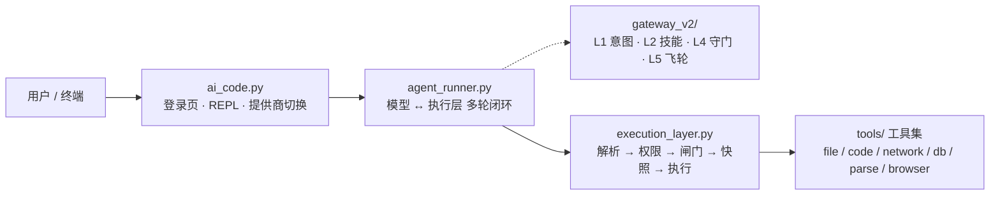

<p align="center">
  
</p>

<h1 align="center">ACE · AI Code Engine</h1>

<p align="center"><strong>中文</strong> · <a href="README.md">English</a></p>


<p align="center">
  <strong>一个把安全下沉到执行层的 AI 编码 Agent —— 模型只负责理解和输出，<br>
  权限、沙箱、快照回滚全部由执行层裁决。</strong>
</p>

<p align="center">
  <a href="https://github.com/ace-code-engine/ace-agent/actions/workflows/ci.yml"></a>
  
  
  <a href="LICENSE"></a>
  <a href="CHANGELOG.md"></a>
  <a href="CHANGELOG.md"></a>
</p>

| 关键属性 | 说明 |
|---|---|
| **本地跑** | 核心纯 stdlib，跑在你自己的机器上，链路里没有云；离线演示不需要任何 API Key |
| **模型无关** | 9 家厂商 · 10 个入口，一个 `/provider` 切换（智谱、DeepSeek、Moonshot、OpenAI、Anthropic、通义千问、SiliconFlow、OpenRouter、Ollama），同时支持 OpenAI 与 Anthropic 两种报文格式 |
| **可插拔** | 每个工具只在 [`tools/registry.py`](tools/registry.py) 声明一次；技能就是普通 `SKILL.md` 文件；接 MCP 不过是 `register()` 一个 `ToolSpec` |

大多数 Agent 把安全交给提示词："请不要删除文件"。ACE 不这么做：模型的每一次工具调用都要穿过一个独立的执行层，由它做权限裁决、危险行为检测、写入前快照。提示词失效时，执行层仍然拦得住。

配套一个 Claude Code 风格的终端：登录页、`/` 实时补全、9 家厂商 · 10 入口一键切换、流式输出。核心零第三方依赖。

v3.7 起，Go 执行器提供**官方预编译二进制**（随 GitHub Release 发布，5 平台）：`ace --install-executor` 一条命令装好，Windows 开 `--sandbox job` **不再需要本机装 Go**。通道设计见 [`docs/design/EXECUTOR-RELEASE.md`](docs/design/EXECUTOR-RELEASE.md)。

v3.8 起，**执行层的承诺有断言守着**：数据发往模型指定的目的地要人点头、项目外"已存在的东西"被覆盖/删除要人点头、安全拦截到阈值就向你告警；同时 README 与 `docs/` 里的结构树、口径数字、审计结论都有 `test_all` 的三节守卫盯着，改坏了 CI 直接红。想直接上手看行为，[`examples/`](examples/README.md) 里有三个可以照做的剧本。

## Why ACE?

如果你的需求只是**聊天式 AI 编程**（对话里生成代码、不改文件、不执行命令）——ACE 未必必要。

如果你的 Agent 要**真实地改文件、执行代码、访问工具**，并且你希望权限裁决、隔离、快照回滚**不完全依赖模型的自觉**——ACE 才是目标场景。模型被越狱、提示词被覆盖、输出被篡改时，执行层仍在。

一句话：**模型负责"想"，执行层负责"管"。**

## 目录

- [快速开始](#快速开始)
- [看它跑起来](#看它跑起来)
- [Why ACE?](#why-ace)
- [设计取向](#设计取向)
- [核心能力](#核心能力)
- [架构概览](#架构概览)
- [常用命令](#常用命令)
- [安全边界](#安全边界)
- [配置入口](#配置入口)
- [测试](#测试)
- [最近更新](#最近更新)
- [项目结构](#项目结构)
- [开发与贡献](#开发与贡献)
- [文档地图](#文档地图)
- [已知未完成与未验证](#已知未完成与未验证)
- [许可](#许可)
- [设计参考](#设计参考)

## 快速开始

**前置**：Python ≥ 3.10（用到 `int.bit_count`，建议 3.11/3.12）。核心不需要装任何第三方包。

```bash
git clone https://github.com/ace-code-engine/ace-agent.git && cd ace-agent
python test_all.py          # 端到端测试，纯 stdlib，应当全绿
python ai_code.py --mock    # 离线演示：完整跑一遍 模型↔执行层 闭环
```

**Demo 不需要 API Key。** 接真实模型时：`python ai_code.py` 进首页 → 选 `2` 走配置向导（① 选提供商 → ② 隐藏输入 API Key → ③ 选模型）→ 选 `1` 进聊天；单次对话用 `python ai_code.py --input "现在几点"`。

Windows 上项目目录已带 `ace.cmd`，加入 PATH 后可在任意目录直接敲 `ace`。

想按场景走一遍？[`examples/`](examples/README.md) 里有三个可以直接照做的剧本：安全实验室（权限裁决 / 快照 / 回滚，无需密钥）、文档解析、多轮真实任务（持久目标 + 子代理 + 知识库）。第一次来建议先读 [`docs/GETTING-STARTED.md`](docs/GETTING-STARTED.md)——它把"permission / sandbox / approval 三个正交维度"和十个常见坑讲清楚了。

<details>
<summary>其他启动方式（工具调用 / 沙箱 / 知识库；完整参数见 docs/COMMANDS.md）</summary>

```bash
ace --tools                    # 原生工具调用（function calling，不支持时自动降级）
ace --install-executor         # 官方预编译执行器（--sandbox job 前置，无需本机 Go）
ace --sandbox job              # Windows Job Object：进程树/内存上限
ace --sandbox docker           # 容器隔离：真实内核边界（需 Docker；镜像缺失自动拉官方预编译镜像）
ace --kb D:\我的资料库         # 外挂知识库（kb_search/kb_add 跨会话持久）
# 更多启动参数：Ollama 本地模型 / 上下文压缩 / --install-ui / 容器编排等 → docs/COMMANDS.md「启动参数」
```

</details>

## 看它跑起来

<p align="center">
  
</p>

<p align="center">
  <sub><b>真正会看到的第一屏。</b>一个面板把当前生效的边界（权限 · 沙箱 · 联网 · 审批）、将要编辑的目录、以及"恢复了哪一次会话"一并摆出来，
  下面是分组菜单与状态栏。由 <code>ace --preview</code> 按 88 列渲染；面板宽度跟着你的终端走。</sub>
</p>

<p align="center">
  
</p>

<p align="center">
  <sub>上图是 <code>python ai_code.py --mock</code> 的真实会话录制（离线、无需密钥），
  用 <a href="demo/record_demo.py"><code>demo/record_demo.py</code></a> 可随时重录；
  CI 跑 <code>--check</code> 盯着它，CLI 输出一变这张图就得跟着重录。</sub>
</p>

<p align="center">
  
</p>

<p align="center">
  <sub><b>改了什么，而不只是跑了什么。</b>Agent 先建一个文件、再改其中一行；卡片带 <code>+1 -0</code> 统计与逐行改动——
  新增绿、删除红——收尾还有一行本轮工具时间线。跑错一条命令当场就知道，改错一行往往几天后才发现。</sub>
</p>

<p align="center">
  
</p>

<p align="center">
  <sub><b>同一个 Agent，想干一件它不该干的事。</b>它伸手去读 <code>~/.ssh/id_rsa</code>，执行层在工具真正执行之前就拒了：
  <code>403</code>，路径越界。这不是"提示词里写了请不要"，是模型无法说服的一道检查。
  同样来自真实会话：<code>python ai_code.py --mock</code>（<code>--session blocked</code>）。</sub>
</p>

## 设计取向

三条贯穿全项目的决定，先说清楚，免得你读代码时觉得奇怪：

**安全属于执行层，不属于提示词。** 权限裁决、危险命令拦截、写入前快照都在 `execution_layer.py` 里，与模型无关。换模型、模型被越狱、提示词被覆盖，这层都还在。

**默认只读。** 起步权限是 `readonly`，写工具会被 403 拦下。模型可以申请授权（`request_permission`），由用户选「本次」或「本会话」。`terminal_exec` 例外：它只接受逐次确认，因为它的危险命令黑名单本身可被绕过，「人看一眼命令」是它唯一有效的防线。

**边界要说清能挡什么、挡不住什么。** 不开沙箱时，`code_execute` 是进程内策略层沙箱、`terminal_exec` 的判定层只是止血层——两者都不是 OS 级隔离。要真正的内核边界就开 `--sandbox docker`（容器）或 `--sandbox job`（Windows Job Object），见 [安全边界](#安全边界)。

## 核心能力

**Core — 执行安全**

| 能力 | 一句话钩子 |
|---|---|
| 三级权限 + 按权限裁剪工具表 | `readonly`/`write`/`full`；工具清单随档位裁剪（`tools/registry.py` 单点声明），模型只在"看得见用得了"的工具里决策 |
| 三层沙箱 | `off`（策略层）/ `job`（Windows Job Object：进程树/内存上限 + 受限令牌）/ `docker`（一次性容器：network none + cap-drop ALL）；job/docker 拿不到边界就 503，绝不静默回退 |
| 写入前快照 | 每次写操作自动物理快照，`/undo` 一键回滚；HMAC 签名防伪造，快照目录 Agent 自身不可写 |
| 外发闸门 | 数据去往**模型指定的目的地**（`api_get`/`api_post`/`browser_*`/`notify_send` 的 email）时，目的地不在白名单内就逐次问人；配置 `egress_allowlist` 即一次性授权，清单外一律 403 |
| 安全事件分级 | 403 里"执行层主动防御"与"模型参数写错"分开计数：前者本会话累计到阈值就明确告警（可能在借被读取的文件/网页注入指令试探边界） |
| 行为检测闸门 | 首次 `code_execute` 注入语义诱饵验证模型清醒 + AST 6 规则（无限递归 / 硬编码密钥 / SQL 注入等） |
| Go 执行器 | 危险工具委派独立 Go 进程（NDJSON），Job Object 整树回收 + 第二道策略复检；官方产物 `ace --install-executor`（v3.7+） |

**Core — Agent 能力**

| 能力 | 一句话钩子 |
|---|---|
| 持久目标（goal） | `goal_create` 后**自动逐轮续跑**直到完成/暂停/阻塞/预算耗尽；blocked 须给机器 code，重启后 `/goal resume` 才续 |
| 子代理 | `subagent` spawn（全新）/ fork（继承父会话）独立上下文会话，自带工具循环（最多 8 轮），结果回传父代理整合 |
| 免 key 联网搜索 | `search` 双引擎兜底（Bing RSS → DuckDuckGo）+ `search_read` 一步抓 top 正文；出站全走 SSRF 校验 + 白名单 |

**Optional — 可选能力**：自定义知识库（`kb_search`/`kb_add`/`kb_list`）、会话事件日志与重启恢复（`/audit`）、Plan Mode、审批疲劳缓解、浏览器自动化、文档解析全家桶（Word/Excel/PPT/PDF/OCR）、SimHash 记忆、AGENTS.md 项目指令、上下文压缩、网络退避、i18n（zh/en/ja）、9 家厂商 · 10 入口（`/provider`）。

**Experimental — 实验性**：聊天内置滚动引擎（引擎已实现，真机接线待做，见 [`docs/history/UI-CHAT-SCROLL.md`](docs/history/UI-CHAT-SCROLL.md)）。

用法细节见 [docs/COMMANDS.md](docs/COMMANDS.md) 与 [docs/INTERFACES.md](docs/INTERFACES.md)。

## 架构概览



每层职责（一行版）：用户层 = 登录页/REPL/斜杠；交互循环 = 模型↔执行层闭环（最多 20 轮）；执行层 = 协议解析 → 权限裁决 → 安全闸门 → 写前快照 → 工具执行（14 阶段状态机，安全裁决的强制边界所在）；工具集 = registry 单点声明 + 按域执行器；支撑模块 `core/work.py`/`core/guardian.py`/`core/archive.py`/`core/nuwa.py` 挂在执行层与循环上。

> **Gateway 与执行层的关系**：网关（L1/L2/L4/L5）是执行层**每轮内调用**的策略/辅助层，不是独立的第二道安全流水线——图中虚线即此意。分层详表、权威目录树与 ADR 索引见 [docs/ARCHITECTURE.md](docs/ARCHITECTURE.md)。

## 常用命令

**首页**：↑/↓ 选择 · 数字直选 · Enter 确认 · Esc/q 退出。聊天内 `exit` 回首页，首页 `7`/`Esc`/`q` 才真正退出。

```bash
/provider                    # 列出 9 家厂商 · 10 入口（当前标 ✓）
/provider zhipu              # 一键切智谱（自动换到 glm-4.7-flash）
/permission write            # 提权（默认 readonly）
/undo                        # 写入前快照 → 一键回滚
```

斜杠：`/help` `/clear` `/status` `/snapshots` `/rollback <id>` `/model <名称>` `/mock` `/open <路径>` `/edit <路径>` `/search <词>` `/memory` `/report` `/expand` `/history [关键词]`
`@` 快捷：`@lang`（zh/en/ja）· `@skill` · `@file` · `@folder` · `@refs`
输入：`Enter` 发送，`Alt+Enter` / `Ctrl+J` 换行，`Ctrl+R` 逐条往回翻历史，`/history dsk` 按关键词模糊找。`/` 菜单与 `/help` 把命令分成「会话 / 安全 / 模型 / 工具」。
工具输出超过 8 行会被卡片折叠，`/expand` 重印上一次的完整输出（单次最多 4000 字符，被截断时如实标注）；写入类卡片给上色 diff 与 `exit N` 退出码；↑/↓ 与 Ctrl+R 翻的是跨会话的 `~/.ace_history`，`ACE_NO_HISTORY=1` 可让它只留在进程内。

→ 完整命令表、`/provider` 全示例、启动参数见 [docs/COMMANDS.md](docs/COMMANDS.md)。

## 安全边界

ACE 的安全分四层，默认启用程度不同：

| 层 | ACE 的做法 |
|---|---|
| Prompt 层 | 提示词只做引导，**不承诺安全** |
| Application 层（默认） | 执行层策略：三级权限 + AST 行为检测 + 写前快照/回滚 + 路径边界 + 网络 SSRF/白名单闸门 + 外发目的地确认（含项目外覆盖/删除要人点头） |
| OS 层（可选，Windows） | `--sandbox job`：Job Object 进程树/内存上限 + 受限令牌 |
| Container 层（可选） | `--sandbox docker`：一次性容器，network none + cap-drop ALL + read-only 根 + `--init` + 只挂工作目录。镜像本地构建一次（`docker/Dockerfile.sandbox`）；放在 registry 里的可用 `ACE_SANDBOX_PULL=1` 自动拉 |

诚实边界：**不开 OS/Container 档时**，上述只是进程内策略（AST 黑名单/AST 求值无法闭合、`terminal_exec` 判定只是止血层），**不是 OS 级隔离**；`job` 档是 Windows 专属原语；Docker 容器共享内核，逃逸仍是逃逸。job/docker 拿不到边界一律 503，**绝不静默回退宿主执行**。

外发闸门也有范围：它管的是**模型挑的目的地**——内置端点（搜索引擎、图片服务）不逐次问，其中 `image_generate` 会把 prompt 明文交给第三方服务；`terminal_exec` 仍能删项目内的审计日志，但那一步每次都过人。这两条都写进了 [docs/SECURITY-MODEL.md](docs/SECURITY-MODEL.md)，不是隐藏行为。

→ 完整安全模型与生产部署必读见 [docs/SECURITY-MODEL.md](docs/SECURITY-MODEL.md)。漏洞报告见 [SECURITY.md](SECURITY.md)。

## 配置入口

```python
# ~/.ai_code.json（命令行参数 > 本文件 > ~/.claude/settings.json > 环境变量）
config = {
    "permission": "readonly",   # readonly / write / full
    "sandbox": "off",           # off / job / docker
    "max_snapshots": 20,        # 快照硬上限，自动清理最旧
}
```

→ 全部配置项（出站白名单 / 检索边界 / str_replace 编码 / db_query 只读等机制说明）见 [docs/CONFIGURATION.md](docs/CONFIGURATION.md)。

## 测试

```bash
python test_all.py          # 全量测试（纯 stdlib，退出码非 0 即失败）
ruff check . --select E9,F63,F7,F82   # CI 硬错误子集
```

→ 测试框架说明、CI 矩阵、基准 / e2e / 冒烟细节见 [docs/TESTING.md](docs/TESTING.md)。

其中三节是**给文档与安全承诺用的守卫**（v3.8 起）：`[38]` 权威目录树 ↔ 真实文件、`[39]` 文档口径数字 ↔ `PROVIDERS`/`TOOL_SPECS`、`[40]` 安全审计里那些原始 payload。它们的作用是让"文档说要问人"这件事不会某天悄悄变成"代码里从来没问过"。

## 最近更新

- **v3.20.0** (2026-09-19)：会话能列、能续、能分叉、能退回——`/sessions`（时间/轮数/首句/**是否被压过**）、`/resume`（历史按它重建，**之后的事件也写进那份日志**）、`/fork`（以某会话为起点开新会话，不共享历史）、`/rewind` **只动对话**（文件是 `/rollback` 的事，提示里每次写明）。外加逐项**待办清单**：`todo_write` 工具（只读组——列个清单不该要授权）、`/todo`、底栏 `待办 1/3`、日志为唯一事实源所以 `/resume` 后不丢。守卫 `[46]` 走真文件 + 真 CLI：`/resume` 后新消息真的写进被续聊的日志、`/rewind` 后磁盘上的文件一字未动
- **v3.19.0** (2026-09-19)：`ace --json` 给出**机器可读的事件流**——一行一个 JSON 对象（`session_start` / `user_message` / `model_request` / `tool_call` / `tool_result` / `permission_request` / `notice` / `final` / `session_end`），契约表 `core/ace_events.EVENT_REQUIRED` 是文档、运行时校验与断言的唯一来源。人话不丢：`--json` 下 stdout 被 `NoticeProxy` 接管，几百处 print 一律变成 `notice` 事件——一处生效，且自动剥色、丢掉 `\r` 重绘与进度条噪音。刻意**不发 `model_delta`**。守卫真的跑子进程逐行解析 stdout
- **v3.18.0** (2026-09-19)：把"你自己的规矩"接进来。**事件钩子**（`pre_tool` / `post_tool` / `user_prompt` / `session_start` / `session_end`）从 stdin 读 JSON、从 stdout 回 `{"decision":"block","reason":…}`，退出码 2 = 拦截；**默认 fail-close**——钩子崩了或超时**不算**"检查通过"。`pre_tool` 拦下是 `HOOK_BLOCKED`（**不计入安全违规**），而且工具**真的没执行**。**自定义斜杠命令**来自 `.ace/commands/*.md`（文件名即命令，`$ARGUMENTS`/`$1` 代入，不引 YAML 依赖，内置命令优先）。**插件**放 `.ace/plugins/<名>/`，贡献命令（自动加前缀）与钩子，**刻意不能带工具**。钩子与 MCP 同一条边界：本地命令、不在沙箱里 → [`docs/EXTENDING.md`](docs/EXTENDING.md)
- **v3.17.0** (2026-09-19)：ACE 会说 **MCP** 了（stdio JSON-RPC 2.0：`initialize` → `tools/list` → `tools/call`）。把 `mcp_servers` 指向一个 server，它的工具就以 `mcp__<server>__<工具名>` 出现、schema 原样透传；权限/审批/审计照旧。`/mcp` 看状态、失败原因与工具清单。权限默认从严（对面声明 `readOnlyHint` 才算只读）。失败分开报：`503` 不可用 / `504` 超时 / `500` 协议错或对面 `isError`；子进程显式收掉。**只支持 stdio**，HTTP/SSE 未实现
- **v3.16.1** (2026-09-19)：前两个 tag 的 CI 在 **lint job** 上红了（测试矩阵全绿）——`ui/ace_diff.py` 多导入了一个只在 docstring 里被提到的 `display_width`。修掉它，并在 `[38]` 加了一条 **AST 版"无未使用导入"**（F401 口径）的本地守卫：装了不 ruff 的环境也能在本地拦住同类错。这条守卫是**注入回去验证过会红**的
- **v3.16.0** (2026-09-19)：输入行补齐了。**多行输入**：`Alt+Enter` 或 `Ctrl+J` 换行（终端支持扩展键协议时 `Shift+Enter` 也行），`Enter` 发送，续行用 `… ` 对齐。**`/history [关键词]`** 用选择器那套子序列评分模糊检索历史（`dsk` 能命中 `deepseek` 那条），命中字符高亮，选中后填进下一次输入行——**不自动发送**。**25 条命令分成四组**（会话/安全/模型/工具），`/` 菜单与 `/help` 同一套分组；菜单数据源是纯函数，所以在没装 prompt_toolkit 的环境里也照样被断言
- **v3.15.0** (2026-09-19)：写入类工具的卡片带上**上色 diff**（标题挂 `+N -M`，`+` 绿、`-` 红、区块头青）——跑错一条命令当场就知道，**改错一行往往几天后才发现**。`file_write` 新增 `data["diff"]`；`str_replace` 早就返回 diff，只是终端从来没显示过。三条边界：新文件不给 diff、**凭据文件不读旧内容**（与"快照不留副本"复用 SEC-04 名单，否则旧内容会进卡片、也顺着工具结果进模型上下文）、超过 200 KB 不算 diff。命令卡片带 `· exit N`（"跑完"≠"成功"），一轮里调 ≥2 次工具会收尾给一行时间线。演示新增第四张图并纳入 CI
- **v3.14.0** (2026-09-19)：首屏重做——**「当前会话」面板**（模型 / 边界四轴 / 目录 / "恢复了哪一次会话"）、**「最近会话」面板**、**分组菜单**，全部由新增的宽度感知排版层 `ui/ace_panel.py` 画，硬保证是"每行宽度严格等于面板宽"（中文按两列算）。自动续聊从 v3.9 就有，但界面上从没说过**恢复的是哪一次**，现在说出来了。新增 `ace --preview`：只画一遍首屏就退出，不开交互终端也能看见界面——README 首图与 CI 校验都靠它。`ui/ace_text` 补上 ANSI 感知：颜色码在终端里占 0 列，此前会被当成十几个字符，于是"上个色边框就歪"
- **v3.13.0** (2026-09-19)：上下文余量从"压缩之后才知道"变成常驻可见。底栏末尾多一段占比（`上下文38%`），颜色即语义——灰=有余量、黄=用掉触发点的 80%、红=下一轮就会压缩；`/status` 打出明细（`约 12k tokens / 窗口 32768（38%，压缩触发点约 23k；估算值，不是服务端读数）`）。逼近阈值时在请求发出前提醒一次（按触发点 10% 一档节流，所以这行字一直值得看）。显示口径与实际压缩决策共用同一个策略构造点——各写一份迟早会对不上，而对不上的数没人会再信。守卫：`[9]` +20 条，含一条盯"触发点同源"的不变量，以及两条走真实（mock）`converse` 的集成断言——只测纯函数的话，函数对但没人调用也照样绿
- **v3.12.0** (2026-09-19)：把一句空话补成真功能。工具卡片从早先版本起就写着"已折叠 N 行（用 /expand 看完整）"，而全仓根本没有这条命令——恰恰在用户最需要出口的地方挂着一句空承诺。现在 `/expand` 重印上一次被折叠的完整输出，没折叠过就如实说没有，被 4000 字符上限截断时在标题里标出来。输入历史改为跨会话保存在 `~/.ace_history`（↑/↓ 与 Ctrl+R 能翻到昨天的输入；`ACE_NO_HISTORY=1` 退回进程内，因为历史文件里可能留着粘贴过的密钥），状态行加上已用秒数，长思考与卡死从此看得出区别。守卫：`[9]` 新增 12 条，其中一条通用不变量盯"命令表里的 parts 标志必须与处理函数真实签名一致"（它第一次运行就抓住了 `/expand` 自己的签名不符）；`[11]` 现在强制三语键集完全一致、同名键的 `{占位符}` 一致、且没有空译文
- **v3.11.1** (2026-09-19)：选择器改成**子序列（模糊）匹配**——`glm4` 能命中 `glm-4.6`（`/model` 里从 0 项变 10 项）、`dsk` 能命中 `deepseek`；评分与高亮共用一个匹配器，模糊命中标的正是真正命中的字符。新增 `ui/ace_text.py` 让文本按**列**算宽度（中文占两列）：卡片此前按字数截断，"60 字"的中文实际占 120 列，会把卡片边框顶出屏幕

- **v3.11.0** (2026-09-19)：容器档的运行参数做了一轮加固，并且**在真实 daemon 上验过**而不是读代码觉得没问题——`--init`（回收僵尸，否则它们吃光 `--pids-limit` 名额）、`--ulimit nofile`、`HOME=/tmp`（只读根下 pip 写不了缓存）、SELinux Enforcing 宿主自动加 `,z`（Fedora/RHEL 不加就写不进挂载盘）、`--label` 便于清理、可选 `ACE_SANDBOX_SECCOMP`。CI 新增 `sandbox-smoke`：构建镜像并用客户端自己的参数构造真跑一遍，断言 `--network none` 与 `--read-only` 真的成立。**不发布官方预编译镜像**：组织的包策略不允许把 GHCR 包设为公开，所以默认仍是"本地构建一次"，`ACE_SANDBOX_PULL=1` 留给自建 registry 的场景 → [完整更新介绍](docs/RELEASE-NOTES-v3.11.0.md)
- **v3.10.1** (2026-09-19)：三处由真机冒烟与实际运行逼出来的修复。格式纠错不再把执行层的报错包进 SEC-011 的外部内容块（模型照约定拒绝纠错、一路耗到 Stall 断路器介入），纠正指令改为附上执行层实际收到的原文；Go 执行器只在真需要时才索取 `PROCESS_SUSPEND_RESUME`，附加失败时点名被拒的访问位，并可在受限令牌宿主下退回普通启动（如实标 `degraded`）保住 Tier-1；`ace.cmd` 改 CRLF 并由 `.gitattributes` 钉死。**这一版要重发预编译执行器** —— 重发之前 `ace --install-executor` 拿到的仍是修复前的二进制
- **v3.10.0** (2026-09-18)：根目录瘦身——20 个模块下沉 `ui/`（终端表现）/ `cli/`（自检·上下文·会话日志）/ `core/`（策略·网络·执行器客户端·记忆与快照），根级只留 4 个 `.py`；README 改为英文为主（中文在本文件）；演示补上"被拦下"那条路径
- **v3.9.0** (2026-09-18)：P2 结构重构落地——测试分段运行（`--only 40` 从 14s 到 0.3s）、`tools/file_tools.py` 按三条执行路径拆域（方法体逐字节未改）、`run_command` 125→25 行 / `converse` 234→175 行、新增共享模型层纯逻辑 `core/ace_model.py`
- **v3.8.4** (2026-09-18)：斜杠命令表驱动（`run_command` 125→46 行）+ R-01 状态机闭环核对 + `docs/design/STRUCT-REFACTOR.md` 立项卡
- **v3.8.3** (2026-09-18)：`approval_policy=never` + 无边界（`off` / `danger_full_access`）**拒绝启动**（ADR-002 的"没人 + 没边界"没有可辩护用途）；库调用方同拦（`PolicyRefused`）
- **v3.8.2** (2026-09-18)：上手路径 [docs/GETTING-STARTED.md](docs/GETTING-STARTED.md)（三维度矩阵 + 十个坑）+ 沙箱档启动预检（job 非 Windows / 缺执行器 / 缺 docker 启动就提示）
- **v3.8.1** (2026-09-18)：无人值守边界写清楚（需要审批的动作在 CI 里被拒绝、无需审批的工具照跑）+ `--approval-policy` 与策略键透传 + 启动风险提示；自评边界与红队清单入档
- **v3.8** (2026-09-18)：执行层承诺兑现为断言——外发闸门、项目外覆盖/删除确认、安全拦截分级告警；文档 `[38]/[39]/[40]` 三节守卫；审计 `SEC-001~019` 全面对账（含新发现并修复的 `SEC-009`）；场景示例 [`examples/`](examples/README.md)（P1 全清）
- **v3.7** (2026-09-06)：执行器官方预编译二进制 + `ace --install-executor`（首个 GitHub Release）

→ 完整版本历史见 [CHANGELOG.md](CHANGELOG.md)。

## 项目结构

架构级视图（逐文件清单与模块职责见 docs/ARCHITECTURE.md）：

```
ace-agent/
├── ai_code.py / agent_runner.py   # 前端（登录页/REPL）+ 交互循环
├── execution_layer.py             # 执行层：安全裁决的强制边界所在
├── ui/  cli/  core/               # 终端表现层 / 操作者工具 / 引擎支撑
├── tools/  gateway_v2/  executor/ # 工具集 / 网关策略 / Go 沙箱执行器
├── test_all.py  benchmarks/  e2e/ # 测试 / 基准 / 真实模型冒烟
├── docker/  docs/  demo/          # 容器编排 / 文档（见下）/ 演示
├── examples/                      # 场景剧本：安全实验室 · 文档解析 · 多轮任务
└── SECURITY.md  CHANGELOG.md  LICENSE
```

→ 权威完整目录树与逐模块职责见 [docs/ARCHITECTURE.md](docs/ARCHITECTURE.md)。

## 开发与贡献

改动前请读 [CONTRIBUTING.md](CONTRIBUTING.md)；开发者标准化流程见 [docs/DEVELOPMENT.md](docs/DEVELOPMENT.md)，接口与类型契约见 [docs/INTERFACES.md](docs/INTERFACES.md)，待办见 [docs/BACKLOG.md](docs/BACKLOG.md)。

## 文档地图

| 想了解 | 去这里 |
|---|---|
| **第一次来先看这个**（5 分钟跑起来 · 三维度矩阵 · 十个坑） | [docs/GETTING-STARTED.md](docs/GETTING-STARTED.md) |
| **跑起来看场景**（安全实验室 / 文档解析 / 多轮任务） | [examples/](examples/README.md) |
| 分层架构 · 完整目录树 · ADR 索引 | [docs/ARCHITECTURE.md](docs/ARCHITECTURE.md) |
| 安全模型 / 审计 / 漏洞报告 | [docs/SECURITY-MODEL.md](docs/SECURITY-MODEL.md) · [docs/SECURITY-AUDIT.md](docs/SECURITY-AUDIT.md) · [SECURITY.md](SECURITY.md) |
| 配置全项与机制 | [docs/CONFIGURATION.md](docs/CONFIGURATION.md) |
| 命令与启动参数 | [docs/COMMANDS.md](docs/COMMANDS.md) |
| 测试与 CI | [docs/TESTING.md](docs/TESTING.md) |
| 开发流程 / 契约 / 待办 | [docs/DEVELOPMENT.md](docs/DEVELOPMENT.md) · [docs/INTERFACES.md](docs/INTERFACES.md) · [docs/BACKLOG.md](docs/BACKLOG.md) |
| 版本历史 | [CHANGELOG.md](CHANGELOG.md) |
| 历史立项卡 / 会话纪要 / 调研 / 提示词规范 | [docs/design/](docs/design/) · [docs/history/](docs/history/) |

## 已知未完成与未验证

诚实起见，以下两件事**没有做完 / 没有验证过**，别把它们当成"应该没问题"：

- **R-03 双前端引擎合并（未完成）** —— `ai_code.ModelClient` ↔ `agent_runner.ModelProvider` 只合并了**安全半边**（两端共用的纯逻辑 `core/ace_model.py`：历史裁剪 / HTTP 错误码提示）。**客户端本体的合并没有做**：交互式前端是"流式 + requests + 重试 + Anthropic 兼容"，无头前端是 urllib 一次性调用，输出契约也不同（边流边渲染 vs `🤖 Agent:` 单行，`e2e` 与 CI 都依赖后者）；合并属于**改行为**，而现有测试只覆盖 `--mock` 路径，**必须在真机（真实模型端点）上验证过才敢动**。推进顺序写在 [`docs/design/STRUCT-REFACTOR.md`](docs/design/STRUCT-REFACTOR.md) §3。
- **REL-03 真机冒烟（未验证）** —— 仓库里的自动化只覆盖 `--mock` 离线链路、无头 `agent_runner` 与 CI 上的三档 Python；**"`ace.cmd` → 真实终端对话"这条路径从未在真机上走过一遍**。Windows 控制台的 VT/编码、`prompt_toolkit` 补全菜单、真实模型下的流式渲染都属于这一类。要在有控制台的机器上手动验证一次。

（另一条同类未验证：**darwin/amd64 执行器产物没有原生冒烟**——交叉编译出来了，但没有 Intel Mac 实机跑过。见 [`docs/BACKLOG.md`](docs/BACKLOG.md) 的 REL 段与 `docs/design/EXECUTOR-RELEASE.md` 的验收备注。）

## 许可

[MIT](LICENSE) © 2026 jincheng3870682453-hash

## 设计参考

架构决策与以下工作对齐——**让模型只负责"理解、选择、输出"，把权限、安全、回滚、记忆全部下沉到执行层**：

- [Agent Harness 工程最佳实践](https://github.com/Delphoa/study-awesome-harness-engineering)（工具 / 权限 / 记忆 / 沙箱 / 可观测性）
- [DeepSeek Harness 设计解析](https://developer.aliyun.com/article/1756780)（对应内部调研 docs/history/dsh_research.md）
- [20 章中文 AI Agent 架构实战](https://github.com/ryzqi/learn-agent)
